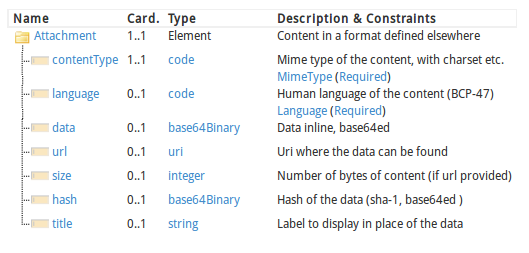

title: 
date: 
categories: doc
---

[首页](../home/index.html) >[文档](documentation.html) >**数据类型**        

 [数据类型](#)  >  [实例](datatypes-examples.html) > [正式定义](datatypes-definitions.html) > [映射](datatypes-mappings.html)             

本页内容:

[基本数据类型](#primitive)

[数据类型](#Types)

[其他类型](#other)

### 1.13.0  数据类型

FHIR标准为资源中的数据元素定义了一系列的数据类型.数据类型分两大类:从XML Schema导入的简单/基础数据类型,和复杂数据类型,主要是可复用的元素集合.这部门介绍数据类型.参考 [数据类型实例](datatypes-examples.html), [数据类型正规定义](datatypes-definitions.html) 和 [数据类型的对应关系](datatypes-mappings.html).


这些数据类型可以在 [W3C Schema](../material/fhir-base.xsd)找到.

<a name="primitive"/>

#### 1.13.0.1 基本数据类型                         


<a name="imports"> </a>

下表中对标准中所用到的基本数据类型和对它们的约束进行了总结, 它们也可以有[扩展](extensibility.html).基本数据类型的value属性和 [W3C Schema (1.0) 标准 第二部分](http://www.w3.org/TR/xmlschema-2/)中定义的值域相同,尽管大多数情况下,以加粗的字体来表示该标准所规定的额外约束.                 
<a name="boolean"> </a><a name="integer"> </a><a name="decimal"> </a><a name="base64Binary"> </a><a name="base64binary"> </a><a name="instant"> </a><a name="string"> </a><a name="uri"> </a><a name="date"> </a><a name="dateTime"> </a><a name="time"> </a><table class="list"> <tr>   <td colspan="3">**基本数据类型**</td> </tr><tr>   <th>FHIR中的名称</th><th>Schema中的类型</th><th>定义</th> </tr> <tr>   <td>boolean</td><td>xs:boolean</td><td>值要么是true要么是flase  (**0和1是无效值**)</td></tr> <tr>   <td>integer</td><td>xs:int</td><td>有符号的32位整数(更大的值 选用decimal)</td> </tr> <tr>   <td>decimal</td><td>xs:decimal</td><td>随机数.实际中不要选用IEEE的浮点数类型,选用内置精度的真正的decimal(如JAVA中的BigDecimal).**Decimals may not use exponents**</td> </tr> <tr>   <td>base64Binary</td><td>xs:base64Binary</td><td>base64 编码的字节流 ([RFC 4648](http://tools.ietf.org/html/rfc4648))</td> </tr> <tr>   <td>instant</td><td>xs:dateTime</td><td>某个时间点- **至少要知道秒,总是包括时区**.    注意: 这个类型适合系统时间,不适合人的时间 (参考date和dateTime).</td> </tr> <tr>   <td>string</td><td>xs:string</td><td> 一个Unicode字符序列 **字符串大小不应该超过 1MB **</td> </tr> <tr>   <td>uri</td><td>xs:anyURI</td><td>唯一的资源标识符引用,可以是绝对或相对引用,可能会包含可选的标识符片段([RFC 3986](http://tools.ietf.org/html/rfc3986))</td> </tr>
 <tr><td>date</td><td>xs:date, xs:gYearMonth, xs:gYear的组合</td><td>人们交流时用到的日期或者日期的一部分(如只是年份或者年份加上月份)  **不包含时区 **. Dates值应该是有效值,date是w3c schema 中 date, gYearMonth,  and gYear的组合 正则表达式为: -?[0-9]{4}(-(0[1-9]|1[0-2])(-(0[0-9]|[1-2][0-9]|3[0-1]))?)?</td></tr> <tr><td>dateTime</td><td>xs:dateTime, xs:date, xs:gYearMonth, xs:gYear的组合</td><td>人们交流时用到的日期,日期-时间或者部分日期(如只是年份或者年份加上月份) 如果指定了小时和分钟,应该要有时区值.可以有秒 也可以没有.日期值应该是有效值.
. **&quot;24:00&quot; 形式的时间是不允许的** dateTime是W3C schema中 dateTime, date, gYearMonth, gYear数据类型的组合. regex: -?[0-9]{4}(-(0[1-9]|1[0-2])(-(0[0-9]|[1-2][0-9]|3[0-1])(T([01][0-9]|2[0-3]):[0-5][0-9]:[0-5][0-9](\.[0-9]+)?(Z|(\+|-)((0[0-9]|1[0-3]):[0-5][0-9]|14:00))?)?)?)? </td></tr> <tr><td>time</td><td>xs:time</td><td>某天内的某个时间点没 但没有规定是哪天. (可以转换成午夜之后的 [Duration](#Duration) 可以有秒,也可以没有. **不允许&quot;24:00&quot;形式的时间,不允许时区的出现**  regex: ([01][0-9]|2[0-3]):[0-5][0-9]:[0-5][0-9](\.[0-9]+)?  <!-- these regex tested using http://www.regexr.com/ -->
 </td>  </tr> <tr><td colspan="3">注意:并非对于date/time数据类型的所有约束都可以用正则表达式来表示,因此其实这些正则表达式的取值要比真正的有效值范围要广一些</td></tr><tr><td colspan="3"/></tr> <tr>   <td colspan="3">**简单约束** <a name="patterns"/><a name="code"> </a><a name="oid"> </a><a name="uuid"> </a><a name="id"> </a></td> </tr> <tr>   <th>FHIR 中的名称</th><th>基本的FHIR数据类型</th><th>描述</th> </tr> <tr><td>code</td><td>string</td><td>表示取值来自其他地方所定义的可控的字符串集合 (更多信息请参考 [编码的使用](terminologies.html) ). 技术上来讲,code是至少包含一个字符的字符串,前后都没有空格, and where there is no whitespace other than single spaces in the contents 正则表达式: [^\s]+([\s]+[^\s]+)*</td></tr><tr><td>oid</td><td>uri</td><td>用URI([RFC 3001](http://www.ietf.org/rfc/rfc3001.txt))来表示OID: urn:oid:1.2.3.4.5</td></tr> <tr><td>uuid</td><td>uri</td><td>用URI([RFC 4122](http://www.ietf.org/rfc/rfc4122.txt))来表示UUID: urn:uuid:a5afddf4-e880-459b-876e-e4591b0acc11. 注意 RFC 批注中要求说UUID的值必须是小写的,系统可以根据情况来处理</td></tr><tr><td>id</td><td>string</td><td>范围在 0 to 2^64-1 之间的数字(可以是十六进制的),  uuid,  oid, 或任意小写字母的组合, 数字, &quot;-&quot; 和 &quot;.&quot;, 长度限制为36位.正则表达式为: [a-z0-9\-\.]{1,36}</td></tr></table>

除了上述的值以外,这些基本数据类型也可以有标识(如xml:id),也可能和资源中的其他元素一样会有[扩展](extensibility.html) 注意 value字段是可选的,可以不存在,这里遵循[所有元素的标准规则](formats.html#element-rules).
比如,基本数据类型的元素可能没有valu字段,取而代之的会存在一个 [数据缺失原因的扩展data-absent-reason extension](general-extensions.html#data-absent-reason) .                

在XML中,这些数据类型表示成XML元素,在value属性中用数据类型的值来表示.元素的名称用数据类型来定义.XML元素可能会有一个 [id 属性](references.html#idref), 和&quot;extension&quot;子元素. 按照XML schema,会忽略数据类型boolean, integer, decimal, base64Binary, instant, uri, date, dateTime, oid, and uri的值中包含的前置和后置的空格.注意这意味着对于XML实例而言,schema aware 和non schema aware 的XML库会存在不同的属性值.鉴于此,这些数据类型的valuse属性的值不应该包含前置或后置的空格.String 的值只有在前置或后置空格本身是值的一部分时才能存在.     

在 JSON中,这些类型用包含它们的对象的简单属性来表示.属性的名称用数据类型来定义.数据类型也会有id属性和extension.在[JSON format](json.html)中描述了如何表示.JSON中空格总是很重要的.除了string之外的基本数据类型不应该包含前置或后置空格.
* * *

<a name="Types"/>

#### 1.13.0.2 复杂数据类型                          

这些数据类型用包含子元素的XML元素来表示,子元素的名称用基本数据类型来定义.
任意XML元素都可能有 [id attribute](references.html#idref).  JSON中,这些数据类型是用对象来表示的,属性的名称和XML元素的名称一样.JSON表达格式几乎是一样的,因此只有第一个[例子](datatypes-examples.html#Attachment) 给出了JSON的表达格式.

复杂数据类型可以用 &quot;被规范&quot;.  [规范](profile.html)中是对元素应该取什么值,哪些元素应该取值的约束.  

**复杂数据类型的UML图**
     

<a name="Attachment"/>
<a name="attachment"/>

#### 1.13.0.3  Attachment

参考[实例](datatypes-examples.html#Attachment), [正式定义](datatypes-definitions.html#Attachment) and [映射](datatypes-mappings.html#Attachment).

该数据类型针对的是包含或引用附件的情况-一些用其他格式定义的数据内容.最常用的情况是包含图片或诸如PDF等格式的报告.然而可以用来表示任何拥有MIME类型的数据.
```
<[name](datatypes-definitions.html#Attachment "For referring to data content defined in other formats.") xmlns="http://hl7.org/fhir"> doco
 <!-- from Element: extension -->
 <contentType value="[code]"/><!-- 1..1 Mime type of the content, with charset etc. -->
 <language value="[code]"/><!-- 0..1 Human language of the content (BCP-47) -->
 <data value="[base64Binary]"/><!-- 0..1 Data inline, base64ed -->
 <url value="[uri]"/><!-- 0..1 Uri where the data can be found -->
 <size value="[integer]"/><!-- 0..1 Number of bytes of content (if url provided) -->
 <hash value="[base64Binary]"/><!-- 0..1 Hash of the data (sha-1, base64ed ) -->
 <title value="[string]"/><!-- 0..1 Label to display in place of the data -->
</[name]>
```
     

其他定义: 资源规范 ([XML](Attachment.profile.xml.html), [JSON](Attachment.profile.json.html))

#####  1.13.0.3.1 术语绑定                 
<table class="grid"> <tr><th>路径</th><th>定义</th><th>数据类型</th><th>参考</th></tr> <tr><td title="MimeType" valign="top">Attachment.contentType </td><td valign="top">attachment的 mime类型</td><td>[Incomplete](terminologies.html#incomplete)</td><td valign="top">[BCP 13 (RFCs 2045, 2046, 2047, 4288, 4289 and 2049)](http://www.rfc-editor.org/bcp/bcp13.txt)</td> </tr> <tr><td title="Language" valign="top">Attachment.language </td><td valign="top">人类使用的语言</td><td>[Incomplete](terminologies.html#incomplete)</td><td valign="top">[IETF language tag](http://tools.ietf.org/html/bcp47)</td> </tr></table>

 _contentType_ 元素总是应赋值.它包含了编码信息和其他的一些mime类型的扩展.如果其中没有编码信息,也就是说没有定义正确的操作,尽管一些mime类型 可能会定义默认的编码集或者可以通过对内容的解读来确定正确的编码集.
Attachment的实际内容是用_data_ 元素或者URL引用来提供的.如果两者皆有的话,URL指向的内容应该和data中的内容一样,决不能指向和data中不同的内容(比方说,reference是存在版本的). URL的reference应该指向一个地址,该地址可以获取实际的数据,一些URI诸如cid能够满足这样的要求.如果URL是一个相对引用的话,应该用和 [resource reference](references.html#references)一样的方式来解读.

包含了 _hash_,这样系统就可以确认URL所返回的内容未经修改.

在很多使用Attachment的情况下,基数设为1.正确的使用重复次数可以在不同的mime类型和语言中传递同样的内容.应该在资源中可重复元素/引用该类型的扩展定义中提供对重复元素含义的指导意见

 描述attachment中所使用语言的language元素取值使用 [BCP 47中定义的编码](http://tools.ietf.org/html/bcp47).

>  **约束**

>  如果data URL都不存在的话,应当理解成对于所声明的原因 ,没有特定mime类型和或语言的内容.
>
> 在使用的场景中可以常常会对能够使用的attachment的类型作出规定(也就是mime的类型).


在这些地方会用到Attachment: [Media](media.html), [Practitioner](practitioner.html), [SecurityPrincipal](securityprincipal.html), [DiagnosticReport](diagnosticreport.html), [Observation](observation.html), [RelatedPerson](relatedperson.html) and [Patient](patient.html)

<a name="Coding"> </a>
<a name="coding"> </a>
<a name="codesystem"> </a>

## <span class="sectioncount">1.13.0.4<a name="1.13.0.4"> </a></span> Coding

See also [Examples](datatypes-examples.html#Coding), [Formal Definitions](datatypes-definitions.html#Coding) and [Mappings](datatypes-mappings.html#Coding).

A Coding is a representation of a defined concept using a symbol from a defined &quot;code system&quot;
- see [Using Codes in resources](terminologies.html) for more details.

<pre class="spec">
&lt;[**[name]**](datatypes-definitions.html#Coding "A reference to a code defined by a terminology system.") xmlns=&quot;http://hl7.org/fhir&quot;&gt; <span style="float: right">[](formats.html "Documentation for this format")</span>
 &lt;!-- from Element: [extension](extensibility.html) --&gt;
 &lt;[**system**](datatypes-definitions.html#Coding.system "The identification of the code system that defines the meaning of the symbol in the code.") value=&quot;[<span style="color: darkgreen">[uri](datatypes.html#uri)</span>]&quot;/&gt;<span style="color: Gray">&lt;!--</span> <span style="color: brown">**0..1**</span> <span style="color: navy">Identity of the terminology system</span><span style="color: Gray"> --&gt;</span>
 &lt;[**version**](datatypes-definitions.html#Coding.version "The version of the code system which was used when choosing this code. Note that a well-maintained code system does not need the version reported, because the meaning of codes is consistent across versions. However this cannot consistently be assured. and When the meaning is not guaranteed to be consistent, the version SHOULD be exchanged.") value=&quot;[<span style="color: darkgreen">[string](datatypes.html#string)</span>]&quot;/&gt;<span style="color: Gray">&lt;!--</span> <span style="color: brown">**0..1**</span> <span style="color: navy">Version of the system - if relevant</span><span style="color: Gray"> --&gt;</span>
 &lt;[**code**](datatypes-definitions.html#Coding.code "A symbol in syntax defined by the system. The symbol may be a predefined code or an expression in a syntax defined by the coding system (e.g. post-coordination).") value=&quot;[<span style="color: darkgreen">[code](datatypes.html#code)</span>]&quot;/&gt;<span style="color: Gray">&lt;!--</span> <span style="color: brown">**0..1**</span> <span style="color: navy">Symbol in syntax defined by the system</span><span style="color: Gray"> --&gt;</span>
 &lt;[**display**](datatypes-definitions.html#Coding.display "A representation of the meaning of the code in the system, following the rules of the system.") value=&quot;[<span style="color: darkgreen">[string](datatypes.html#string)</span>]&quot;/&gt;<span style="color: Gray">&lt;!--</span> <span style="color: brown">**0..1**</span> <span style="color: navy">Representation defined by the system</span><span style="color: Gray"> --&gt;</span>
 &lt;[**primary**](datatypes-definitions.html#Coding.primary "Indicates that this code was chosen by a user directly - i.e. off a pick list of available items (codes or displays).") value=&quot;[<span style="color: darkgreen">[boolean](datatypes.html#boolean)</span>]&quot;/&gt;<span style="color: Gray">&lt;!--</span> <span style="color: brown">**0..1**</span> <span style="color: navy">If this code was chosen directly by the user</span><span style="color: Gray"> --&gt;</span>
 &lt;[**valueSet**](datatypes-definitions.html#Coding.valueSet "The set of possible coded values this coding was chosen from or constrained by.")&gt;<span style="color: Gray">&lt;!--</span> <span style="color: brown">**0..1**</span> <span style="color: darkgreen">[Resource](references.html#Resource)([ValueSet](valueset.html#ValueSet))</span> <span style="color: navy">Set this coding was chosen from</span><span style="color: Gray"> --&gt;</span>&lt;/valueSet&gt;
&lt;/[name]&gt;
</pre>

<table style="border: 0px; font-size: 11px; font-family: verdana; vertical-align: top;" cellpadding="0" border="0" cellspacing="0"><tr style="border: 1px #F0F0F0 solid; font-size: 11px; font-family: verdana; vertical-align: top;"><th style="vertical-align: top; text-align : left; padding:0px 4px 0px 4px" class="heirarchy">Name</th><th style="vertical-align: top; text-align : left; padding:0px 4px 0px 4px" class="heirarchy">Card.</th><th style="width: 100px" class="heirarchy">Type</th><th style="vertical-align: top; text-align : left; padding:0px 4px 0px 4px" class="heirarchy">Description &amp; Constraints</th></tr><tr style="border: 0px; padding:0px; vertical-align: top; background-color: white;"><td style="vertical-align: top; text-align : left; padding:0px 4px 0px 4px; white-space: nowrap; background-image: url(tbl_bck1.png)" class="heirarchy"> [Coding](datatype-definitions.html#Coding "A reference to a code defined by a terminology system.")<a name="Coding"> </a></td><td style="vertical-align: top; text-align : left; padding:0px 4px 0px 4px" class="heirarchy">1..1</td><td style="vertical-align: top; text-align : left; padding:0px 4px 0px 4px" class="heirarchy">Element</td><td style="vertical-align: top; text-align : left; padding:0px 4px 0px 4px" class="heirarchy">A reference to a code defined by a terminology system
<span title="1">If a valueSet is provided, a system URI Is required</span></td></tr>
<tr style="border: 0px; padding:0px; vertical-align: top; background-color: white;"><td style="vertical-align: top; text-align : left; padding:0px 4px 0px 4px; white-space: nowrap; background-image: url(tbl_bck10.png)" class="heirarchy"> [system](datatype-definitions.html#Coding.system "The identification of the code system that defines the meaning of the symbol in the code.")<a name="Coding.system"> </a></td><td style="vertical-align: top; text-align : left; padding:0px 4px 0px 4px" class="heirarchy">0..1</td><td style="vertical-align: top; text-align : left; padding:0px 4px 0px 4px" class="heirarchy">[uri](datatypes.html#uri)</td><td style="vertical-align: top; text-align : left; padding:0px 4px 0px 4px" class="heirarchy">Identity of the terminology system</td></tr>
<tr style="border: 0px; padding:0px; vertical-align: top; background-color: white;"><td style="vertical-align: top; text-align : left; padding:0px 4px 0px 4px; white-space: nowrap; background-image: url(tbl_bck10.png)" class="heirarchy"> [version](datatype-definitions.html#Coding.version "The version of the code system which was used when choosing this code. Note that a well-maintained code system does not need the version reported, because the meaning of codes is consistent across versions. However this cannot consistently be assured. and When the meaning is not guaranteed to be consistent, the version SHOULD be exchanged.")<a name="Coding.version"> </a></td><td style="vertical-align: top; text-align : left; padding:0px 4px 0px 4px" class="heirarchy">0..1</td><td style="vertical-align: top; text-align : left; padding:0px 4px 0px 4px" class="heirarchy">[string](datatypes.html#string)</td><td style="vertical-align: top; text-align : left; padding:0px 4px 0px 4px" class="heirarchy">Version of the system - if relevant</td></tr>
<tr style="border: 0px; padding:0px; vertical-align: top; background-color: white;"><td style="vertical-align: top; text-align : left; padding:0px 4px 0px 4px; white-space: nowrap; background-image: url(tbl_bck10.png)" class="heirarchy"> [code](datatype-definitions.html#Coding.code "A symbol in syntax defined by the system. The symbol may be a predefined code or an expression in a syntax defined by the coding system (e.g. post-coordination).")<a name="Coding.code"> </a></td><td style="vertical-align: top; text-align : left; padding:0px 4px 0px 4px" class="heirarchy">0..1</td><td style="vertical-align: top; text-align : left; padding:0px 4px 0px 4px" class="heirarchy">[code](datatypes.html#code)</td><td style="vertical-align: top; text-align : left; padding:0px 4px 0px 4px" class="heirarchy">Symbol in syntax defined by the system</td></tr>
<tr style="border: 0px; padding:0px; vertical-align: top; background-color: white;"><td style="vertical-align: top; text-align : left; padding:0px 4px 0px 4px; white-space: nowrap; background-image: url(tbl_bck10.png)" class="heirarchy"> [display](datatype-definitions.html#Coding.display "A representation of the meaning of the code in the system, following the rules of the system.")<a name="Coding.display"> </a></td><td style="vertical-align: top; text-align : left; padding:0px 4px 0px 4px" class="heirarchy">0..1</td><td style="vertical-align: top; text-align : left; padding:0px 4px 0px 4px" class="heirarchy">[string](datatypes.html#string)</td><td style="vertical-align: top; text-align : left; padding:0px 4px 0px 4px" class="heirarchy">Representation defined by the system</td></tr>
<tr style="border: 0px; padding:0px; vertical-align: top; background-color: white;"><td style="vertical-align: top; text-align : left; padding:0px 4px 0px 4px; white-space: nowrap; background-image: url(tbl_bck10.png)" class="heirarchy"> [primary](datatype-definitions.html#Coding.primary "Indicates that this code was chosen by a user directly - i.e. off a pick list of available items (codes or displays).")<a name="Coding.primary"> </a></td><td style="vertical-align: top; text-align : left; padding:0px 4px 0px 4px" class="heirarchy">0..1</td><td style="vertical-align: top; text-align : left; padding:0px 4px 0px 4px" class="heirarchy">[boolean](datatypes.html#boolean)</td><td style="vertical-align: top; text-align : left; padding:0px 4px 0px 4px" class="heirarchy">If this code was chosen directly by the user</td></tr>
<tr style="border: 0px; padding:0px; vertical-align: top; background-color: white;"><td style="vertical-align: top; text-align : left; padding:0px 4px 0px 4px; white-space: nowrap; background-image: url(tbl_bck00.png)" class="heirarchy"> [valueSet](datatype-definitions.html#Coding.valueSet "The set of possible coded values this coding was chosen from or constrained by.")<a name="Coding.valueSet"> </a></td><td style="vertical-align: top; text-align : left; padding:0px 4px 0px 4px" class="heirarchy">0..1</td><td style="vertical-align: top; text-align : left; padding:0px 4px 0px 4px" class="heirarchy">[ValueSet](valueset.html)</td><td style="vertical-align: top; text-align : left; padding:0px 4px 0px 4px" class="heirarchy">Set this coding was chosen from</td></tr>
</table>Alternate definitions: Resource Profile ([XML](Coding.profile.xml.html), [JSON](Coding.profile.json.html))

The meaning of the Coding is defined by the code. The _system_ provides
the source of the definition of the code, along with an optional version reference.
The display is a human display for the text defined by the system - it adds no other 
value. The Value Set reference provides context information about the selection of the 
code. 

The _system_ is a URI that references the code system that defines the _code_. 
The URI may be: 

*   a URI defined in the [the named systems list](terminologies-systems.html)
*   an OID (urn:oid:) or a UUID (urn:uuid:). OIDs and UUIDs may be registered in the [HL7 OID registry](http://hl7.org/oid)
*   a URL that references a definition of the system directly, which may be a reference to a code system defined as part of [ValueSet](valueset.html) resource (i.e. the value in _ValueSet.define.system_)
*   or any other URI that uniquely identifies the code system definition

The correct value to use in the _system_ for a given code system can be determined by working through the following list, in order:

*   the [Named Systems List](terminologies-systems.html) section
*   the [HL7 OID Registry](http://www.hl7.org/oid/index.cfm?ref=common)
*   the documentation associated with the code system
*   consulting the owner of the code system
*   asking on the HL7 vocabulary mailing list

A code system version may also be supplied. If the meaning of codes within the code system is consistent across releases, this is not required. 
The version SHOULD be exchanged when this the system does not maintain consistent definitions across versions.
If a value set is referenced, and the value set defines the code system, and the code system definition specifies a version, the version SHALL be the same as in the value set. 
Note that the following systems SHOULD always have a version specified:

*   [LOINC](http://loinc.org)
*   Various versions of ICD
*   National releases of SNOMED CT (consistency of definitions varies amongst jurisdications, and some jurisdictions may make their own rules on this)

See the [discussion of code system versions in the Value Set resource](valueset.html#versioning) for further discussion on versioning.

If present, the _code_ SHALL be a syntactically correct symbol as defined by the _system_.
In some code systems such as SNOMED CT, the symbol may be an expression composed of other predefined symbol (e.g. post-coordination). 
Note that codes are case sensitive unless specified otherwise by the code system. The _display_ 
is a text representation of the code defined by the _system_ and is used to display 
the meaning of the code by an application that is not aware of the _system_. 

Where the code system defines multiple possible display strings, one of these SHALL be used in _display_. 
If one is labelled as preferred, it SHOULD be used. If the code system does not define a text representation 
(e.g. SNOMED CT Expressions) then _display_ cannot be populated, and the meaning of the code won't be 
accessible to systems that don't understand the code expression.

In some cases, the _system_ may not be known - only the code is known. 
In this case, no useful processing of the code may be performed unless
the system can be safely inferred by the context. 
This practice should be avoided where possible, as 
information sharing in a wider context is very likely to arise eventually, and codes cannot
be used in the absence of a known system.

If the system is present, and there is no code, then this is understood to mean that there
is no suitable code in the system in which to represent the code. 

If two codings have the same _system_, _version_ and _code_ then they have the same meaning.
If the version information is missing, or the _system_, _version_ or the _code_ elements differ, then 
how they codes are related can only be determined by consulting the definitions of the system(s) and any [mappings](conceptmap.html) available.

A coding may be marked as a &quot;primary&quot; if a user selected the particular coded value 
in a user interface (e.g. the user selects an item in a picklist). A primary
is the preferred choice for performing translations etc. 

A reference to a [value set](valueset.html) may be provided to help a user or system processing the code
to understand the context in which the code arose. In some contexts, the possible
set of codes from which the code was chosen influences how the code should be 
interpreted. A value set reference is not an acceptable substitute for a logical
URI in the system, and the system URI SHALL not contain a reference to a value set. 
(If the value set defines its own codes, then the correct value for the 
system is _ValueSet.define.system_, and the value set contains a direct reference
to the value set resource.

  <!-- 

### Version Management

Some code systems have periodic releases where the meanings of the codes are changed between
each release. Other code systems provide multiple releases where only minor consistent changes 
are allowed - mainly the addition of new codes. Finally, a few code systems provide an elaborate 
set of policies and procedures to allow concepts to be refined and modified within a single
definitional space. For the second two types of code system, it may help with implementation 
and interpretation tasks to track which minor release (version) of the code system is in use. 

For SNOMED CT, the minor release (and optionally module/release) are indicated as part of the 
_system_ element using the http://snomed.info/sct identifier as defined by SNOMED CT. For
all other code systems, the _version_ element is used to indicate the minor release. 
In the absence of a specified version release format by the code system (such as 2.36 for 
LOINC), the release date is to be used.

The _version_ element SHALL always be ignored when comparing _Coding_ values

 -->
<div class="use">

**Constraints**

  <!-- 

*   **Inv-1**: If a valueSet is provided, a system URI Is required (xpath: <span style="font-family: Courier New, monospace">not (exists(f:valueSet) and exists(f:code)) or exists(f:system)</span>)

Unless the Coding element has a dataAbsentReason flag, it SHALL contain a _system_ element 
and it should contain a _display_ if it contains a _code_.
<!-!- It can only contain a
_version_ element if it contains a _system_ element.-!->

 -->

If a valueSet is provided, a system URI SHALL also be provided.

The context of use (as defined in the resource or applicable profile) usually makes rules about what codes and systems are allowed or required in a 
particular context by [binding](terminologies.html) the element to a value set.

</div>

Coding is used in the following places: [CodeableConcept](#CodeableConcept), [Composition](composition.html), [Questionnaire](questionnaire.html), [OperationOutcome](operationoutcome.html), [Conformance](conformance.html), [Profile](profile.html), [ImagingStudy](imagingstudy.html), [Provenance](provenance.html), [MessageHeader](messageheader.html), [DataElement](dataelement.html), [SecurityEvent](securityevent.html) and [OperationDefinition](operationdefinition.html)

> **Design Note**: This specification defines two types for representing coded values:
> 
> *   **Coding**: a simple direct reference to a code defined by a code system
> *   **CodeableConcept**: a text description and/or a list of Codings (i.e.g a list of references to codes defned by codes systems)
> 
> The _Coding_ data type corresponds to the simple case of selecting 
> a single code from a code list. However this type is rarely used in the 
> FHIR specifications; long experience with exchanging coded values in
> HL7 shows that in the general case, systems need to able to exchange
> multiple translation codes, and/or an original text. 
> 
> The _Coding_ data type is used directly  when there is certainty that the value 
> must be selected directly from one of the available codes, and the list of 
> possible codes is agreed to by all participants. This is not usually the case
> in the context of FHIR - general interoperabiity - so Coding is mostly used
> in extensions, which are usually intended to be defined for a well-controlled context of use.

<a name="CodeableConcept"/>
<a name="codeableconcept"/>

## <span class="sectioncount">1.13.0.5<a name="1.13.0.5"> </a></span> 
CodeableConcept

See also [Examples](datatypes-examples.html#CodeableConcept), [Formal Definitions](datatypes-definitions.html#CodeableConcept) and [Mappings](datatypes-mappings.html#CodeableConcept).

A CodeableConcept represents a value that is usually supplied by providing a reference to one or more terminologies or ontologies, but may also be defined by the 
provision of text. This is a common pattern in healthcare data.

<pre class="spec">
&lt;[**[name]**](datatypes-definitions.html#CodeableConcept "A concept that may be defined by a formal reference to a terminology or ontology or may be provided by text.") xmlns=&quot;http://hl7.org/fhir&quot;&gt; <span style="float: right">[](formats.html "Documentation for this format")</span>
 &lt;!-- from Element: [extension](extensibility.html) --&gt;
 &lt;[**coding**](datatypes-definitions.html#CodeableConcept.coding "A reference to a code defined by a terminology system.")&gt;<span style="color: Gray">&lt;!--</span> <span style="color: brown">**0..***</span> <span style="color: darkgreen">[Coding](datatypes.html#Coding)</span> <span style="color: navy">Code defined by a terminology system</span><span style="color: Gray"> --&gt;</span>&lt;/coding&gt;
 &lt;[**text**](datatypes-definitions.html#CodeableConcept.text "A human language representation of the concept as seen/selected/uttered by the user who entered the data and/or which represents the intended meaning of the user.") value=&quot;[<span style="color: darkgreen">[string](datatypes.html#string)</span>]&quot;/&gt;<span style="color: Gray">&lt;!--</span> <span style="color: brown">**0..1**</span> <span style="color: navy">Plain text representation of the concept</span><span style="color: Gray"> --&gt;</span>
&lt;/[name]&gt;
</pre>

<table style="border: 0px; font-size: 11px; font-family: verdana; vertical-align: top;" cellpadding="0" border="0" cellspacing="0"><tr style="border: 1px #F0F0F0 solid; font-size: 11px; font-family: verdana; vertical-align: top;"><th style="vertical-align: top; text-align : left; padding:0px 4px 0px 4px" class="heirarchy">Name</th><th style="vertical-align: top; text-align : left; padding:0px 4px 0px 4px" class="heirarchy">Card.</th><th style="width: 100px" class="heirarchy">Type</th><th style="vertical-align: top; text-align : left; padding:0px 4px 0px 4px" class="heirarchy">Description &amp; Constraints</th></tr><tr style="border: 0px; padding:0px; vertical-align: top; background-color: white;"><td style="vertical-align: top; text-align : left; padding:0px 4px 0px 4px; white-space: nowrap; background-image: url(tbl_bck1.png)" class="heirarchy"> [CodeableConcept](datatype-definitions.html#CodeableConcept "A concept that may be defined by a formal reference to a terminology or ontology or may be provided by text.")<a name="CodeableConcept"> </a></td><td style="vertical-align: top; text-align : left; padding:0px 4px 0px 4px" class="heirarchy">1..1</td><td style="vertical-align: top; text-align : left; padding:0px 4px 0px 4px" class="heirarchy">Element</td><td style="vertical-align: top; text-align : left; padding:0px 4px 0px 4px" class="heirarchy">Concept - reference to a terminology or just  text
<span title="2">Only one coding in a set can be chosen directly by the user</span></td></tr>
<tr style="border: 0px; padding:0px; vertical-align: top; background-color: white;"><td style="vertical-align: top; text-align : left; padding:0px 4px 0px 4px; white-space: nowrap; background-image: url(tbl_bck10.png)" class="heirarchy"> [coding](datatype-definitions.html#CodeableConcept.coding "A reference to a code defined by a terminology system.")<a name="CodeableConcept.coding"> </a></td><td style="vertical-align: top; text-align : left; padding:0px 4px 0px 4px" class="heirarchy">0..*</td><td style="vertical-align: top; text-align : left; padding:0px 4px 0px 4px" class="heirarchy">[Coding](datatypes.html#Coding)</td><td style="vertical-align: top; text-align : left; padding:0px 4px 0px 4px" class="heirarchy">Code defined by a terminology system</td></tr>
<tr style="border: 0px; padding:0px; vertical-align: top; background-color: white;"><td style="vertical-align: top; text-align : left; padding:0px 4px 0px 4px; white-space: nowrap; background-image: url(tbl_bck00.png)" class="heirarchy"> [text](datatype-definitions.html#CodeableConcept.text "A human language representation of the concept as seen/selected/uttered by the user who entered the data and/or which represents the intended meaning of the user.")<a name="CodeableConcept.text"> </a></td><td style="vertical-align: top; text-align : left; padding:0px 4px 0px 4px" class="heirarchy">0..1</td><td style="vertical-align: top; text-align : left; padding:0px 4px 0px 4px" class="heirarchy">[string](datatypes.html#string)</td><td style="vertical-align: top; text-align : left; padding:0px 4px 0px 4px" class="heirarchy">Plain text representation of the concept</td></tr>
</table>Alternate definitions: Resource Profile ([XML](CodeableConcept.profile.xml.html), [JSON](CodeableConcept.profile.json.html))

Each _coding_ is a representation of the concept as described above. The concept may be coded multiple times in different code systems (or even 
multiple times in the same code systems, where multiple forms are possible, such as 
with SNOMED CT). The different codings may have slightly different granularity due to the differences 
in the definitions of the underlying codes. There is no meaning associated with the ordering of _coding_ within a _CodeableConcept_. 
A typical use of _CodeableConcept_ is to send the local code that the concept was coded with, and also one or more translations to publicly defined 
code systems such as LOINC or SNOMED CT. Sending local codes is useful and important for the purposes of debugging and integrity auditing.  

Whether or not _coding_ elements are present, the _text_ 
is the representation of the concept as entered or chosen by the user, and which most closely 
represents the intended meaning of the user or concept. Very often the _text_ 
is the same as a _display_ of one of the codings. One of the codings 
may be flagged as the primary - the code or concept that the user actually selected directly. 
When none of the _coding_ elements is marked as primary, the text (if present)
is the preferred source of meaning. 

<div class="use">

**Constraints**

*   **Inv-2**: Only one coding in a set can be chosen directly by the user (xpath: <span style="font-family: Courier New, monospace">count(f:coding[f:primary/@value='true'])&lt;=1</span>)

The context of use usually makes rules about what codes and systems are allowed or required in a 
particular context by [binding](terminologies.html) the element to a value set.

</div>

CodeableConcept is used in the following places: [Condition](condition.html), [Supply](supply.html), [Organization](organization.html), [Group](group.html), [ImmunizationRecommendation](immunizationrecommendation.html), [Appointment](appointment.html), [MedicationDispense](medicationdispense.html), [MedicationPrescription](medicationprescription.html), [Slot](slot.html), [Contraindication](contraindication.html), [AppointmentResponse](appointmentresponse.html), [MedicationStatement](medicationstatement.html), [Composition](composition.html), [Conformance](conformance.html), [Media](media.html), [Other](other.html), [DocumentReference](documentreference.html), [Immunization](immunization.html), [OrderResponse](orderresponse.html), [Practitioner](practitioner.html), [CarePlan](careplan.html), [Provenance](provenance.html), [Device](device.html), [Order](order.html), [Procedure](procedure.html), [Substance](substance.html), [DiagnosticReport](diagnosticreport.html), [Medication](medication.html), [MessageHeader](messageheader.html), [DocumentManifest](documentmanifest.html), [DataElement](dataelement.html), [Availability](availability.html), [MedicationAdministration](medicationadministration.html), [Encounter](encounter.html), [SecurityEvent](securityevent.html), [List](list.html), [DeviceObservationReport](deviceobservationreport.html), [RiskAssessment](riskassessment.html), [FamilyHistory](familyhistory.html), [Location](location.html), [Observation](observation.html), [RelatedPerson](relatedperson.html), [Specimen](specimen.html), [Alert](alert.html), [Namespace](namespace.html), [Patient](patient.html), [AdverseReaction](adversereaction.html) and [DiagnosticOrder](diagnosticorder.html)

<a name="Quantity"/>
<a name="quantity"/>

## <span class="sectioncount">1.13.0.6<a name="1.13.0.6"> </a></span> 
Quantity

See also [Examples](datatypes-examples.html#Quantity), [Formal Definitions](datatypes-definitions.html#Quantity) and [Mappings](datatypes-mappings.html#Quantity).

A measured amount (or an amount that can potentially be measured).

<pre class="spec">
&lt;[**[name]**](datatypes-definitions.html#Quantity "A measured amount (or an amount that can potentially be measured). Note that measured amounts include amounts that are not precisely quantified, including amounts involving arbitrary units and floating currencies.") xmlns=&quot;http://hl7.org/fhir&quot;&gt; <span style="float: right">[](formats.html "Documentation for this format")</span>
 &lt;!-- from Element: [extension](extensibility.html) --&gt;
 &lt;[**value**](datatypes-definitions.html#Quantity.value "The value of the measured amount. The value includes an implicit precision in the presentation of the value.") value=&quot;[<span style="color: darkgreen">[decimal](datatypes.html#decimal)</span>]&quot;/&gt;<span style="color: Gray">&lt;!--</span> <span style="color: brown">**0..1**</span> <span style="color: navy">Numerical value (with implicit precision)</span><span style="color: Gray"> --&gt;</span>
 &lt;[<span style="text-decoration: underline">**comparator**</span>](datatypes-definitions.html#Quantity.comparator "How the value should be understood and represented - whether the actual value is greater or less than the stated value due to measurement issues. E.g. if the comparator is &quot;&lt;&quot; , then the real value is &lt; stated value (this element modifies the meaning of other elements)") value=&quot;[<span style="color: darkgreen">[code](datatypes.html#code)</span>]&quot;/&gt;<span style="color: Gray">&lt;!--</span> <span style="color: brown">**0..1**</span> <span style="color: navy">[&lt; | &lt;= | &gt;= | &gt; - how to understand the value](quantity-comparator.html)</span><span style="color: Gray"> --&gt;</span>
 &lt;[**units**](datatypes-definitions.html#Quantity.units "A human-readable form of the units.") value=&quot;[<span style="color: darkgreen">[string](datatypes.html#string)</span>]&quot;/&gt;<span style="color: Gray">&lt;!--</span> <span style="color: brown">**0..1**</span> <span style="color: navy">Unit representation</span><span style="color: Gray"> --&gt;</span>
 &lt;[**system**](datatypes-definitions.html#Quantity.system "The identification of the system that provides the coded form of the unit.") value=&quot;[<span style="color: darkgreen">[uri](datatypes.html#uri)</span>]&quot;/&gt;<span style="color: Gray">&lt;!--</span> <span title="Inv-3: If a code for the units is present, the system SHALL also be present" style="color: brown">** 0..1**</span> <span style="color: navy">System that defines coded unit form</span><span style="color: Gray"> --&gt;</span>
 &lt;[**code**](datatypes-definitions.html#Quantity.code "A computer processable form of the units in some unit representation system.") value=&quot;[<span style="color: darkgreen">[code](datatypes.html#code)</span>]&quot;/&gt;<span style="color: Gray">&lt;!--</span> <span style="color: brown">**0..1**</span> <span style="color: navy">Coded form of the unit</span><span style="color: Gray"> --&gt;</span>
&lt;/[name]&gt;
</pre>

<table style="border: 0px; font-size: 11px; font-family: verdana; vertical-align: top;" cellpadding="0" border="0" cellspacing="0"><tr style="border: 1px #F0F0F0 solid; font-size: 11px; font-family: verdana; vertical-align: top;"><th style="vertical-align: top; text-align : left; padding:0px 4px 0px 4px" class="heirarchy">Name</th><th style="vertical-align: top; text-align : left; padding:0px 4px 0px 4px" class="heirarchy">Card.</th><th style="width: 100px" class="heirarchy">Type</th><th style="vertical-align: top; text-align : left; padding:0px 4px 0px 4px" class="heirarchy">Description &amp; Constraints</th></tr><tr style="border: 0px; padding:0px; vertical-align: top; background-color: white;"><td style="vertical-align: top; text-align : left; padding:0px 4px 0px 4px; white-space: nowrap; background-image: url(tbl_bck1.png)" class="heirarchy"> [Quantity](datatype-definitions.html#Quantity "A measured amount (or an amount that can potentially be measured). Note that measured amounts include amounts that are not precisely quantified, including amounts involving arbitrary units and floating currencies.")<a name="Quantity"> </a></td><td style="vertical-align: top; text-align : left; padding:0px 4px 0px 4px" class="heirarchy">1..1</td><td style="vertical-align: top; text-align : left; padding:0px 4px 0px 4px" class="heirarchy">Element</td><td style="vertical-align: top; text-align : left; padding:0px 4px 0px 4px" class="heirarchy">A measured or measurable amount
<span title="3">If a code for the units is present, the system SHALL also be present</span></td></tr>
<tr style="border: 0px; padding:0px; vertical-align: top; background-color: white;"><td style="vertical-align: top; text-align : left; padding:0px 4px 0px 4px; white-space: nowrap; background-image: url(tbl_bck10.png)" class="heirarchy"> [value](datatype-definitions.html#Quantity.value "The value of the measured amount. The value includes an implicit precision in the presentation of the value.")<a name="Quantity.value"> </a></td><td style="vertical-align: top; text-align : left; padding:0px 4px 0px 4px" class="heirarchy">0..1</td><td style="vertical-align: top; text-align : left; padding:0px 4px 0px 4px" class="heirarchy">[decimal](datatypes.html#decimal)</td><td style="vertical-align: top; text-align : left; padding:0px 4px 0px 4px" class="heirarchy">Numerical value (with implicit precision)</td></tr>
<tr style="border: 0px; padding:0px; vertical-align: top; background-color: white;"><td style="vertical-align: top; text-align : left; padding:0px 4px 0px 4px; white-space: nowrap; background-image: url(tbl_bck10.png)" class="heirarchy"> [comparator](datatype-definitions.html#Quantity.comparator "How the value should be understood and represented - whether the actual value is greater or less than the stated value due to measurement issues. E.g. if the comparator is &quot;&lt;&quot; , then the real value is &lt; stated value.")<a name="Quantity.comparator"> </a></td><td style="vertical-align: top; text-align : left; padding:0px 4px 0px 4px" class="heirarchy">0..1</td><td style="vertical-align: top; text-align : left; padding:0px 4px 0px 4px" class="heirarchy">[code](datatypes.html#code)</td><td style="vertical-align: top; text-align : left; padding:0px 4px 0px 4px" class="heirarchy">&lt; | &lt;= | &gt;= | &gt; - how to understand the value
[QuantityCompararator](quantity-comparator.html "How the Quantity should be understood and represented") ([Required](terminologies.html#code "One of the the defined codes must be used"))</td></tr>
<tr style="border: 0px; padding:0px; vertical-align: top; background-color: white;"><td style="vertical-align: top; text-align : left; padding:0px 4px 0px 4px; white-space: nowrap; background-image: url(tbl_bck10.png)" class="heirarchy"> [units](datatype-definitions.html#Quantity.units "A human-readable form of the units.")<a name="Quantity.units"> </a></td><td style="vertical-align: top; text-align : left; padding:0px 4px 0px 4px" class="heirarchy">0..1</td><td style="vertical-align: top; text-align : left; padding:0px 4px 0px 4px" class="heirarchy">[string](datatypes.html#string)</td><td style="vertical-align: top; text-align : left; padding:0px 4px 0px 4px" class="heirarchy">Unit representation</td></tr>
<tr style="border: 0px; padding:0px; vertical-align: top; background-color: white;"><td style="vertical-align: top; text-align : left; padding:0px 4px 0px 4px; white-space: nowrap; background-image: url(tbl_bck10.png)" class="heirarchy"> [system](datatype-definitions.html#Quantity.system "The identification of the system that provides the coded form of the unit.")<a name="Quantity.system"> </a></td><td style="vertical-align: top; text-align : left; padding:0px 4px 0px 4px" class="heirarchy">0..1</td><td style="vertical-align: top; text-align : left; padding:0px 4px 0px 4px" class="heirarchy">[uri](datatypes.html#uri)</td><td style="vertical-align: top; text-align : left; padding:0px 4px 0px 4px" class="heirarchy">System that defines coded unit form</td></tr>
<tr style="border: 0px; padding:0px; vertical-align: top; background-color: white;"><td style="vertical-align: top; text-align : left; padding:0px 4px 0px 4px; white-space: nowrap; background-image: url(tbl_bck00.png)" class="heirarchy"> [code](datatype-definitions.html#Quantity.code "A computer processable form of the units in some unit representation system.")<a name="Quantity.code"> </a></td><td style="vertical-align: top; text-align : left; padding:0px 4px 0px 4px" class="heirarchy">0..1</td><td style="vertical-align: top; text-align : left; padding:0px 4px 0px 4px" class="heirarchy">[code](datatypes.html#code)</td><td style="vertical-align: top; text-align : left; padding:0px 4px 0px 4px" class="heirarchy">Coded form of the unit</td></tr>
</table>Alternate definitions: Resource Profile ([XML](Quantity.profile.xml.html), [JSON](Quantity.profile.json.html))

### <span class="sectioncount">1.13.0.6.1<a name="1.13.0.6.1"> </a></span> 
Terminology Bindings

<table class="grid">
 <tr><th>Path</th><th>Definition</th><th>Type</th><th>Reference</th></tr>
 <tr><td title="QuantityCompararator" valign="top">Quantity.comparator </td><td valign="top">How the Quantity should be understood and represented</td><td>[Fixed](terminologies.html#code)</td><td valign="top">[http://hl7.org/fhir/quantity-comparator](quantity-comparator.html)</td> </tr>
</table>

The _value_ contains the numerical value of the quantity, including an implicit precision. 
If no comparator is specified, the value is a point value (i.e. '='). The _comparator_ element can never be ignored.

The _units_ element contains a displayable unit that defines what is measured. 
The units may additionally be coded in some formal way using the _code_ and the _system_ 
(see [Coding](#Coding) for further information about how to use the _system_ element). 

If the units are able to be coded in UCUM and a code is provided, it SHOULD be a UCUM code. 
If a UCUM unit is provided in the _code_ then a canonical value can be generated for 
purposes of comparison between quantities. Note that the _units_ element will often 
contain text that is actually a valid UCUM unit, but it cannot be assumed that doesthe units element actually contains a valid UCUM unit. 

<div class="use">

**Constraints**

*   **Inv-3**: If a code for the units is present, the system SHALL also be present (xpath: <span style="font-family: Courier New, monospace">not(exists(f:code)) or exists(f:system)</span>)

The context of use may frequently define what kind of quantity
this is and therefore what kind of units can be used. The context 
of use may additionally require a _code_ from a particular _system_.
The context of use may also restrict the values for the _value_ or _range_.

</div>

Coding is used in the following places: [Range](#Range), [Ratio](#Ratio), [SampledData](#SampledData), [Supply](supply.html), [Group](group.html), [MedicationDispense](medicationdispense.html), [MedicationPrescription](medicationprescription.html), [MedicationStatement](medicationstatement.html), [Immunization](immunization.html), [CarePlan](careplan.html), [Substance](substance.html), [Medication](medication.html), [MedicationAdministration](medicationadministration.html), [Observation](observation.html) and [Specimen](specimen.html)

### <span class="sectioncount">1.13.0.6.2<a name="1.13.0.6.2"> </a></span> 
Defined Variations on Quantity

These are used as types in resource content models, but they are really just a Quantity with some rules:

<a name="Age"> </a><a name="age"> </a>
<a name="Count"> </a><a name="count"> </a>
<a name="Money"> </a><a name="money"> </a>
<a name="Distance"> </a><a name="distance"> </a>
<a name="Duration"> </a><a name="duration"> </a>
<table class="list">
 <tr><td>Age</td><td>A duration (length of time) with a UCUM code</td><td>Profile ([XML](Age.profile.xml.html), [JSON](Age.profile.json.html))</td></tr>
 <tr><td>Count</td><td>A count of a discrete element (no unit)</td><td>Profile ([XML](Count.profile.xml.html), [JSON](Count.profile.json.html))</td></tr>
 <tr><td>Money</td><td>An amount of money. With regard to precision, see [[X]]</td><td>Profile ([XML](Money.profile.xml.html), [JSON](Money.profile.json.html))</td></tr>
 <tr><td>Distance</td><td>A measure of distance</td><td>Profile ([XML](Distance.profile.xml.html), [JSON](Distance.profile.json.html))</td></tr>
 <tr><td>Duration</td><td>A length of time</td><td>Profile ([XML](Duration.profile.xml.html), [JSON](Duration.profile.json.html))</td></tr>
</table>

<a name="Range"/>
<a name="range"/>

## <span class="sectioncount">1.13.0.7<a name="1.13.0.7"> </a></span> 
Range

See also [Examples](datatypes-examples.html#Range), [Formal Definitions](datatypes-definitions.html#Range) and [Mappings](datatypes-mappings.html#Range).

A set of ordered Quantity values defined by a low and high limit.

A Range specifies a set of possible values; usually, one value from the range applies (e.g. &quot;give the patient between 2 and 4 tablets&quot;).
Ranges are typically used in instructions.

<pre class="spec">
&lt;[**[name]**](datatypes-definitions.html#Range "A set of ordered Quantities defined by a low and high limit.") xmlns=&quot;http://hl7.org/fhir&quot;&gt; <span style="float: right">[](formats.html "Documentation for this format")</span>
 &lt;!-- from Element: [extension](extensibility.html) --&gt;
 &lt;[**low**](datatypes-definitions.html#Range.low "The low limit. The boundary is inclusive.")&gt;<span style="color: Gray">&lt;!--</span> <span title="Inv-2: If present, low SHALL have a lower value than high; Inv-3: Quantity values cannot have a comparator when used in a Range" style="color: brown">** 0..1**</span> <span style="color: darkgreen">[Quantity](datatypes.html#Quantity)</span> <span style="color: navy">Low limit</span><span style="color: Gray"> --&gt;</span>&lt;/low&gt;
 &lt;[**high**](datatypes-definitions.html#Range.high "The high limit. The boundary is inclusive.")&gt;<span style="color: Gray">&lt;!--</span> <span title="Inv-2: If present, low SHALL have a lower value than high; Inv-3: Quantity values cannot have a comparator when used in a Range" style="color: brown">** 0..1**</span> <span style="color: darkgreen">[Quantity](datatypes.html#Quantity)</span> <span style="color: navy">High limit</span><span style="color: Gray"> --&gt;</span>&lt;/high&gt;
&lt;/[name]&gt;
</pre>

<table style="border: 0px; font-size: 11px; font-family: verdana; vertical-align: top;" cellpadding="0" border="0" cellspacing="0"><tr style="border: 1px #F0F0F0 solid; font-size: 11px; font-family: verdana; vertical-align: top;"><th style="vertical-align: top; text-align : left; padding:0px 4px 0px 4px" class="heirarchy">Name</th><th style="vertical-align: top; text-align : left; padding:0px 4px 0px 4px" class="heirarchy">Card.</th><th style="width: 100px" class="heirarchy">Type</th><th style="vertical-align: top; text-align : left; padding:0px 4px 0px 4px" class="heirarchy">Description &amp; Constraints</th></tr><tr style="border: 0px; padding:0px; vertical-align: top; background-color: white;"><td style="vertical-align: top; text-align : left; padding:0px 4px 0px 4px; white-space: nowrap; background-image: url(tbl_bck1.png)" class="heirarchy"> [Range](datatype-definitions.html#Range "A set of ordered Quantities defined by a low and high limit.")<a name="Range"> </a></td><td style="vertical-align: top; text-align : left; padding:0px 4px 0px 4px" class="heirarchy">1..1</td><td style="vertical-align: top; text-align : left; padding:0px 4px 0px 4px" class="heirarchy">Element</td><td style="vertical-align: top; text-align : left; padding:0px 4px 0px 4px" class="heirarchy">Set of values bounded by low and high
<span title="3">Quantity values cannot have a comparator when used in a Range</span><span title="2">If present, low SHALL have a lower value than high</span></td></tr>
<tr style="border: 0px; padding:0px; vertical-align: top; background-color: white;"><td style="vertical-align: top; text-align : left; padding:0px 4px 0px 4px; white-space: nowrap; background-image: url(tbl_bck10.png)" class="heirarchy"> [low](datatype-definitions.html#Range.low "The low limit. The boundary is inclusive.")<a name="Range.low"> </a></td><td style="vertical-align: top; text-align : left; padding:0px 4px 0px 4px" class="heirarchy">0..1</td><td style="vertical-align: top; text-align : left; padding:0px 4px 0px 4px" class="heirarchy">[Quantity](datatypes.html#Quantity)</td><td style="vertical-align: top; text-align : left; padding:0px 4px 0px 4px" class="heirarchy">Low limit</td></tr>
<tr style="border: 0px; padding:0px; vertical-align: top; background-color: white;"><td style="vertical-align: top; text-align : left; padding:0px 4px 0px 4px; white-space: nowrap; background-image: url(tbl_bck00.png)" class="heirarchy"> [high](datatype-definitions.html#Range.high "The high limit. The boundary is inclusive.")<a name="Range.high"> </a></td><td style="vertical-align: top; text-align : left; padding:0px 4px 0px 4px" class="heirarchy">0..1</td><td style="vertical-align: top; text-align : left; padding:0px 4px 0px 4px" class="heirarchy">[Quantity](datatypes.html#Quantity)</td><td style="vertical-align: top; text-align : left; padding:0px 4px 0px 4px" class="heirarchy">High limit</td></tr>
</table>Alternate definitions: Resource Profile ([XML](Range.profile.xml.html), [JSON](Range.profile.json.html))

The _units_ and _code_/_system_ elements of the _low_ or _high_ elements SHALL match. 
If the _low_ or _high_ elements are missing, the meaning
is that the low or high boundaries are not known and therefore neither is the complete range.

The _range_ flag on the _low_ or _high_ elements cannot be present. Note that the Range type should not be 
used to represent out of range measurements: A quantity type with the comparator element should be used instead.

The low and the high values are inclusive, and are assumed to have arbitrarily high precision. E.g. the range 1.5 to 2.5 
includes 1.50, and 2.50 but not 1.49 or 2.51.

<div class="use">

**Constraints**

*   **Inv-2**: If present, low SHALL have a lower value than high (xpath: <span style="font-family: Courier New, monospace">not(exists(f:low/f:value/@value)) or not(exists(f:high/f:value/@value)) or (number(f:low/f:value/@value) &lt;= number(f:high/f:value/@value))</span>)
*   **Inv-3**: Quantity values cannot have a comparator when used in a Range (xpath: <span style="font-family: Courier New, monospace">not(exists(f:low/f:comparator) or exists(f:high/f:comparator))</span>)
</div>

Range is used in the following places: [Group](group.html), [RiskAssessment](riskassessment.html), [FamilyHistory](familyhistory.html) and [Observation](observation.html)

<a name="Ratio"/>
<a name="ratio"/>

## <span class="sectioncount">1.13.0.8<a name="1.13.0.8"> </a></span> 
Ratio

See also [Examples](datatypes-examples.html#Ratio), [Formal Definitions](datatypes-definitions.html#Ratio) and [Mappings](datatypes-mappings.html#Ratio).

A relationship between two Quantity values expressed as a numerator and a denominator.

<pre class="spec">
&lt;[**[name]**](datatypes-definitions.html#Ratio "A relationship of two Quantity values - expressed as a numerator and a denominator.") xmlns=&quot;http://hl7.org/fhir&quot;&gt; <span style="float: right">[](formats.html "Documentation for this format")</span>
 &lt;!-- from Element: [extension](extensibility.html) --&gt;
 &lt;[**numerator**](datatypes-definitions.html#Ratio.numerator "The value of the numerator.")&gt;<span style="color: Gray">&lt;!--</span> <span style="color: brown">**0..1**</span> <span style="color: darkgreen">[Quantity](datatypes.html#Quantity)</span> <span style="color: navy">Numerator value</span><span style="color: Gray"> --&gt;</span>&lt;/numerator&gt;
 &lt;[**denominator**](datatypes-definitions.html#Ratio.denominator "The value of the denominator.")&gt;<span style="color: Gray">&lt;!--</span> <span style="color: brown">**0..1**</span> <span style="color: darkgreen">[Quantity](datatypes.html#Quantity)</span> <span style="color: navy">Denominator value</span><span style="color: Gray"> --&gt;</span>&lt;/denominator&gt;
&lt;/[name]&gt;
</pre>

<table style="border: 0px; font-size: 11px; font-family: verdana; vertical-align: top;" cellpadding="0" border="0" cellspacing="0"><tr style="border: 1px #F0F0F0 solid; font-size: 11px; font-family: verdana; vertical-align: top;"><th style="vertical-align: top; text-align : left; padding:0px 4px 0px 4px" class="heirarchy">Name</th><th style="vertical-align: top; text-align : left; padding:0px 4px 0px 4px" class="heirarchy">Card.</th><th style="width: 100px" class="heirarchy">Type</th><th style="vertical-align: top; text-align : left; padding:0px 4px 0px 4px" class="heirarchy">Description &amp; Constraints</th></tr><tr style="border: 0px; padding:0px; vertical-align: top; background-color: white;"><td style="vertical-align: top; text-align : left; padding:0px 4px 0px 4px; white-space: nowrap; background-image: url(tbl_bck1.png)" class="heirarchy"> [Ratio](datatype-definitions.html#Ratio "A relationship of two Quantity values - expressed as a numerator and a denominator.")<a name="Ratio"> </a></td><td style="vertical-align: top; text-align : left; padding:0px 4px 0px 4px" class="heirarchy">1..1</td><td style="vertical-align: top; text-align : left; padding:0px 4px 0px 4px" class="heirarchy">Element</td><td style="vertical-align: top; text-align : left; padding:0px 4px 0px 4px" class="heirarchy">A ratio of two Quantity values - a numerator and a denominator
<span title="1">numerator and denominator SHALL both be present, or both be absent</span></td></tr>
<tr style="border: 0px; padding:0px; vertical-align: top; background-color: white;"><td style="vertical-align: top; text-align : left; padding:0px 4px 0px 4px; white-space: nowrap; background-image: url(tbl_bck10.png)" class="heirarchy"> [numerator](datatype-definitions.html#Ratio.numerator "The value of the numerator.")<a name="Ratio.numerator"> </a></td><td style="vertical-align: top; text-align : left; padding:0px 4px 0px 4px" class="heirarchy">0..1</td><td style="vertical-align: top; text-align : left; padding:0px 4px 0px 4px" class="heirarchy">[Quantity](datatypes.html#Quantity)</td><td style="vertical-align: top; text-align : left; padding:0px 4px 0px 4px" class="heirarchy">Numerator value</td></tr>
<tr style="border: 0px; padding:0px; vertical-align: top; background-color: white;"><td style="vertical-align: top; text-align : left; padding:0px 4px 0px 4px; white-space: nowrap; background-image: url(tbl_bck00.png)" class="heirarchy"> [denominator](datatype-definitions.html#Ratio.denominator "The value of the denominator.")<a name="Ratio.denominator"> </a></td><td style="vertical-align: top; text-align : left; padding:0px 4px 0px 4px" class="heirarchy">0..1</td><td style="vertical-align: top; text-align : left; padding:0px 4px 0px 4px" class="heirarchy">[Quantity](datatypes.html#Quantity)</td><td style="vertical-align: top; text-align : left; padding:0px 4px 0px 4px" class="heirarchy">Denominator value</td></tr>
</table>Alternate definitions: Resource Profile ([XML](Ratio.profile.xml.html), [JSON](Ratio.profile.json.html))

Common factors in the numerator and denominator are not automatically cancelled out. The Ratio 
data type is used for titers (e.g., &quot;1:128&quot;) and other quantities produced by laboratories that 
truly represent ratios. Ratios are not simply &quot;structured numerics&quot; - for example blood pressure measurements 
(e.g. &quot;120/60&quot;) are not ratios. In addition, ratios are used where common factors in the numerator 
and denominator do not cancel out. The most common example of this is where the ratio represents a 
unit cost, and the numerator is a currency (e.g. 50/$10).

A proper ratio has both a numerator and a denominator; however these are not mandatory in order
to allow an invalid ratio with an extension with further information. 

<div class="use">

**Constraints**

*   **Inv-1**: numerator and denominator SHALL both be present, or both be absent (xpath: <span style="font-family: Courier New, monospace">count(f:numerator) = count(f:denominator)</span>)

The context of use may require particular types of Quantity for the numerator or denominator.

</div>

Ratio is used in the following places: [MedicationDispense](medicationdispense.html), [MedicationPrescription](medicationprescription.html), [MedicationStatement](medicationstatement.html), [Substance](substance.html), [Medication](medication.html), [MedicationAdministration](medicationadministration.html) and [Observation](observation.html)

<a name="Period"/>
<a name="period"/>

## <span class="sectioncount">1.13.0.9<a name="1.13.0.9"> </a></span> 
Period

See also [Examples](datatypes-examples.html#Period), [Formal Definitions](datatypes-definitions.html#Period) and [Mappings](datatypes-mappings.html#Period).

A time period defined by a start and end date/time.

A period specifies a range of times. The context
of use will specify whether the entire range applies (e.g. &quot;the patient
was an inpatient of the hospital for this time range&quot;) or one value 
from the period applies (e.g. &quot;give to the patient between 2 and 4 pm on 24-Jun 2013&quot;).

<pre class="spec">
&lt;[**[name]**](datatypes-definitions.html#Period "A time period defined by a start and end date and optionally time.") xmlns=&quot;http://hl7.org/fhir&quot;&gt; <span style="float: right">[](formats.html "Documentation for this format")</span>
 &lt;!-- from Element: [extension](extensibility.html) --&gt;
 &lt;[**start**](datatypes-definitions.html#Period.start "The start of the period. The boundary is inclusive.") value=&quot;[<span style="color: darkgreen">[dateTime](datatypes.html#dateTime)</span>]&quot;/&gt;<span style="color: Gray">&lt;!--</span> <span title="Inv-1: If present, start SHALL have a lower value than end" style="color: brown">** 0..1**</span> <span style="color: navy">Starting time with inclusive boundary</span><span style="color: Gray"> --&gt;</span>
 &lt;[**end**](datatypes-definitions.html#Period.end "The end of the period. If the end of the period is missing, it means that the period is ongoing.") value=&quot;[<span style="color: darkgreen">[dateTime](datatypes.html#dateTime)</span>]&quot;/&gt;<span style="color: Gray">&lt;!--</span> <span title="Inv-1: If present, start SHALL have a lower value than end" style="color: brown">** 0..1**</span> <span style="color: navy">End time with inclusive boundary, if not ongoing</span><span style="color: Gray"> --&gt;</span>
&lt;/[name]&gt;
</pre>

<table style="border: 0px; font-size: 11px; font-family: verdana; vertical-align: top;" cellpadding="0" border="0" cellspacing="0"><tr style="border: 1px #F0F0F0 solid; font-size: 11px; font-family: verdana; vertical-align: top;"><th style="vertical-align: top; text-align : left; padding:0px 4px 0px 4px" class="heirarchy">Name</th><th style="vertical-align: top; text-align : left; padding:0px 4px 0px 4px" class="heirarchy">Card.</th><th style="width: 100px" class="heirarchy">Type</th><th style="vertical-align: top; text-align : left; padding:0px 4px 0px 4px" class="heirarchy">Description &amp; Constraints</th></tr><tr style="border: 0px; padding:0px; vertical-align: top; background-color: white;"><td style="vertical-align: top; text-align : left; padding:0px 4px 0px 4px; white-space: nowrap; background-image: url(tbl_bck1.png)" class="heirarchy"> [Period](datatype-definitions.html#Period "A time period defined by a start and end date and optionally time.")<a name="Period"> </a></td><td style="vertical-align: top; text-align : left; padding:0px 4px 0px 4px" class="heirarchy">1..1</td><td style="vertical-align: top; text-align : left; padding:0px 4px 0px 4px" class="heirarchy">Element</td><td style="vertical-align: top; text-align : left; padding:0px 4px 0px 4px" class="heirarchy">Time range defined by start and end date/time
<span title="1">If present, start SHALL have a lower value than end</span></td></tr>
<tr style="border: 0px; padding:0px; vertical-align: top; background-color: white;"><td style="vertical-align: top; text-align : left; padding:0px 4px 0px 4px; white-space: nowrap; background-image: url(tbl_bck10.png)" class="heirarchy"> [start](datatype-definitions.html#Period.start "The start of the period. The boundary is inclusive.")<a name="Period.start"> </a></td><td style="vertical-align: top; text-align : left; padding:0px 4px 0px 4px" class="heirarchy">0..1</td><td style="vertical-align: top; text-align : left; padding:0px 4px 0px 4px" class="heirarchy">[dateTime](datatypes.html#dateTime)</td><td style="vertical-align: top; text-align : left; padding:0px 4px 0px 4px" class="heirarchy">Starting time with inclusive boundary</td></tr>
<tr style="border: 0px; padding:0px; vertical-align: top; background-color: white;"><td style="vertical-align: top; text-align : left; padding:0px 4px 0px 4px; white-space: nowrap; background-image: url(tbl_bck00.png)" class="heirarchy"> [end](datatype-definitions.html#Period.end "The end of the period. If the end of the period is missing, it means that the period is ongoing.")<a name="Period.end"> </a></td><td style="vertical-align: top; text-align : left; padding:0px 4px 0px 4px" class="heirarchy">0..1</td><td style="vertical-align: top; text-align : left; padding:0px 4px 0px 4px" class="heirarchy">[dateTime](datatypes.html#dateTime)</td><td style="vertical-align: top; text-align : left; padding:0px 4px 0px 4px" class="heirarchy">End time with inclusive boundary, if not ongoing</td></tr>
</table>Alternate definitions: Resource Profile ([XML](Period.profile.xml.html), [JSON](Period.profile.json.html))

If the _start_ element is  missing, the start of the period is not
known. If the _end_ element is missing, it means that the period is ongoing.

The end value includes any matching date/time. For example, the period 
2011-05-23 to 2011-05-27 includes all the times of 23rd May through to 
the end of the 27th May.

  <!-- <div class="use">

**Constraints**

*   **Inv-1**: If present, start SHALL have a lower value than end (xpath: <span style="font-family: Courier New, monospace">not(exists(f:start)) or not(exists(f:end)) or (f:start/@value &lt;= f:end/@value)</span>)
</div> -->

Period is used in the following places: [Identifier](#Identifier), [Supply](supply.html), [MedicationDispense](medicationdispense.html), [MedicationPrescription](medicationprescription.html), [MedicationStatement](medicationstatement.html), [Composition](composition.html), [DocumentReference](documentreference.html), [Practitioner](practitioner.html), [CarePlan](careplan.html), [Provenance](provenance.html), [Procedure](procedure.html), [DiagnosticReport](diagnosticreport.html), [Availability](availability.html), [MedicationAdministration](medicationadministration.html), [Encounter](encounter.html), [RiskAssessment](riskassessment.html), [FamilyHistory](familyhistory.html), [Observation](observation.html), [Specimen](specimen.html) and [Namespace](namespace.html)

<a name="SampledData"/>
<a name="sampleddata"/>

## <span class="sectioncount">1.13.0.10<a name="1.13.0.10"> </a></span> 
SampledData

See also [Examples](datatypes-examples.html#SampledData), [Formal Definitions](datatypes-definitions.html#SampledData) and [Mappings](datatypes-mappings.html#SampledData).

Data that comes from a series of measurements taken by a device, with upper and lower limits. There may be more than one dimension in the data.

A SampledData provides a concise way to handle the data produced by devices that sample a physical particular state at a high frequency. A typical 
use for this is for the output of an ECG or EKG device.

<pre class="spec">
&lt;[**[name]**](datatypes-definitions.html#SampledData "A series of measurements taken by a device, with upper and lower limits. There may be more than one dimension in the data.") xmlns=&quot;http://hl7.org/fhir&quot;&gt; <span style="float: right">[](formats.html "Documentation for this format")</span>
 &lt;!-- from Element: [extension](extensibility.html) --&gt;
 &lt;[**origin**](datatypes-definitions.html#SampledData.origin "The base quantity that a measured value of zero represents. In addition, this provides the units of the entire measurement series.")&gt;<span style="color: Gray">&lt;!--</span> <span style="color: brown">**1..1**</span> <span style="color: darkgreen">[Quantity](datatypes.html#Quantity)</span> <span style="color: navy">Zero value and units</span><span style="color: Gray"> --&gt;</span>&lt;/origin&gt;
 &lt;[**period**](datatypes-definitions.html#SampledData.period "The length of time between sampling times, measured in milliseconds.") value=&quot;[<span style="color: darkgreen">[decimal](datatypes.html#decimal)</span>]&quot;/&gt;<span style="color: Gray">&lt;!--</span> <span style="color: brown">**1..1**</span> <span style="color: navy">Number of milliseconds between samples</span><span style="color: Gray"> --&gt;</span>
 &lt;[**factor**](datatypes-definitions.html#SampledData.factor "A correction factor that is applied to the sampled data points before they are added to the origin.") value=&quot;[<span style="color: darkgreen">[decimal](datatypes.html#decimal)</span>]&quot;/&gt;<span style="color: Gray">&lt;!--</span> <span style="color: brown">**0..1**</span> <span style="color: navy">Multiply data by this before adding to origin</span><span style="color: Gray"> --&gt;</span>
 &lt;[**lowerLimit**](datatypes-definitions.html#SampledData.lowerLimit "The lower limit of detection of the measured points. This is needed if any of the data points have the value &quot;L&quot; (lower than detection limit).") value=&quot;[<span style="color: darkgreen">[decimal](datatypes.html#decimal)</span>]&quot;/&gt;<span style="color: Gray">&lt;!--</span> <span style="color: brown">**0..1**</span> <span style="color: navy">Lower limit of detection</span><span style="color: Gray"> --&gt;</span>
 &lt;[**upperLimit**](datatypes-definitions.html#SampledData.upperLimit "The upper limit of detection of the measured points. This is needed if any of the data points have the value &quot;U&quot; (higher than detection limit).") value=&quot;[<span style="color: darkgreen">[decimal](datatypes.html#decimal)</span>]&quot;/&gt;<span style="color: Gray">&lt;!--</span> <span style="color: brown">**0..1**</span> <span style="color: navy">Upper limit of detection</span><span style="color: Gray"> --&gt;</span>
 &lt;[**dimensions**](datatypes-definitions.html#SampledData.dimensions "The number of sample points at each time point. If this value is greater than one, then the dimensions will be interlaced - all the sample points for a point in time will be recorded at once.") value=&quot;[<span style="color: darkgreen">[integer](datatypes.html#integer)</span>]&quot;/&gt;<span style="color: Gray">&lt;!--</span> <span style="color: brown">**1..1**</span> <span style="color: navy">Number of sample points at each time point</span><span style="color: Gray"> --&gt;</span>
 &lt;[**data**](datatypes-definitions.html#SampledData.data "A series of data points which are decimal values separated by a single space (character u20). The special values &quot;E&quot; (error), &quot;L&quot; (below detection limit) and &quot;U&quot; (above detection limit) can also be used in place of a decimal value.") value=&quot;[<span style="color: darkgreen">[string](datatypes.html#string)</span>]&quot;/&gt;<span style="color: Gray">&lt;!--</span> <span style="color: brown">**1..1**</span> <span style="color: navy">Decimal values with spaces, or &quot;E&quot; | &quot;U&quot; | &quot;L&quot;</span><span style="color: Gray"> --&gt;</span>
&lt;/[name]&gt;
</pre>

<table style="border: 0px; font-size: 11px; font-family: verdana; vertical-align: top;" cellpadding="0" border="0" cellspacing="0"><tr style="border: 1px #F0F0F0 solid; font-size: 11px; font-family: verdana; vertical-align: top;"><th style="vertical-align: top; text-align : left; padding:0px 4px 0px 4px" class="heirarchy">Name</th><th style="vertical-align: top; text-align : left; padding:0px 4px 0px 4px" class="heirarchy">Card.</th><th style="width: 100px" class="heirarchy">Type</th><th style="vertical-align: top; text-align : left; padding:0px 4px 0px 4px" class="heirarchy">Description &amp; Constraints</th></tr><tr style="border: 0px; padding:0px; vertical-align: top; background-color: white;"><td style="vertical-align: top; text-align : left; padding:0px 4px 0px 4px; white-space: nowrap; background-image: url(tbl_bck1.png)" class="heirarchy"> [SampledData](datatype-definitions.html#SampledData "A series of measurements taken by a device, with upper and lower limits. There may be more than one dimension in the data.")<a name="SampledData"> </a></td><td style="vertical-align: top; text-align : left; padding:0px 4px 0px 4px" class="heirarchy">1..1</td><td style="vertical-align: top; text-align : left; padding:0px 4px 0px 4px" class="heirarchy">Element</td><td style="vertical-align: top; text-align : left; padding:0px 4px 0px 4px" class="heirarchy">A series of measurements taken by a device</td></tr>
<tr style="border: 0px; padding:0px; vertical-align: top; background-color: white;"><td style="vertical-align: top; text-align : left; padding:0px 4px 0px 4px; white-space: nowrap; background-image: url(tbl_bck10.png)" class="heirarchy"> [origin](datatype-definitions.html#SampledData.origin "The base quantity that a measured value of zero represents. In addition, this provides the units of the entire measurement series.")<a name="SampledData.origin"> </a></td><td style="vertical-align: top; text-align : left; padding:0px 4px 0px 4px" class="heirarchy">1..1</td><td style="vertical-align: top; text-align : left; padding:0px 4px 0px 4px" class="heirarchy">[Quantity](datatypes.html#Quantity)</td><td style="vertical-align: top; text-align : left; padding:0px 4px 0px 4px" class="heirarchy">Zero value and units</td></tr>
<tr style="border: 0px; padding:0px; vertical-align: top; background-color: white;"><td style="vertical-align: top; text-align : left; padding:0px 4px 0px 4px; white-space: nowrap; background-image: url(tbl_bck10.png)" class="heirarchy"> [period](datatype-definitions.html#SampledData.period "The length of time between sampling times, measured in milliseconds.")<a name="SampledData.period"> </a></td><td style="vertical-align: top; text-align : left; padding:0px 4px 0px 4px" class="heirarchy">1..1</td><td style="vertical-align: top; text-align : left; padding:0px 4px 0px 4px" class="heirarchy">[decimal](datatypes.html#decimal)</td><td style="vertical-align: top; text-align : left; padding:0px 4px 0px 4px" class="heirarchy">Number of milliseconds between samples</td></tr>
<tr style="border: 0px; padding:0px; vertical-align: top; background-color: white;"><td style="vertical-align: top; text-align : left; padding:0px 4px 0px 4px; white-space: nowrap; background-image: url(tbl_bck10.png)" class="heirarchy"> [factor](datatype-definitions.html#SampledData.factor "A correction factor that is applied to the sampled data points before they are added to the origin.")<a name="SampledData.factor"> </a></td><td style="vertical-align: top; text-align : left; padding:0px 4px 0px 4px" class="heirarchy">0..1</td><td style="vertical-align: top; text-align : left; padding:0px 4px 0px 4px" class="heirarchy">[decimal](datatypes.html#decimal)</td><td style="vertical-align: top; text-align : left; padding:0px 4px 0px 4px" class="heirarchy">Multiply data by this before adding to origin</td></tr>
<tr style="border: 0px; padding:0px; vertical-align: top; background-color: white;"><td style="vertical-align: top; text-align : left; padding:0px 4px 0px 4px; white-space: nowrap; background-image: url(tbl_bck10.png)" class="heirarchy"> [lowerLimit](datatype-definitions.html#SampledData.lowerLimit "The lower limit of detection of the measured points. This is needed if any of the data points have the value &quot;L&quot; (lower than detection limit).")<a name="SampledData.lowerLimit"> </a></td><td style="vertical-align: top; text-align : left; padding:0px 4px 0px 4px" class="heirarchy">0..1</td><td style="vertical-align: top; text-align : left; padding:0px 4px 0px 4px" class="heirarchy">[decimal](datatypes.html#decimal)</td><td style="vertical-align: top; text-align : left; padding:0px 4px 0px 4px" class="heirarchy">Lower limit of detection</td></tr>
<tr style="border: 0px; padding:0px; vertical-align: top; background-color: white;"><td style="vertical-align: top; text-align : left; padding:0px 4px 0px 4px; white-space: nowrap; background-image: url(tbl_bck10.png)" class="heirarchy"> [upperLimit](datatype-definitions.html#SampledData.upperLimit "The upper limit of detection of the measured points. This is needed if any of the data points have the value &quot;U&quot; (higher than detection limit).")<a name="SampledData.upperLimit"> </a></td><td style="vertical-align: top; text-align : left; padding:0px 4px 0px 4px" class="heirarchy">0..1</td><td style="vertical-align: top; text-align : left; padding:0px 4px 0px 4px" class="heirarchy">[decimal](datatypes.html#decimal)</td><td style="vertical-align: top; text-align : left; padding:0px 4px 0px 4px" class="heirarchy">Upper limit of detection</td></tr>
<tr style="border: 0px; padding:0px; vertical-align: top; background-color: white;"><td style="vertical-align: top; text-align : left; padding:0px 4px 0px 4px; white-space: nowrap; background-image: url(tbl_bck10.png)" class="heirarchy"> [dimensions](datatype-definitions.html#SampledData.dimensions "The number of sample points at each time point. If this value is greater than one, then the dimensions will be interlaced - all the sample points for a point in time will be recorded at once.")<a name="SampledData.dimensions"> </a></td><td style="vertical-align: top; text-align : left; padding:0px 4px 0px 4px" class="heirarchy">1..1</td><td style="vertical-align: top; text-align : left; padding:0px 4px 0px 4px" class="heirarchy">[integer](datatypes.html#integer)</td><td style="vertical-align: top; text-align : left; padding:0px 4px 0px 4px" class="heirarchy">Number of sample points at each time point</td></tr>
<tr style="border: 0px; padding:0px; vertical-align: top; background-color: white;"><td style="vertical-align: top; text-align : left; padding:0px 4px 0px 4px; white-space: nowrap; background-image: url(tbl_bck00.png)" class="heirarchy"> [data](datatype-definitions.html#SampledData.data "A series of data points which are decimal values separated by a single space (character u20). The special values &quot;E&quot; (error), &quot;L&quot; (below detection limit) and &quot;U&quot; (above detection limit) can also be used in place of a decimal value.")<a name="SampledData.data"> </a></td><td style="vertical-align: top; text-align : left; padding:0px 4px 0px 4px" class="heirarchy">1..1</td><td style="vertical-align: top; text-align : left; padding:0px 4px 0px 4px" class="heirarchy">[string](datatypes.html#string)</td><td style="vertical-align: top; text-align : left; padding:0px 4px 0px 4px" class="heirarchy">Decimal values with spaces, or &quot;E&quot; | &quot;U&quot; | &quot;L&quot;</td></tr>
</table>Alternate definitions: Resource Profile ([XML](SampledData.profile.xml.html), [JSON](SampledData.profile.json.html))

The digits are a set of decimal values separated by a single space (Unicode character u20).
In addition to decimal values, the special values &quot;E&quot; (error), &quot;L&quot; (below detection limit) 
and &quot;U&quot; (above detection limit) can also be used. If there is more than one dimension, the
different dimensions are interlaced - all the data points for a particular time are
represented together. 
The default value for _factor_ is 1. 

SampledData is used in the following places: [Observation](observation.html)

<a name="Identifier"/>
<a name="identifier"/>

## <span class="sectioncount">1.13.0.11<a name="1.13.0.11"> </a></span> 
Identifier

See also [Examples](datatypes-examples.html#Identifier), [Formal Definitions](datatypes-definitions.html#Identifier) and [Mappings](datatypes-mappings.html#Identifier).

A numeric or alphanumeric string that is associated with a single object or entity within a given system. 
Typically, identifiers are used to connect content in resources to external content available in other frameworks or protocols.
Typically, identifiers are used to connect content in resources to external content available in other frameworks or protocols.
Identifiers are associated with objects, and may be changed or retired due to human or system process and
errors. 

<pre class="spec">
&lt;[**[name]**](datatypes-definitions.html#Identifier "A technical identifier - identifies some entity uniquely and unambiguously.") xmlns=&quot;http://hl7.org/fhir&quot;&gt; <span style="float: right">[](formats.html "Documentation for this format")</span>
 &lt;!-- from Element: [extension](extensibility.html) --&gt;
 &lt;[<span style="text-decoration: underline">**use**</span>](datatypes-definitions.html#Identifier.use "The purpose of this identifier (this element modifies the meaning of other elements)") value=&quot;[<span style="color: darkgreen">[code](datatypes.html#code)</span>]&quot;/&gt;<span style="color: Gray">&lt;!--</span> <span style="color: brown">**0..1**</span> <span style="color: navy">[usual | official | temp | secondary (If known)](identifier-use.html)</span><span style="color: Gray"> --&gt;</span>
 &lt;[**label**](datatypes-definitions.html#Identifier.label "A text string for the identifier that can be displayed to a human so they can recognize the identifier.") value=&quot;[<span style="color: darkgreen">[string](datatypes.html#string)</span>]&quot;/&gt;<span style="color: Gray">&lt;!--</span> <span style="color: brown">**0..1**</span> <span style="color: navy">Description of identifier</span><span style="color: Gray"> --&gt;</span>
 &lt;[**system**](datatypes-definitions.html#Identifier.system "Establishes the namespace in which set of possible id values is unique.") value=&quot;[<span style="color: darkgreen">[uri](datatypes.html#uri)</span>]&quot;/&gt;<span style="color: Gray">&lt;!--</span> <span style="color: brown">**0..1**</span> <span style="color: navy">The namespace for the identifier</span><span style="color: Gray"> --&gt;</span>
 &lt;[**value**](datatypes-definitions.html#Identifier.value "The portion of the identifier typically displayed to the user and which is unique within the context of the system.") value=&quot;[<span style="color: darkgreen">[string](datatypes.html#string)</span>]&quot;/&gt;<span style="color: Gray">&lt;!--</span> <span style="color: brown">**0..1**</span> <span style="color: navy">The value that is unique</span><span style="color: Gray"> --&gt;</span>
 &lt;[**period**](datatypes-definitions.html#Identifier.period "Time period during which identifier is/was valid for use.")&gt;<span style="color: Gray">&lt;!--</span> <span style="color: brown">**0..1**</span> <span style="color: darkgreen">[Period](datatypes.html#Period)</span> <span style="color: navy">Time period when id is/was valid for use</span><span style="color: Gray"> --&gt;</span>&lt;/period&gt;
 &lt;[**assigner**](datatypes-definitions.html#Identifier.assigner "Organization that issued/manages the identifier.")&gt;<span style="color: Gray">&lt;!--</span> <span style="color: brown">**0..1**</span> <span style="color: darkgreen">[Resource](references.html#Resource)([Organization](organization.html#Organization))</span> <span style="color: navy">Organization that issued id (may be just text)</span><span style="color: Gray"> --&gt;</span>&lt;/assigner&gt;
&lt;/[name]&gt;
</pre>

<table style="border: 0px; font-size: 11px; font-family: verdana; vertical-align: top;" cellpadding="0" border="0" cellspacing="0"><tr style="border: 1px #F0F0F0 solid; font-size: 11px; font-family: verdana; vertical-align: top;"><th style="vertical-align: top; text-align : left; padding:0px 4px 0px 4px" class="heirarchy">Name</th><th style="vertical-align: top; text-align : left; padding:0px 4px 0px 4px" class="heirarchy">Card.</th><th style="width: 100px" class="heirarchy">Type</th><th style="vertical-align: top; text-align : left; padding:0px 4px 0px 4px" class="heirarchy">Description &amp; Constraints</th></tr><tr style="border: 0px; padding:0px; vertical-align: top; background-color: white;"><td style="vertical-align: top; text-align : left; padding:0px 4px 0px 4px; white-space: nowrap; background-image: url(tbl_bck1.png)" class="heirarchy"> [Identifier](datatype-definitions.html#Identifier "A technical identifier - identifies some entity uniquely and unambiguously.")<a name="Identifier"> </a></td><td style="vertical-align: top; text-align : left; padding:0px 4px 0px 4px" class="heirarchy">1..1</td><td style="vertical-align: top; text-align : left; padding:0px 4px 0px 4px" class="heirarchy">Element</td><td style="vertical-align: top; text-align : left; padding:0px 4px 0px 4px" class="heirarchy">An identifier intended for computation</td></tr>
<tr style="border: 0px; padding:0px; vertical-align: top; background-color: white;"><td style="vertical-align: top; text-align : left; padding:0px 4px 0px 4px; white-space: nowrap; background-image: url(tbl_bck10.png)" class="heirarchy"> [use](datatype-definitions.html#Identifier.use "The purpose of this identifier.")<a name="Identifier.use"> </a></td><td style="vertical-align: top; text-align : left; padding:0px 4px 0px 4px" class="heirarchy">0..1</td><td style="vertical-align: top; text-align : left; padding:0px 4px 0px 4px" class="heirarchy">[code](datatypes.html#code)</td><td style="vertical-align: top; text-align : left; padding:0px 4px 0px 4px" class="heirarchy">usual | official | temp | secondary (If known)
[IdentifierUse](identifier-use.html "Identifies the purpose for this identifier, if known") ([Required](terminologies.html#code "One of the the defined codes must be used"))</td></tr>
<tr style="border: 0px; padding:0px; vertical-align: top; background-color: white;"><td style="vertical-align: top; text-align : left; padding:0px 4px 0px 4px; white-space: nowrap; background-image: url(tbl_bck10.png)" class="heirarchy"> [label](datatype-definitions.html#Identifier.label "A text string for the identifier that can be displayed to a human so they can recognize the identifier.")<a name="Identifier.label"> </a></td><td style="vertical-align: top; text-align : left; padding:0px 4px 0px 4px" class="heirarchy">0..1</td><td style="vertical-align: top; text-align : left; padding:0px 4px 0px 4px" class="heirarchy">[string](datatypes.html#string)</td><td style="vertical-align: top; text-align : left; padding:0px 4px 0px 4px" class="heirarchy">Description of identifier</td></tr>
<tr style="border: 0px; padding:0px; vertical-align: top; background-color: white;"><td style="vertical-align: top; text-align : left; padding:0px 4px 0px 4px; white-space: nowrap; background-image: url(tbl_bck10.png)" class="heirarchy"> [system](datatype-definitions.html#Identifier.system "Establishes the namespace in which set of possible id values is unique.")<a name="Identifier.system"> </a></td><td style="vertical-align: top; text-align : left; padding:0px 4px 0px 4px" class="heirarchy">0..1</td><td style="vertical-align: top; text-align : left; padding:0px 4px 0px 4px" class="heirarchy">[uri](datatypes.html#uri)</td><td style="vertical-align: top; text-align : left; padding:0px 4px 0px 4px" class="heirarchy">The namespace for the identifier</td></tr>
<tr style="border: 0px; padding:0px; vertical-align: top; background-color: white;"><td style="vertical-align: top; text-align : left; padding:0px 4px 0px 4px; white-space: nowrap; background-image: url(tbl_bck10.png)" class="heirarchy"> [value](datatype-definitions.html#Identifier.value "The portion of the identifier typically displayed to the user and which is unique within the context of the system.")<a name="Identifier.value"> </a></td><td style="vertical-align: top; text-align : left; padding:0px 4px 0px 4px" class="heirarchy">0..1</td><td style="vertical-align: top; text-align : left; padding:0px 4px 0px 4px" class="heirarchy">[string](datatypes.html#string)</td><td style="vertical-align: top; text-align : left; padding:0px 4px 0px 4px" class="heirarchy">The value that is unique</td></tr>
<tr style="border: 0px; padding:0px; vertical-align: top; background-color: white;"><td style="vertical-align: top; text-align : left; padding:0px 4px 0px 4px; white-space: nowrap; background-image: url(tbl_bck10.png)" class="heirarchy"> [period](datatype-definitions.html#Identifier.period "Time period during which identifier is/was valid for use.")<a name="Identifier.period"> </a></td><td style="vertical-align: top; text-align : left; padding:0px 4px 0px 4px" class="heirarchy">0..1</td><td style="vertical-align: top; text-align : left; padding:0px 4px 0px 4px" class="heirarchy">[Period](datatypes.html#Period)</td><td style="vertical-align: top; text-align : left; padding:0px 4px 0px 4px" class="heirarchy">Time period when id is/was valid for use</td></tr>
<tr style="border: 0px; padding:0px; vertical-align: top; background-color: white;"><td style="vertical-align: top; text-align : left; padding:0px 4px 0px 4px; white-space: nowrap; background-image: url(tbl_bck00.png)" class="heirarchy"> [assigner](datatype-definitions.html#Identifier.assigner "Organization that issued/manages the identifier.")<a name="Identifier.assigner"> </a></td><td style="vertical-align: top; text-align : left; padding:0px 4px 0px 4px" class="heirarchy">0..1</td><td style="vertical-align: top; text-align : left; padding:0px 4px 0px 4px" class="heirarchy">[Organization](organization.html)</td><td style="vertical-align: top; text-align : left; padding:0px 4px 0px 4px" class="heirarchy">Organization that issued id (may be just text)</td></tr>
</table>Alternate definitions: Resource Profile ([XML](Identifier.profile.xml.html), [JSON](Identifier.profile.json.html))

### <span class="sectioncount">1.13.0.11.1<a name="1.13.0.11.1"> </a></span> 
Terminology Bindings

<table class="grid">
 <tr><th>Path</th><th>Definition</th><th>Type</th><th>Reference</th></tr>
 <tr><td title="IdentifierUse" valign="top">Identifier.use </td><td valign="top">Identifies the purpose for this identifier, if known</td><td>[Fixed](terminologies.html#code)</td><td valign="top">[http://hl7.org/fhir/identifier-use](identifier-use.html)</td> </tr>
</table>

The _system_ referred to by means of a URI defines how the identifier is defined (i.e. how the value is made unique). 
It might be a specific application or a recognized standard/specification for a set or identifiers
or a way of making identifiers unique. The _value_ SHALL be unique within the defined _system_
and have a consistent meaning wherever it appears. Both _system_ and _value_ are always case sensitive.

FHIR defines [some useful URIs directly](terminologies-systems.html). OIDs (urn:oid:) and UUIDs (urn:uuid:) 
may be registered in the [HL7 OID registry](http://hl7.org/oid) and should be if the 
content is shared or exchanged across institutional boundaries. If the identifier itself 
is naturally globally unique (e.g. an OID, a UUID, or a URI with no trailing local part), 
then the _system_ SHALL be &quot;urn:ietf:rfc:3986&quot;, and the URI is in the _value_.

In some cases, the system may not be known - only the value is known (e.g. a simple device that scans a barcode), 
or the system is known implicitly (simple exchange in a limited context, often driven by barcode readers). 
In this case, no useful matching may be performed using the value unless the system can be safely inferred by the 
context. This practice should be avoided where possible, as 
information sharing in a wider context is very likely to arise eventually, and values without a system are inherently limited in use.

The _assigner_ is used to indicate what registry/state/facility/etc. assigned the identifier. 

Identifier is used in the following places: [Condition](condition.html), [Supply](supply.html), [Organization](organization.html), [Group](group.html), [ValueSet](valueset.html), [ImmunizationRecommendation](immunizationrecommendation.html), [Appointment](appointment.html), [MedicationDispense](medicationdispense.html), [MedicationPrescription](medicationprescription.html), [Slot](slot.html), [Contraindication](contraindication.html), [AppointmentResponse](appointmentresponse.html), [MedicationStatement](medicationstatement.html), [Composition](composition.html), [Questionnaire](questionnaire.html), [Media](media.html), [Other](other.html), [Profile](profile.html), [DocumentReference](documentreference.html), [Immunization](immunization.html), [SecurityGroup](securitygroup.html), [OrderResponse](orderresponse.html), [ImagingStudy](imagingstudy.html), [Practitioner](practitioner.html), [CarePlan](careplan.html), [Device](device.html), [SecurityPrincipal](securityprincipal.html), [Order](order.html), [Procedure](procedure.html), [Substance](substance.html), [DiagnosticReport](diagnosticreport.html), [DocumentManifest](documentmanifest.html), [DataElement](dataelement.html), [Availability](availability.html), [MedicationAdministration](medicationadministration.html), [Encounter](encounter.html), [SecurityEvent](securityevent.html), [List](list.html), [DeviceObservationReport](deviceobservationreport.html), [RiskAssessment](riskassessment.html), [FamilyHistory](familyhistory.html), [Location](location.html), [AllergyIntolerance](allergyintolerance.html), [Observation](observation.html), [RelatedPerson](relatedperson.html), [Specimen](specimen.html), [Alert](alert.html), [Patient](patient.html), [AdverseReaction](adversereaction.html) and [DiagnosticOrder](diagnosticorder.html)

<a name="HumanName"/>
<a name="humanname"/>

## <span class="sectioncount">1.13.0.12<a name="1.13.0.12"> </a></span> 
HumanName

See also [Examples](datatypes-examples.html#HumanName), [Formal Definitions](datatypes-definitions.html#HumanName) and [Mappings](datatypes-mappings.html#HumanName).

A name of a human with text, parts and usage information.

Names may be changed or repudiated.  People may have different names in different 
contexts. Names may be divided into parts of different type that have variable 
significance depending on context, though the division into parts is not always 
significant. With personal names, the different parts may or may not be imbued with
some implicit meaning; various cultures associate different importance with the 
name parts and the degree to which systems SHALL care about name parts around the 
world varies widely.

<pre class="spec">
&lt;[**[name]**](datatypes-definitions.html#HumanName "A human") xmlns=&quot;http://hl7.org/fhir&quot;&gt; <span style="float: right">[](formats.html "Documentation for this format")</span>
 &lt;!-- from Element: [extension](extensibility.html) --&gt;
 &lt;[<span style="text-decoration: underline">**use**</span>](datatypes-definitions.html#HumanName.use "Identifies the purpose for this name (this element modifies the meaning of other elements)") value=&quot;[<span style="color: darkgreen">[code](datatypes.html#code)</span>]&quot;/&gt;<span style="color: Gray">&lt;!--</span> <span style="color: brown">**0..1**</span> <span style="color: navy">[usual | official | temp | nickname | anonymous | old | maiden](name-use.html)</span><span style="color: Gray"> --&gt;</span>
 &lt;[**text**](datatypes-definitions.html#HumanName.text "A full text representation of the name.") value=&quot;[<span style="color: darkgreen">[string](datatypes.html#string)</span>]&quot;/&gt;<span style="color: Gray">&lt;!--</span> <span style="color: brown">**0..1**</span> <span style="color: navy">Text representation of the full name</span><span style="color: Gray"> --&gt;</span>
 &lt;[**family**](datatypes-definitions.html#HumanName.family "The part of a name that links to the genealogy. In some cultures (e.g. Eritrea) the family name of a son is the first name of his father.") value=&quot;[<span style="color: darkgreen">[string](datatypes.html#string)</span>]&quot;/&gt;<span style="color: Gray">&lt;!--</span> <span style="color: brown">**0..***</span> <span style="color: navy">Family name (often called 'Surname')</span><span style="color: Gray"> --&gt;</span>
 &lt;[**given**](datatypes-definitions.html#HumanName.given "Given name.") value=&quot;[<span style="color: darkgreen">[string](datatypes.html#string)</span>]&quot;/&gt;<span style="color: Gray">&lt;!--</span> <span style="color: brown">**0..***</span> <span style="color: navy">Given names (not always 'first'). Includes middle names</span><span style="color: Gray"> --&gt;</span>
 &lt;[**prefix**](datatypes-definitions.html#HumanName.prefix "Part of the name that is acquired as a title due to academic, legal, employment or nobility status, etc. and that appears at the start of the name.") value=&quot;[<span style="color: darkgreen">[string](datatypes.html#string)</span>]&quot;/&gt;<span style="color: Gray">&lt;!--</span> <span style="color: brown">**0..***</span> <span style="color: navy">Parts that come before the name</span><span style="color: Gray"> --&gt;</span>
 &lt;[**suffix**](datatypes-definitions.html#HumanName.suffix "Part of the name that is acquired as a title due to academic, legal, employment or nobility status, etc. and that appears at the end of the name.") value=&quot;[<span style="color: darkgreen">[string](datatypes.html#string)</span>]&quot;/&gt;<span style="color: Gray">&lt;!--</span> <span style="color: brown">**0..***</span> <span style="color: navy">Parts that come after the name</span><span style="color: Gray"> --&gt;</span>
 &lt;[**period**](datatypes-definitions.html#HumanName.period "Indicates the period of time when this name was valid for the named person.")&gt;<span style="color: Gray">&lt;!--</span> <span style="color: brown">**0..1**</span> <span style="color: darkgreen">[Period](datatypes.html#Period)</span> <span style="color: navy">Time period when name was/is in use</span><span style="color: Gray"> --&gt;</span>&lt;/period&gt;
&lt;/[name]&gt;
</pre>

<table style="border: 0px; font-size: 11px; font-family: verdana; vertical-align: top;" cellpadding="0" border="0" cellspacing="0"><tr style="border: 1px #F0F0F0 solid; font-size: 11px; font-family: verdana; vertical-align: top;"><th style="vertical-align: top; text-align : left; padding:0px 4px 0px 4px" class="heirarchy">Name</th><th style="vertical-align: top; text-align : left; padding:0px 4px 0px 4px" class="heirarchy">Card.</th><th style="width: 100px" class="heirarchy">Type</th><th style="vertical-align: top; text-align : left; padding:0px 4px 0px 4px" class="heirarchy">Description &amp; Constraints</th></tr><tr style="border: 0px; padding:0px; vertical-align: top; background-color: white;"><td style="vertical-align: top; text-align : left; padding:0px 4px 0px 4px; white-space: nowrap; background-image: url(tbl_bck1.png)" class="heirarchy"> [HumanName](datatype-definitions.html#HumanName "A human")<a name="HumanName"> </a></td><td style="vertical-align: top; text-align : left; padding:0px 4px 0px 4px" class="heirarchy">1..1</td><td style="vertical-align: top; text-align : left; padding:0px 4px 0px 4px" class="heirarchy">Element</td><td style="vertical-align: top; text-align : left; padding:0px 4px 0px 4px" class="heirarchy">Name of a human - parts and usage</td></tr>
<tr style="border: 0px; padding:0px; vertical-align: top; background-color: white;"><td style="vertical-align: top; text-align : left; padding:0px 4px 0px 4px; white-space: nowrap; background-image: url(tbl_bck10.png)" class="heirarchy"> [use](datatype-definitions.html#HumanName.use "Identifies the purpose for this name.")<a name="HumanName.use"> </a></td><td style="vertical-align: top; text-align : left; padding:0px 4px 0px 4px" class="heirarchy">0..1</td><td style="vertical-align: top; text-align : left; padding:0px 4px 0px 4px" class="heirarchy">[code](datatypes.html#code)</td><td style="vertical-align: top; text-align : left; padding:0px 4px 0px 4px" class="heirarchy">usual | official | temp | nickname | anonymous | old | maiden
[NameUse](name-use.html "The use of a human name") ([Required](terminologies.html#code "One of the the defined codes must be used"))</td></tr>
<tr style="border: 0px; padding:0px; vertical-align: top; background-color: white;"><td style="vertical-align: top; text-align : left; padding:0px 4px 0px 4px; white-space: nowrap; background-image: url(tbl_bck10.png)" class="heirarchy"> [text](datatype-definitions.html#HumanName.text "A full text representation of the name.")<a name="HumanName.text"> </a></td><td style="vertical-align: top; text-align : left; padding:0px 4px 0px 4px" class="heirarchy">0..1</td><td style="vertical-align: top; text-align : left; padding:0px 4px 0px 4px" class="heirarchy">[string](datatypes.html#string)</td><td style="vertical-align: top; text-align : left; padding:0px 4px 0px 4px" class="heirarchy">Text representation of the full name</td></tr>
<tr style="border: 0px; padding:0px; vertical-align: top; background-color: white;"><td style="vertical-align: top; text-align : left; padding:0px 4px 0px 4px; white-space: nowrap; background-image: url(tbl_bck10.png)" class="heirarchy"> [family](datatype-definitions.html#HumanName.family "The part of a name that links to the genealogy. In some cultures (e.g. Eritrea) the family name of a son is the first name of his father.")<a name="HumanName.family"> </a></td><td style="vertical-align: top; text-align : left; padding:0px 4px 0px 4px" class="heirarchy">0..*</td><td style="vertical-align: top; text-align : left; padding:0px 4px 0px 4px" class="heirarchy">[string](datatypes.html#string)</td><td style="vertical-align: top; text-align : left; padding:0px 4px 0px 4px" class="heirarchy">Family name (often called 'Surname')</td></tr>
<tr style="border: 0px; padding:0px; vertical-align: top; background-color: white;"><td style="vertical-align: top; text-align : left; padding:0px 4px 0px 4px; white-space: nowrap; background-image: url(tbl_bck10.png)" class="heirarchy"> [given](datatype-definitions.html#HumanName.given "Given name.")<a name="HumanName.given"> </a></td><td style="vertical-align: top; text-align : left; padding:0px 4px 0px 4px" class="heirarchy">0..*</td><td style="vertical-align: top; text-align : left; padding:0px 4px 0px 4px" class="heirarchy">[string](datatypes.html#string)</td><td style="vertical-align: top; text-align : left; padding:0px 4px 0px 4px" class="heirarchy">Given names (not always 'first'). Includes middle names</td></tr>
<tr style="border: 0px; padding:0px; vertical-align: top; background-color: white;"><td style="vertical-align: top; text-align : left; padding:0px 4px 0px 4px; white-space: nowrap; background-image: url(tbl_bck10.png)" class="heirarchy"> [prefix](datatype-definitions.html#HumanName.prefix "Part of the name that is acquired as a title due to academic, legal, employment or nobility status, etc. and that appears at the start of the name.")<a name="HumanName.prefix"> </a></td><td style="vertical-align: top; text-align : left; padding:0px 4px 0px 4px" class="heirarchy">0..*</td><td style="vertical-align: top; text-align : left; padding:0px 4px 0px 4px" class="heirarchy">[string](datatypes.html#string)</td><td style="vertical-align: top; text-align : left; padding:0px 4px 0px 4px" class="heirarchy">Parts that come before the name</td></tr>
<tr style="border: 0px; padding:0px; vertical-align: top; background-color: white;"><td style="vertical-align: top; text-align : left; padding:0px 4px 0px 4px; white-space: nowrap; background-image: url(tbl_bck10.png)" class="heirarchy"> [suffix](datatype-definitions.html#HumanName.suffix "Part of the name that is acquired as a title due to academic, legal, employment or nobility status, etc. and that appears at the end of the name.")<a name="HumanName.suffix"> </a></td><td style="vertical-align: top; text-align : left; padding:0px 4px 0px 4px" class="heirarchy">0..*</td><td style="vertical-align: top; text-align : left; padding:0px 4px 0px 4px" class="heirarchy">[string](datatypes.html#string)</td><td style="vertical-align: top; text-align : left; padding:0px 4px 0px 4px" class="heirarchy">Parts that come after the name</td></tr>
<tr style="border: 0px; padding:0px; vertical-align: top; background-color: white;"><td style="vertical-align: top; text-align : left; padding:0px 4px 0px 4px; white-space: nowrap; background-image: url(tbl_bck00.png)" class="heirarchy"> [period](datatype-definitions.html#HumanName.period "Indicates the period of time when this name was valid for the named person.")<a name="HumanName.period"> </a></td><td style="vertical-align: top; text-align : left; padding:0px 4px 0px 4px" class="heirarchy">0..1</td><td style="vertical-align: top; text-align : left; padding:0px 4px 0px 4px" class="heirarchy">[Period](datatypes.html#Period)</td><td style="vertical-align: top; text-align : left; padding:0px 4px 0px 4px" class="heirarchy">Time period when name was/is in use</td></tr>
</table>Alternate definitions: Resource Profile ([XML](HumanName.profile.xml.html), [JSON](HumanName.profile.json.html))

### <span class="sectioncount">1.13.0.12.1<a name="1.13.0.12.1"> </a></span> 
Terminology Bindings

<table class="grid">
 <tr><th>Path</th><th>Definition</th><th>Type</th><th>Reference</th></tr>
 <tr><td title="NameUse" valign="top">HumanName.use </td><td valign="top">The use of a human name</td><td>[Fixed](terminologies.html#code)</td><td valign="top">[http://hl7.org/fhir/name-use](name-use.html)</td> </tr>
</table>

The parts of a name SHOULD NOT contain whitespace. For family name, hyphenated 
names such as &quot;Smith-Jones&quot; are a single name, but names with spaces such as 
&quot;Smith Jones&quot; are broken into multiple parts. For given names, initials may 
be used in place of the full name if that is all that is recorded. 

The _text_ element specifies the entire name as it should be represented. This
may be provided instead of or as well as specific parts. Applications updating a name
SHALL ensure either that the text and the parts are in agreement, or that only one
of the two is present. Systems that do not support as many name parts as are 
provided in an instance may wish to append some of the parts together 
using spaces

Note that the order of the  parts within a given part type has 
significance and SHALL be observed. The appropriate order between 
family name and given names depends on culture and context of use.  

HumanName is used in the following places: [Organization](organization.html), [Practitioner](practitioner.html), [SecurityPrincipal](securityprincipal.html), [RelatedPerson](relatedperson.html), [Namespace](namespace.html) and [Patient](patient.html)

  <!-- <div class="use">

**Constraints**

</div> -->

<a name="Address"/>
<a name="address"/>

## <span class="sectioncount">1.13.0.13<a name="1.13.0.13"> </a></span> 
Address

See also [Examples](datatypes-examples.html#Address), [Formal Definitions](datatypes-definitions.html#Address) and [Mappings](datatypes-mappings.html#Address).

A postal address. There is a variety of postal address formats defined around the world. 
Postal addresses are often also used to record a location that can be
visited to find a patient or person.

<pre class="spec">
&lt;[**[name]**](datatypes-definitions.html#Address "There is a variety of postal address formats defined around the world. This format defines a superset that is the basis for all addresses around the world.") xmlns=&quot;http://hl7.org/fhir&quot;&gt; <span style="float: right">[](formats.html "Documentation for this format")</span>
 &lt;!-- from Element: [extension](extensibility.html) --&gt;
 &lt;[<span style="text-decoration: underline">**use**</span>](datatypes-definitions.html#Address.use "The purpose of this address (this element modifies the meaning of other elements)") value=&quot;[<span style="color: darkgreen">[code](datatypes.html#code)</span>]&quot;/&gt;<span style="color: Gray">&lt;!--</span> <span style="color: brown">**0..1**</span> <span style="color: navy">[home | work | temp | old - purpose of this address](address-use.html)</span><span style="color: Gray"> --&gt;</span>
 &lt;[**text**](datatypes-definitions.html#Address.text "A full text representation of the address.") value=&quot;[<span style="color: darkgreen">[string](datatypes.html#string)</span>]&quot;/&gt;<span style="color: Gray">&lt;!--</span> <span style="color: brown">**0..1**</span> <span style="color: navy">Text representation of the address</span><span style="color: Gray"> --&gt;</span>
 &lt;[**line**](datatypes-definitions.html#Address.line "This component contains the house number, apartment number, street name, street direction, 
P.O. Box number, delivery hints, and similar address information.") value=&quot;[<span style="color: darkgreen">[string](datatypes.html#string)</span>]&quot;/&gt;<span style="color: Gray">&lt;!--</span> <span style="color: brown">**0..***</span> <span style="color: navy">Street name, number, direction &amp; P.O. Box etc</span><span style="color: Gray"> --&gt;</span>
 &lt;[**city**](datatypes-definitions.html#Address.city "The name of the city, town, village or other community or delivery center.") value=&quot;[<span style="color: darkgreen">[string](datatypes.html#string)</span>]&quot;/&gt;<span style="color: Gray">&lt;!--</span> <span style="color: brown">**0..1**</span> <span style="color: navy">Name of city, town etc.</span><span style="color: Gray"> --&gt;</span>
 &lt;[**state**](datatypes-definitions.html#Address.state "Sub-unit of a country with limited sovereignty in a federally organized country. A code may be used if codes are in common use (i.e. US 2 letter state codes).") value=&quot;[<span style="color: darkgreen">[string](datatypes.html#string)</span>]&quot;/&gt;<span style="color: Gray">&lt;!--</span> <span style="color: brown">**0..1**</span> <span style="color: navy">Sub-unit of country (abreviations ok)</span><span style="color: Gray"> --&gt;</span>
 &lt;[**zip**](datatypes-definitions.html#Address.zip "A postal code designating a region defined by the postal service.") value=&quot;[<span style="color: darkgreen">[string](datatypes.html#string)</span>]&quot;/&gt;<span style="color: Gray">&lt;!--</span> <span style="color: brown">**0..1**</span> <span style="color: navy">Postal code for area</span><span style="color: Gray"> --&gt;</span>
 &lt;[**country**](datatypes-definitions.html#Address.country "Country - a nation as commonly understood or generally accepted.") value=&quot;[<span style="color: darkgreen">[string](datatypes.html#string)</span>]&quot;/&gt;<span style="color: Gray">&lt;!--</span> <span style="color: brown">**0..1**</span> <span style="color: navy">Country (can be ISO 3166 3 letter code)</span><span style="color: Gray"> --&gt;</span>
 &lt;[**period**](datatypes-definitions.html#Address.period "Time period when address was/is in use.")&gt;<span style="color: Gray">&lt;!--</span> <span style="color: brown">**0..1**</span> <span style="color: darkgreen">[Period](datatypes.html#Period)</span> <span style="color: navy">Time period when address was/is in use</span><span style="color: Gray"> --&gt;</span>&lt;/period&gt;
&lt;/[name]&gt;
</pre>

<table style="border: 0px; font-size: 11px; font-family: verdana; vertical-align: top;" cellpadding="0" border="0" cellspacing="0"><tr style="border: 1px #F0F0F0 solid; font-size: 11px; font-family: verdana; vertical-align: top;"><th style="vertical-align: top; text-align : left; padding:0px 4px 0px 4px" class="heirarchy">Name</th><th style="vertical-align: top; text-align : left; padding:0px 4px 0px 4px" class="heirarchy">Card.</th><th style="width: 100px" class="heirarchy">Type</th><th style="vertical-align: top; text-align : left; padding:0px 4px 0px 4px" class="heirarchy">Description &amp; Constraints</th></tr><tr style="border: 0px; padding:0px; vertical-align: top; background-color: white;"><td style="vertical-align: top; text-align : left; padding:0px 4px 0px 4px; white-space: nowrap; background-image: url(tbl_bck1.png)" class="heirarchy"> [Address](datatype-definitions.html#Address "There is a variety of postal address formats defined around the world. This format defines a superset that is the basis for all addresses around the world.")<a name="Address"> </a></td><td style="vertical-align: top; text-align : left; padding:0px 4px 0px 4px" class="heirarchy">1..1</td><td style="vertical-align: top; text-align : left; padding:0px 4px 0px 4px" class="heirarchy">Element</td><td style="vertical-align: top; text-align : left; padding:0px 4px 0px 4px" class="heirarchy">A postal address</td></tr>
<tr style="border: 0px; padding:0px; vertical-align: top; background-color: white;"><td style="vertical-align: top; text-align : left; padding:0px 4px 0px 4px; white-space: nowrap; background-image: url(tbl_bck10.png)" class="heirarchy"> [use](datatype-definitions.html#Address.use "The purpose of this address.")<a name="Address.use"> </a></td><td style="vertical-align: top; text-align : left; padding:0px 4px 0px 4px" class="heirarchy">0..1</td><td style="vertical-align: top; text-align : left; padding:0px 4px 0px 4px" class="heirarchy">[code](datatypes.html#code)</td><td style="vertical-align: top; text-align : left; padding:0px 4px 0px 4px" class="heirarchy">home | work | temp | old - purpose of this address
[AddressUse](address-use.html "The use of an address") ([Required](terminologies.html#code "One of the the defined codes must be used"))</td></tr>
<tr style="border: 0px; padding:0px; vertical-align: top; background-color: white;"><td style="vertical-align: top; text-align : left; padding:0px 4px 0px 4px; white-space: nowrap; background-image: url(tbl_bck10.png)" class="heirarchy"> [text](datatype-definitions.html#Address.text "A full text representation of the address.")<a name="Address.text"> </a></td><td style="vertical-align: top; text-align : left; padding:0px 4px 0px 4px" class="heirarchy">0..1</td><td style="vertical-align: top; text-align : left; padding:0px 4px 0px 4px" class="heirarchy">[string](datatypes.html#string)</td><td style="vertical-align: top; text-align : left; padding:0px 4px 0px 4px" class="heirarchy">Text representation of the address</td></tr>
<tr style="border: 0px; padding:0px; vertical-align: top; background-color: white;"><td style="vertical-align: top; text-align : left; padding:0px 4px 0px 4px; white-space: nowrap; background-image: url(tbl_bck10.png)" class="heirarchy"> [line](datatype-definitions.html#Address.line "This component contains the house number, apartment number, street name, street direction, 
P.O. Box number, delivery hints, and similar address information.")<a name="Address.line"> </a></td><td style="vertical-align: top; text-align : left; padding:0px 4px 0px 4px" class="heirarchy">0..*</td><td style="vertical-align: top; text-align : left; padding:0px 4px 0px 4px" class="heirarchy">[string](datatypes.html#string)</td><td style="vertical-align: top; text-align : left; padding:0px 4px 0px 4px" class="heirarchy">Street name, number, direction &amp; P.O. Box etc</td></tr>
<tr style="border: 0px; padding:0px; vertical-align: top; background-color: white;"><td style="vertical-align: top; text-align : left; padding:0px 4px 0px 4px; white-space: nowrap; background-image: url(tbl_bck10.png)" class="heirarchy"> [city](datatype-definitions.html#Address.city "The name of the city, town, village or other community or delivery center.")<a name="Address.city"> </a></td><td style="vertical-align: top; text-align : left; padding:0px 4px 0px 4px" class="heirarchy">0..1</td><td style="vertical-align: top; text-align : left; padding:0px 4px 0px 4px" class="heirarchy">[string](datatypes.html#string)</td><td style="vertical-align: top; text-align : left; padding:0px 4px 0px 4px" class="heirarchy">Name of city, town etc.</td></tr>
<tr style="border: 0px; padding:0px; vertical-align: top; background-color: white;"><td style="vertical-align: top; text-align : left; padding:0px 4px 0px 4px; white-space: nowrap; background-image: url(tbl_bck10.png)" class="heirarchy"> [state](datatype-definitions.html#Address.state "Sub-unit of a country with limited sovereignty in a federally organized country. A code may be used if codes are in common use (i.e. US 2 letter state codes).")<a name="Address.state"> </a></td><td style="vertical-align: top; text-align : left; padding:0px 4px 0px 4px" class="heirarchy">0..1</td><td style="vertical-align: top; text-align : left; padding:0px 4px 0px 4px" class="heirarchy">[string](datatypes.html#string)</td><td style="vertical-align: top; text-align : left; padding:0px 4px 0px 4px" class="heirarchy">Sub-unit of country (abreviations ok)</td></tr>
<tr style="border: 0px; padding:0px; vertical-align: top; background-color: white;"><td style="vertical-align: top; text-align : left; padding:0px 4px 0px 4px; white-space: nowrap; background-image: url(tbl_bck10.png)" class="heirarchy"> [zip](datatype-definitions.html#Address.zip "A postal code designating a region defined by the postal service.")<a name="Address.zip"> </a></td><td style="vertical-align: top; text-align : left; padding:0px 4px 0px 4px" class="heirarchy">0..1</td><td style="vertical-align: top; text-align : left; padding:0px 4px 0px 4px" class="heirarchy">[string](datatypes.html#string)</td><td style="vertical-align: top; text-align : left; padding:0px 4px 0px 4px" class="heirarchy">Postal code for area</td></tr>
<tr style="border: 0px; padding:0px; vertical-align: top; background-color: white;"><td style="vertical-align: top; text-align : left; padding:0px 4px 0px 4px; white-space: nowrap; background-image: url(tbl_bck10.png)" class="heirarchy"> [country](datatype-definitions.html#Address.country "Country - a nation as commonly understood or generally accepted.")<a name="Address.country"> </a></td><td style="vertical-align: top; text-align : left; padding:0px 4px 0px 4px" class="heirarchy">0..1</td><td style="vertical-align: top; text-align : left; padding:0px 4px 0px 4px" class="heirarchy">[string](datatypes.html#string)</td><td style="vertical-align: top; text-align : left; padding:0px 4px 0px 4px" class="heirarchy">Country (can be ISO 3166 3 letter code)</td></tr>
<tr style="border: 0px; padding:0px; vertical-align: top; background-color: white;"><td style="vertical-align: top; text-align : left; padding:0px 4px 0px 4px; white-space: nowrap; background-image: url(tbl_bck00.png)" class="heirarchy"> [period](datatype-definitions.html#Address.period "Time period when address was/is in use.")<a name="Address.period"> </a></td><td style="vertical-align: top; text-align : left; padding:0px 4px 0px 4px" class="heirarchy">0..1</td><td style="vertical-align: top; text-align : left; padding:0px 4px 0px 4px" class="heirarchy">[Period](datatypes.html#Period)</td><td style="vertical-align: top; text-align : left; padding:0px 4px 0px 4px" class="heirarchy">Time period when address was/is in use</td></tr>
</table>Alternate definitions: Resource Profile ([XML](Address.profile.xml.html), [JSON](Address.profile.json.html))

### <span class="sectioncount">1.13.0.13.1<a name="1.13.0.13.1"> </a></span> 
Terminology Bindings

<table class="grid">
 <tr><th>Path</th><th>Definition</th><th>Type</th><th>Reference</th></tr>
 <tr><td title="AddressUse" valign="top">Address.use </td><td valign="top">The use of an address</td><td>[Fixed](terminologies.html#code)</td><td valign="top">[http://hl7.org/fhir/address-use](address-use.html)</td> </tr>
</table>

The _text_ element specifies the entire address as it should be represented. This
may be provided instead of or as well as the specific parts. Applications updating an address
SHALL ensure either that the text and the parts are in agreement, or that only one
of the two is present.

<div class="use">

**Constraints**

</div>

Address is used in the following places: [Organization](organization.html), [Practitioner](practitioner.html), [Location](location.html), [RelatedPerson](relatedperson.html) and [Patient](patient.html)

<a name="Contact"/>
<a name="contact"/>

## <span class="sectioncount">1.13.0.14<a name="1.13.0.14"> </a></span> 
Contact

See also [Examples](datatypes-examples.html#Contact), [Formal Definitions](datatypes-definitions.html#Contact) and [Mappings](datatypes-mappings.html#Contact).

All kinds of technology-mediated contact details for a person or organization, including telephone, email, etc.

<pre class="spec">
&lt;[**[name]**](datatypes-definitions.html#Contact "All kinds of technology mediated contact details for a person or organization, including telephone, email, etc.") xmlns=&quot;http://hl7.org/fhir&quot;&gt; <span style="float: right">[](formats.html "Documentation for this format")</span>
 &lt;!-- from Element: [extension](extensibility.html) --&gt;
 &lt;[**system**](datatypes-definitions.html#Contact.system "Telecommunications form for contact - what communications system is required to make use of the contact.") value=&quot;[<span style="color: darkgreen">[code](datatypes.html#code)</span>]&quot;/&gt;<span style="color: Gray">&lt;!--</span> <span title="Inv-2: A system is required if a value is provided." style="color: brown">** 0..1**</span> <span style="color: navy">[phone | fax | email | url](contact-system.html)</span><span style="color: Gray"> --&gt;</span>
 &lt;[**value**](datatypes-definitions.html#Contact.value "The actual contact details, in a form that is meaningful to the designated communication system (i.e. phone number or email address).") value=&quot;[<span style="color: darkgreen">[string](datatypes.html#string)</span>]&quot;/&gt;<span style="color: Gray">&lt;!--</span> <span style="color: brown">**0..1**</span> <span style="color: navy">The actual contact details</span><span style="color: Gray"> --&gt;</span>
 &lt;[<span style="text-decoration: underline">**use**</span>](datatypes-definitions.html#Contact.use "Identifies the purpose for the address (this element modifies the meaning of other elements)") value=&quot;[<span style="color: darkgreen">[code](datatypes.html#code)</span>]&quot;/&gt;<span style="color: Gray">&lt;!--</span> <span style="color: brown">**0..1**</span> <span style="color: navy">[home | work | temp | old | mobile - purpose of this address](contact-use.html)</span><span style="color: Gray"> --&gt;</span>
 &lt;[**period**](datatypes-definitions.html#Contact.period "Time period when the contact was/is in use.")&gt;<span style="color: Gray">&lt;!--</span> <span style="color: brown">**0..1**</span> <span style="color: darkgreen">[Period](datatypes.html#Period)</span> <span style="color: navy">Time period when the contact was/is in use</span><span style="color: Gray"> --&gt;</span>&lt;/period&gt;
&lt;/[name]&gt;
</pre>

<table style="border: 0px; font-size: 11px; font-family: verdana; vertical-align: top;" cellpadding="0" border="0" cellspacing="0"><tr style="border: 1px #F0F0F0 solid; font-size: 11px; font-family: verdana; vertical-align: top;"><th style="vertical-align: top; text-align : left; padding:0px 4px 0px 4px" class="heirarchy">Name</th><th style="vertical-align: top; text-align : left; padding:0px 4px 0px 4px" class="heirarchy">Card.</th><th style="width: 100px" class="heirarchy">Type</th><th style="vertical-align: top; text-align : left; padding:0px 4px 0px 4px" class="heirarchy">Description &amp; Constraints</th></tr><tr style="border: 0px; padding:0px; vertical-align: top; background-color: white;"><td style="vertical-align: top; text-align : left; padding:0px 4px 0px 4px; white-space: nowrap; background-image: url(tbl_bck1.png)" class="heirarchy"> [Contact](datatype-definitions.html#Contact "All kinds of technology mediated contact details for a person or organization, including telephone, email, etc.")<a name="Contact"> </a></td><td style="vertical-align: top; text-align : left; padding:0px 4px 0px 4px" class="heirarchy">1..1</td><td style="vertical-align: top; text-align : left; padding:0px 4px 0px 4px" class="heirarchy">Element</td><td style="vertical-align: top; text-align : left; padding:0px 4px 0px 4px" class="heirarchy">Technology mediated contact details (phone, fax, email, etc)
<span title="2">A system is required if a value is provided.</span></td></tr>
<tr style="border: 0px; padding:0px; vertical-align: top; background-color: white;"><td style="vertical-align: top; text-align : left; padding:0px 4px 0px 4px; white-space: nowrap; background-image: url(tbl_bck10.png)" class="heirarchy"> [system](datatype-definitions.html#Contact.system "Telecommunications form for contact - what communications system is required to make use of the contact.")<a name="Contact.system"> </a></td><td style="vertical-align: top; text-align : left; padding:0px 4px 0px 4px" class="heirarchy">0..1</td><td style="vertical-align: top; text-align : left; padding:0px 4px 0px 4px" class="heirarchy">[code](datatypes.html#code)</td><td style="vertical-align: top; text-align : left; padding:0px 4px 0px 4px" class="heirarchy">phone | fax | email | url
[ContactSystem](contact-system.html "Telecommunications form for contact") ([Required](terminologies.html#code "One of the the defined codes must be used"))</td></tr>
<tr style="border: 0px; padding:0px; vertical-align: top; background-color: white;"><td style="vertical-align: top; text-align : left; padding:0px 4px 0px 4px; white-space: nowrap; background-image: url(tbl_bck10.png)" class="heirarchy"> [value](datatype-definitions.html#Contact.value "The actual contact details, in a form that is meaningful to the designated communication system (i.e. phone number or email address).")<a name="Contact.value"> </a></td><td style="vertical-align: top; text-align : left; padding:0px 4px 0px 4px" class="heirarchy">0..1</td><td style="vertical-align: top; text-align : left; padding:0px 4px 0px 4px" class="heirarchy">[string](datatypes.html#string)</td><td style="vertical-align: top; text-align : left; padding:0px 4px 0px 4px" class="heirarchy">The actual contact details</td></tr>
<tr style="border: 0px; padding:0px; vertical-align: top; background-color: white;"><td style="vertical-align: top; text-align : left; padding:0px 4px 0px 4px; white-space: nowrap; background-image: url(tbl_bck10.png)" class="heirarchy"> [use](datatype-definitions.html#Contact.use "Identifies the purpose for the address.")<a name="Contact.use"> </a></td><td style="vertical-align: top; text-align : left; padding:0px 4px 0px 4px" class="heirarchy">0..1</td><td style="vertical-align: top; text-align : left; padding:0px 4px 0px 4px" class="heirarchy">[code](datatypes.html#code)</td><td style="vertical-align: top; text-align : left; padding:0px 4px 0px 4px" class="heirarchy">home | work | temp | old | mobile - purpose of this address
[ContactUse](contact-use.html "Location, type or status of telecommunications address indicating use") ([Required](terminologies.html#code "One of the the defined codes must be used"))</td></tr>
<tr style="border: 0px; padding:0px; vertical-align: top; background-color: white;"><td style="vertical-align: top; text-align : left; padding:0px 4px 0px 4px; white-space: nowrap; background-image: url(tbl_bck00.png)" class="heirarchy"> [period](datatype-definitions.html#Contact.period "Time period when the contact was/is in use.")<a name="Contact.period"> </a></td><td style="vertical-align: top; text-align : left; padding:0px 4px 0px 4px" class="heirarchy">0..1</td><td style="vertical-align: top; text-align : left; padding:0px 4px 0px 4px" class="heirarchy">[Period](datatypes.html#Period)</td><td style="vertical-align: top; text-align : left; padding:0px 4px 0px 4px" class="heirarchy">Time period when the contact was/is in use</td></tr>
</table>Alternate definitions: Resource Profile ([XML](Contact.profile.xml.html), [JSON](Contact.profile.json.html))

### <span class="sectioncount">1.13.0.14.1<a name="1.13.0.14.1"> </a></span> 
Terminology Bindings

<table class="grid">
 <tr><th>Path</th><th>Definition</th><th>Type</th><th>Reference</th></tr>
 <tr><td title="ContactSystem" valign="top">Contact.system </td><td valign="top">Telecommunications form for contact</td><td>[Fixed](terminologies.html#code)</td><td valign="top">[http://hl7.org/fhir/contact-system](contact-system.html)</td> </tr>
 <tr><td title="ContactUse" valign="top">Contact.use </td><td valign="top">Location, type or status of telecommunications address indicating use</td><td>[Fixed](terminologies.html#code)</td><td valign="top">[http://hl7.org/fhir/contact-use](contact-use.html)</td> </tr>
</table>

If capturing a phone, fax or similar contact, the value should be a properly formatted telephone number according to 
[ITU-T E.123](http://www.itu.int/rec/T-REC-E.123-200102-I/e). 
However, this is frequently not possible due to legacy data and/or recording methods.

<div class="use">

**Constraints**

*   **Inv-2**: A system is required if a value is provided. (xpath: <span style="font-family: Courier New, monospace">not(exists(f:value)) or exists(f:system)</span>)
</div>

Contact is used in the following places: [Organization](organization.html), [ValueSet](valueset.html), [Conformance](conformance.html), [Profile](profile.html), [Subscription](subscription.html), [ConceptMap](conceptmap.html), [Practitioner](practitioner.html), [Device](device.html), [SecurityPrincipal](securityprincipal.html), [MessageHeader](messageheader.html), [DataElement](dataelement.html), [OperationDefinition](operationdefinition.html), [Location](location.html), [RelatedPerson](relatedperson.html), [Namespace](namespace.html) and [Patient](patient.html)

<a name="Schedule"/>
<a name="schedule"/>

## <span class="sectioncount">1.13.0.15<a name="1.13.0.15"> </a></span> 
Schedule

See also [Examples](datatypes-examples.html#Schedule), [Formal Definitions](datatypes-definitions.html#Schedule) and [Mappings](datatypes-mappings.html#Schedule).

Specifies an event that may occur multiple times. Schedules are not used for recording when things did happen, but when they are expected or requested to occur.
A schedule can be either a list of events - periods on which the event occurs, 
or a single event with repeating criteria, or just repeating criteria with no actual event. 

  <!-- 

Note: a possible enhancement to this is to have the repeat content repeat with each event. This is richer and more complex - is the added functionality useful?

 -->
<pre class="spec">
&lt;[**[name]**](datatypes-definitions.html#Schedule "Specifies an event that may occur multiple times. Schedules are used for to reord when things are expected or requested to occur.") xmlns=&quot;http://hl7.org/fhir&quot;&gt; <span style="float: right">[](formats.html "Documentation for this format")</span>
 &lt;!-- from Element: [extension](extensibility.html) --&gt;
 &lt;[**event**](datatypes-definitions.html#Schedule.event "Identifies specific time periods when the event should occur.")&gt;<span style="color: Gray">&lt;!--</span> <span style="color: brown">**0..***</span> <span style="color: darkgreen">[Period](datatypes.html#Period)</span> <span style="color: navy">When the event occurs</span><span style="color: Gray"> --&gt;</span>&lt;/event&gt;
 &lt;[**repeat**](datatypes-definitions.html#Schedule.repeat "Identifies a repeating pattern to the intended time periods.")&gt;  <span style="color: Gray">&lt;!-- <span title="Inv-1: There can only be a repeat element if there is none or one event" style="color: brown">** 0..1**</span> Only if there is none or one event --&gt;</span>
  &lt;[**frequency**](datatypes-definitions.html#Schedule.repeat.frequency "Indicates how often the event should occur.") value=&quot;[<span style="color: darkgreen">[integer](datatypes.html#integer)</span>]&quot;/&gt;<span style="color: Gray">&lt;!--</span> <span title="Inv-2: Either frequency or when SHALL be present, but not both" style="color: brown">** 0..1**</span> <span style="color: navy">Event occurs frequency times per duration</span><span style="color: Gray"> --&gt;</span>
  &lt;[**when**](datatypes-definitions.html#Schedule.repeat.when "Identifies the occurrence of daily life that determines timing.") value=&quot;[<span style="color: darkgreen">[code](datatypes.html#code)</span>]&quot;/&gt;<span style="color: Gray">&lt;!--</span> <span title="Inv-2: Either frequency or when SHALL be present, but not both" style="color: brown">** 0..1**</span> <span style="color: navy">[HS | WAKE | AC | ACM | ACD | ACV | PC | PCM | PCD | PCV - common life events](event-timing.html)</span><span style="color: Gray"> --&gt;</span>
  &lt;[**duration**](datatypes-definitions.html#Schedule.repeat.duration "How long each repetition should last.") value=&quot;[<span style="color: darkgreen">[decimal](datatypes.html#decimal)</span>]&quot;/&gt;<span style="color: Gray">&lt;!--</span> <span title="Inv-4: duration SHALL be a positive value" style="color: brown">** 1..1**</span> <span style="color: navy">Repeating or event-related duration</span><span style="color: Gray"> --&gt;</span>
  &lt;[**units**](datatypes-definitions.html#Schedule.repeat.units "The units of time for the duration.") value=&quot;[<span style="color: darkgreen">[code](datatypes.html#code)</span>]&quot;/&gt;<span style="color: Gray">&lt;!--</span> <span style="color: brown">**1..1**</span> <span style="color: navy">[s | min | h | d | wk | mo | a - unit of time (UCUM)](units-of-time.html)</span><span style="color: Gray"> --&gt;</span>
  &lt;[**count**](datatypes-definitions.html#Schedule.repeat.count "A total count of the desired number of repetitions.") value=&quot;[<span style="color: darkgreen">[integer](datatypes.html#integer)</span>]&quot;/&gt;<span style="color: Gray">&lt;!--</span> <span title="Inv-3: At most, only one of count or end can be present" style="color: brown">** 0..1**</span> <span style="color: navy">Number of times to repeat</span><span style="color: Gray"> --&gt;</span>
  &lt;[**end**](datatypes-definitions.html#Schedule.repeat.end "When to stop repeating the schedule.") value=&quot;[<span style="color: darkgreen">[dateTime](datatypes.html#dateTime)</span>]&quot;/&gt;<span style="color: Gray">&lt;!--</span> <span title="Inv-3: At most, only one of count or end can be present" style="color: brown">** 0..1**</span> <span style="color: navy">When to stop repeats</span><span style="color: Gray"> --&gt;</span>
 &lt;/repeat&gt;
&lt;/[name]&gt;
</pre>

<table style="border: 0px; font-size: 11px; font-family: verdana; vertical-align: top;" cellpadding="0" border="0" cellspacing="0"><tr style="border: 1px #F0F0F0 solid; font-size: 11px; font-family: verdana; vertical-align: top;"><th style="vertical-align: top; text-align : left; padding:0px 4px 0px 4px" class="heirarchy">Name</th><th style="vertical-align: top; text-align : left; padding:0px 4px 0px 4px" class="heirarchy">Card.</th><th style="width: 100px" class="heirarchy">Type</th><th style="vertical-align: top; text-align : left; padding:0px 4px 0px 4px" class="heirarchy">Description &amp; Constraints</th></tr><tr style="border: 0px; padding:0px; vertical-align: top; background-color: white;"><td style="vertical-align: top; text-align : left; padding:0px 4px 0px 4px; white-space: nowrap; background-image: url(tbl_bck1.png)" class="heirarchy"> [Schedule](datatype-definitions.html#Schedule "Specifies an event that may occur multiple times. Schedules are used for to reord when things are expected or requested to occur.")<a name="Schedule"> </a></td><td style="vertical-align: top; text-align : left; padding:0px 4px 0px 4px" class="heirarchy">1..1</td><td style="vertical-align: top; text-align : left; padding:0px 4px 0px 4px" class="heirarchy">Element</td><td style="vertical-align: top; text-align : left; padding:0px 4px 0px 4px" class="heirarchy">A schedule that specifies an event that may occur multiple times
<span title="1">There can only be a repeat element if there is none or one event</span></td></tr>
<tr style="border: 0px; padding:0px; vertical-align: top; background-color: white;"><td style="vertical-align: top; text-align : left; padding:0px 4px 0px 4px; white-space: nowrap; background-image: url(tbl_bck10.png)" class="heirarchy"> [event](datatype-definitions.html#Schedule.event "Identifies specific time periods when the event should occur.")<a name="Schedule.event"> </a></td><td style="vertical-align: top; text-align : left; padding:0px 4px 0px 4px" class="heirarchy">0..*</td><td style="vertical-align: top; text-align : left; padding:0px 4px 0px 4px" class="heirarchy">[Period](datatypes.html#Period)</td><td style="vertical-align: top; text-align : left; padding:0px 4px 0px 4px" class="heirarchy">When the event occurs</td></tr>
<tr style="border: 0px; padding:0px; vertical-align: top; background-color: white;"><td style="vertical-align: top; text-align : left; padding:0px 4px 0px 4px; white-space: nowrap; background-image: url(tbl_bck01.png)" class="heirarchy"> [repeat](datatype-definitions.html#Schedule.repeat "Identifies a repeating pattern to the intended time periods.")<a name="Schedule.repeat"> </a></td><td style="vertical-align: top; text-align : left; padding:0px 4px 0px 4px" class="heirarchy">0..1</td><td style="vertical-align: top; text-align : left; padding:0px 4px 0px 4px" class="heirarchy">Element</td><td style="vertical-align: top; text-align : left; padding:0px 4px 0px 4px" class="heirarchy">Only if there is none or one event
<span title="3">At most, only one of count or end can be present</span><span title="2">Either frequency or when SHALL be present, but not both</span></td></tr>
<tr style="border: 0px; padding:0px; vertical-align: top; background-color: white;"><td style="vertical-align: top; text-align : left; padding:0px 4px 0px 4px; white-space: nowrap; background-image: url(tbl_bck010.png)" class="heirarchy"> [frequency](datatype-definitions.html#Schedule.repeat.frequency "Indicates how often the event should occur.")<a name="Schedule.repeat.frequency"> </a></td><td style="vertical-align: top; text-align : left; padding:0px 4px 0px 4px" class="heirarchy">0..1</td><td style="vertical-align: top; text-align : left; padding:0px 4px 0px 4px" class="heirarchy">[integer](datatypes.html#integer)</td><td style="vertical-align: top; text-align : left; padding:0px 4px 0px 4px" class="heirarchy">Event occurs frequency times per duration</td></tr>
<tr style="border: 0px; padding:0px; vertical-align: top; background-color: white;"><td style="vertical-align: top; text-align : left; padding:0px 4px 0px 4px; white-space: nowrap; background-image: url(tbl_bck010.png)" class="heirarchy"> [when](datatype-definitions.html#Schedule.repeat.when "Identifies the occurrence of daily life that determines timing.")<a name="Schedule.repeat.when"> </a></td><td style="vertical-align: top; text-align : left; padding:0px 4px 0px 4px" class="heirarchy">0..1</td><td style="vertical-align: top; text-align : left; padding:0px 4px 0px 4px" class="heirarchy">[code](datatypes.html#code)</td><td style="vertical-align: top; text-align : left; padding:0px 4px 0px 4px" class="heirarchy">HS | WAKE | AC | ACM | ACD | ACV | PC | PCM | PCD | PCV - common life events
[EventTiming](event-timing.html "Real world event that the schedule relates to") ([Required](terminologies.html#code "One of the the defined codes must be used"))</td></tr>
<tr style="border: 0px; padding:0px; vertical-align: top; background-color: white;"><td style="vertical-align: top; text-align : left; padding:0px 4px 0px 4px; white-space: nowrap; background-image: url(tbl_bck010.png)" class="heirarchy"> [duration](datatype-definitions.html#Schedule.repeat.duration "How long each repetition should last.")<a name="Schedule.repeat.duration"> </a></td><td style="vertical-align: top; text-align : left; padding:0px 4px 0px 4px" class="heirarchy">1..1</td><td style="vertical-align: top; text-align : left; padding:0px 4px 0px 4px" class="heirarchy">[decimal](datatypes.html#decimal)</td><td style="vertical-align: top; text-align : left; padding:0px 4px 0px 4px" class="heirarchy">Repeating or event-related duration
<span title="4">duration SHALL be a positive value</span></td></tr>
<tr style="border: 0px; padding:0px; vertical-align: top; background-color: white;"><td style="vertical-align: top; text-align : left; padding:0px 4px 0px 4px; white-space: nowrap; background-image: url(tbl_bck010.png)" class="heirarchy"> [units](datatype-definitions.html#Schedule.repeat.units "The units of time for the duration.")<a name="Schedule.repeat.units"> </a></td><td style="vertical-align: top; text-align : left; padding:0px 4px 0px 4px" class="heirarchy">1..1</td><td style="vertical-align: top; text-align : left; padding:0px 4px 0px 4px" class="heirarchy">[code](datatypes.html#code)</td><td style="vertical-align: top; text-align : left; padding:0px 4px 0px 4px" class="heirarchy">s | min | h | d | wk | mo | a - unit of time (UCUM)
[UnitsOfTime](units-of-time.html "A unit of time (units from UCUM)") ([Required](terminologies.html#code "One of the the defined codes must be used"))</td></tr>
<tr style="border: 0px; padding:0px; vertical-align: top; background-color: white;"><td style="vertical-align: top; text-align : left; padding:0px 4px 0px 4px; white-space: nowrap; background-image: url(tbl_bck010.png)" class="heirarchy"> [count](datatype-definitions.html#Schedule.repeat.count "A total count of the desired number of repetitions.")<a name="Schedule.repeat.count"> </a></td><td style="vertical-align: top; text-align : left; padding:0px 4px 0px 4px" class="heirarchy">0..1</td><td style="vertical-align: top; text-align : left; padding:0px 4px 0px 4px" class="heirarchy">[integer](datatypes.html#integer)</td><td style="vertical-align: top; text-align : left; padding:0px 4px 0px 4px" class="heirarchy">Number of times to repeat</td></tr>
<tr style="border: 0px; padding:0px; vertical-align: top; background-color: white;"><td style="vertical-align: top; text-align : left; padding:0px 4px 0px 4px; white-space: nowrap; background-image: url(tbl_bck000.png)" class="heirarchy"> [end](datatype-definitions.html#Schedule.repeat.end "When to stop repeating the schedule.")<a name="Schedule.repeat.end"> </a></td><td style="vertical-align: top; text-align : left; padding:0px 4px 0px 4px" class="heirarchy">0..1</td><td style="vertical-align: top; text-align : left; padding:0px 4px 0px 4px" class="heirarchy">[dateTime](datatypes.html#dateTime)</td><td style="vertical-align: top; text-align : left; padding:0px 4px 0px 4px" class="heirarchy">When to stop repeats</td></tr>
</table>Alternate definitions: Resource Profile ([XML](Schedule.profile.xml.html), [JSON](Schedule.profile.json.html))

### <span class="sectioncount">1.13.0.15.1<a name="1.13.0.15.1"> </a></span> 
Terminology Bindings

<table class="grid">
 <tr><th>Path</th><th>Definition</th><th>Type</th><th>Reference</th></tr>
 <tr><td title="EventTiming" valign="top">Schedule.repeat.when </td><td valign="top">Real world event that the schedule relates to</td><td>[Fixed](terminologies.html#code)</td><td valign="top">[http://hl7.org/fhir/event-timing](event-timing.html)</td> </tr>
 <tr><td title="UnitsOfTime" valign="top">Schedule.repeat.units </td><td valign="top">A unit of time (units from UCUM)</td><td>[Fixed](terminologies.html#code)</td><td valign="top">[http://hl7.org/fhir/units-of-time](units-of-time.html)</td> </tr>
</table>

If events are specified, at least _event.start_ SHALL be specified for each event. If no _event.end_ is 
specified, the event is assumed to last a limited but unknown time as clinically relevant.

If the schedule has repeating criteria, the repeat can occur a given number of times per 
the specified duration or in relation to some real world event. Also, if the event repeats,
a time to end the schedule can be specified, either with a count of the number of times 
it can occur or a date/time at which to end the schedule. If no end condition is specified, 
the Schedule will terminate on some criteria that are expressed elsewhere. 

<div class="use">

**Constraints**

*   **Inv-1**: There can only be a repeat element if there is none or one event (xpath: <span style="font-family: Courier New, monospace">not(exists(f:repeat)) or count(f:event) &lt; 2</span>)
*   **Inv-2**: On Schedule.repeat: Either frequency or when SHALL be present, but not both (xpath on f:Schedule/f:repeat: <span style="font-family: Courier New, monospace">exists(f:frequency) != exists(f:when)</span>)
*   **Inv-3**: On Schedule.repeat: At most, only one of count or end can be present (xpath on f:Schedule/f:repeat: <span style="font-family: Courier New, monospace">not(exists(f:count) and exists(f:end))</span>)
*   **Inv-4**: On Schedule.repeat.duration: duration SHALL be a positive value (xpath on f:Schedule/f:repeat/f:duration: <span style="font-family: Courier New, monospace">@value &gt; 0 or not(@value)</span>)

</div>

Schedule is used in the following places: [MedicationDispense](medicationdispense.html), [MedicationPrescription](medicationprescription.html), [MedicationStatement](medicationstatement.html), [CarePlan](careplan.html) and [Order](order.html)

<a name="open"> </a>

## <span class="sectioncount">1.13.0.16<a name="1.13.0.16"> </a></span> Open Type Element

Some elements do not have a specified type. The type is represented by the wildcard symbol &quot;*&quot;. In these cases, the element type may be one of the following:

*   [integer](datatypes.html#integer)
*   [decimal](datatypes.html#decimal)
*   [dateTime](datatypes.html#dateTime)
*   [date](datatypes.html#date)
*   [instant](datatypes.html#instant)
*   [time](datatypes.html#time)
*   [string](datatypes.html#string)
*   [uri](datatypes.html#uri)
*   [boolean](datatypes.html#boolean)
*   [code](datatypes.html#code) - if the extension definition provides a binding to a suitable set of codes
*   [base64Binary](datatypes.html#base64Binary)
*   [Coding](datatypes.html#Coding)
*   [CodeableConcept](datatypes.html#CodeableConcept)
*   [Attachment](datatypes.html#Attachment)
*   [Identifier](datatypes.html#Identifier)
*   [Quantity](datatypes.html#Quantity)
*   [Range](datatypes.html#Range)
*   [Period](datatypes.html#Period)
*   [Ratio](datatypes.html#Ratio)
*   [HumanName](datatypes.html#HumanName)
*   [Address](datatypes.html#Address)
*   [Contact](datatypes.html#Contact)
*   [Schedule](datatypes.html#Schedule)
*   [Resource](references.html#ResourceReference) - a reference to another resource

The element name ends with &quot;[x]&quot;, and this is replaced with the Title cased name of the data type.

Open references are used in the following places: [Profile](profile.html), [DataElement](dataelement.html) and [QuestionnaireAnswers](questionnaireanswers.html)

<a name="other"> </a>

## <span class="sectioncount">1.13.0.17<a name="1.13.0.17"> </a></span> Other Types

The following types are defined as part of the data types, but are documented elsewhere in the specification:


*   **[Resource](resources.html#metadata)** - the conceptual base class for all resources
*   **[ResourceReference](references.html#Resource)** - for references from one resource to another
*   **[Extension](extensibility.html)** - used to convey additional data in a resource
*   **[Narrative](narrative.html#Narrative)** - conveys a human-readable representation of the content of a resource

</div>
<div class="col-3"><div class="itoc">


