title: 
date: 
categories: doc
---

[首页](../home/index.html) >[文档](documentation.html) >**数据类型**        


本页内容:

  

*   [数据类型](#)
*   [示例](datatypes-examples.html)
*   [详细描述](datatypes-definitions.html)
*   [映射](datatypes-mappings.html)
### 1.13.0  数据类型

FHIR标准为资源中的数据元素定义了一系列的数据类型.数据类型分两大类:从XML Schema导入的简单/基础数据类型,和复杂数据类型,主要是可复用的元素集合.这部门介绍数据类型.更多信息请参考 [数据类型实例](datatypes-examples.html), [数据类型正规定义](datatypes-definitions.html) 和 [数据类型的对应关系](datatypes-mappings.html).

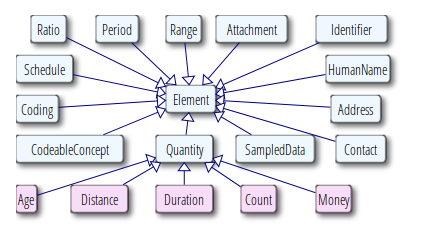

这些数据类型可以在 [W3C Schema](../material/fhir-base.xsd)找到.

<a name="primitive"/>

#### 1.13.0.1 基本数据类型                         

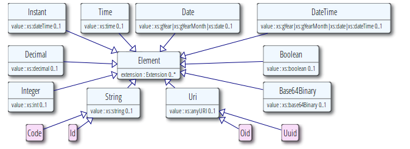

<a name="imports"> </a>

下表中对标准中所用到的基本数据类型和对它们的约束进行了总结.基本数据类型也就是说它们只有value属性，没有子元素(但和其他数据类型一样，它们可以有扩展)                
<table class="list">
 <tr>
   <td colspan="3">**Primitive Types**</td>
 </tr>
 <tr>
   <th>FHIR Name</th>
   <th>Value Domain</th>
   <th>XML Representation</th>
   <th>JSON representation</th>
 </tr>
 <tr>
   <td>boolean</td>
   <td>true | false</td>
   <td>xs:boolean, 值可以为true或者false（0和1是无效的值）</td>
   <td>JSON boolean (true or false)</td>
 </tr>
 <tr>
   <td>integer</td>
   <td>32位整数（对于更大的值，使用decimal）</td>
   <td>xs:int</td>
   <td>JSON number</td>
 </tr>
 <tr>
   <td>string</td>
   <td>Unicode编码的字符序列</td>
   <td>xs:string</td>
   <td>JSON String</td>
 </tr>
 <tr>
   <td style="border-top: 0px silver solid"/>
   <td colspan="3" style="border-top: 0px silver solid">字符串大小不超过1MB</td>
 </tr> 
 <tr>
   <td>decimal</td>
   <td>带小数点的有理数。
</td>
   <td>xs:decimal, except that **decimals may not use exponents**</td>
   <td>A JSON number, but without exponents</td>
 </tr>
 <tr>
   <td>uri</td>
   <td>统一资源标识符([RFC 3986](http://tools.ietf.org/html/rfc3986))</td>
    <td>xs:anyURI</td>
   <td>A JSON string - a URI</td>
 </tr>
 <tr>
   <td style="border-top: 0px silver solid"/>
   <td colspan="3" style="border-top: 0px silver solid">它可以是绝对的或相对的，也可能是一个可选的片段标识符（R </td>
 </tr> 
 <tr>
   <td>base64Binary</td>
   <td>base64(([RFC 4648](http://tools.ietf.org/html/rfc4648)))编码的字节流 </td>
   <td>xs:base64Binary</td>
   <td>A JSON string - base64 content</td>
 </tr>
 <tr>
   <td style="border-top: 0px silver solid"/>
   <td colspan="3" style="border-top: 0px silver solid">_Todo: is it possible to impose an upper absolute limit on a base64Binary (for denial of service reasons, like on string)_</td>
 </tr> 
 <tr>
   <td>instant</td>
   <td>一个时间的瞬间 - **至少要到秒，总是会包括一个时区**</td>
   <td>xs:dateTime</td>
   <td>A JSON string - an xs:dateTime</td>
 </tr>
 <tr>
   <td style="border-top: 0px silver solid"/>
   <td colspan="3" style="border-top: 0px silver solid">备注: 该类型作系统时间之用，非人用时间(参考下面的 date and dateTime ).</td>
 </tr>
 <tr>
   <td>date</td>
   <td>在人们交流时时使用的日期，日期时间或部分日期（比如年或年+月）。**不能存在时区**。日期应该是有效日期</td>
   <td>union of xs:date, xs:gYearMonth, xs:gYear</td>
   <td>A JSON string - a union of xs:date, xs:gYearMonth, xs:gYear</td>
  </tr>
 <tr>
   <td style="border-top: 0px silver solid"/>
   <td colspan="3" style="border-top: 0px silver solid">Regex: -?[0-9]{4}(-(0[1-9]|1[0-2])(-(0[0-9]|[1-2][0-9]|3[0-1]))?)?</td>
 </tr>
 <tr>
   <td>dateTime</td>
   <td>在人们交流时时使用的日期，日期时间或部分日期（比如年或年+月）。如果指定小时和分钟，通常应该加上时区。可以加上秒，也可以不加。日期应该是有效日期. **不允许如&quot;24:00&quot;的出现**</td>
   <td>union of xs:dateTime, xs:date, xs:gYearMonth, xs:gYear</td>
   <td>A JSON string - a union of xs:dateTime, xs:date, xs:gYearMonth, xs:gYear</td>
  </tr>
 <tr>
   <td style="border-top: 0px silver solid"/>
   <td colspan="3" style="border-top: 0px silver solid">Regex: -?[0-9]{4}(-(0[1-9]|1[0-2])(-(0[0-9]|[1-2][0-9]|3[0-1])(T([01][0-9]|2[0-3]):[0-5][0-9]:[0-5][0-9](\.[0-9]+)?(Z|(\+|-)((0[0-9]|1[0-3]):[0-5][0-9]|14:00))?)?)?)?</td>
 </tr>
 <tr>
   <td>time</td>
   <td>一天内的某个时间，没有指定日期（可以转化成自午夜算起的Duration数据类型）。秒可以加上也可以不加上。**不允许出现如“24:00”或是包含时区**</td>
   <td>xs:time</td>
   <td>A JSON string - an xs:time</td>
  </tr>
 <tr>
   <td style="border-top: 0px silver solid"/>
   <td colspan="3" style="border-top: 0px silver solid">Regex: ([01][0-9]|2[0-3]):[0-5][0-9]:[0-5][0-9](\.[0-9]+)?</td>
 </tr>
</table>

备注:

*   对于上面提到的数据类型，除了需要转义字符不同之外，XML和JSON的表达方式都是一样的(in XML, you escape the & < >, in Json you escape \t\r\n etc)。
*   正则表达式所能表达的允许值范围比实际的要大，还需要一些额外的校验手段
*   decimal值的精度是很重要的：

    *   比如0.010和0.01是两个不同的值
    *   在开发中应该按照原始值中的精度来处理decimal的值
    *   在使用GMP或者Java 的BigDecimal时会遇到这问题，因为它们之中精度是随意设的，或者采用一个64位的浮点值加上一个表示精度的字段
    *   对于值的大小没有特别的限制，因为此类值在医疗中是特别罕见的。可能会在[Location](location.html) coordinates中用到。


##### 1.17.0.1.1 XML和JSON 表达格式

如上所述,这些基本数据类型是由value属性，内部标识(如xml:id),和[扩展](extensibility.html)组合而成.XML中value是字段的属性，

```
  <count value="2"/>
````

JSON中value是一个property
```
  "count" : 2
````

至于说内部标识和扩展是如何在XML和JSON中表示的请参考[XML](xml.html)[JSON](json.html).如果value没有值，在数据实例中可以不出现，也就是说XML中不会有value属性，JSON property也不会存在。

按照XML schema,会忽略数据类型boolean, integer, decimal, base64Binary, instant, uri, date, dateTime, oid, and uri的value值中包含的前置和后置的空格.注意这意味着对于XML实例而言,schema aware 和non schema aware 的XML库会存在不同的属性值.鉴于此,这些数据类型的value属性的值不应该包含前置或后置的空格.只有在前置或后置空格本身是值的一部分时，String 的值中才能存在空格.     

JSON中空格总是很重要的.除了string之外的基本数据类型不应该包含前置或后置空格.


#####  1.17.0.1.2  简单数据类型

除了基本数据类型之外，也有一些简单的数据类型，它们对基本数据类型做了一些限制和约束。


<table class="list">
 <tr>
   <th>FHIR Name</th><th>Base FHIR Type</th><th>Description</th>
 </tr>
 <tr><td>code</td><td>string</td><td>在某处所定义的一些可控字符串中抽出的一个值。技术上来讲，表示code的字符串至少一个字符，不包括前置后置的空格，且其内容中不能出现连续的空格符 regex: [^\s]+([\s]+[^\s]+)*</td></tr>

 <tr><td>oid</td><td>uri</td><td>用URI（([RFC 3001](http://www.ietf.org/rfc/rfc3001.txt))）表示的OID，如: urn:oid:1.2.3.4.5. </td></tr>
  <!-- <tr><td>uuid</td><td>uri</td><td>A UUID, represented as a URI ([RFC 4122](http://www.ietf.org/rfc/rfc4122.txt)): urn:uuid:a5afddf4-e880-459b-876e-e4591b0acc11. Note the RFC comments about case: UUID values SHALL be represented in lower case, but systems SHOULD interpret them case insensitively</td></tr> -->
 <tr><td>id</td><td>string</td><td>任意大写或小写ASCII字母的组合（'A'..'Z', 和'a'..'z',数字('0'..'9'), '-' 和 '.',限制在64位字符长度
以内。可能是一个整数，一个无前缀的OID, UUID或者满足这些约束条件的任何其他标识模式。） Id是大小写敏感的。UUIDs必须用小写字母。注意：这个版本格式通常使用[ISO 18232](http://www.iso.org/iso/home/store/catalogue_tc/catalogue_detail.htm?csnumber=38610),标识符格式，也可以使用除ISO18232以外不区分大小写的
标识符格式  regex: [A-Za-z0-9\-\.]{1,64}</td></tr>
</table>

#### 1.13.0.2 复杂数据类型                          

这些数据类型用包含子元素的XML元素来表示,子元素的名称用基本数据类型来定义.
任意XML元素都可能有 [id attribute](references.html#idref).  JSON中,这些数据类型是用包含properties的和XML元素名称一样的对象来表示的.JSON表达格式几乎和XML是一样的,因此只有第一个[例子](datatypes-examples.html#Attachment) 给出了JSON的表达格式.

复杂数据类型可以用 &quot;被规范&quot;.  [structuredefinition](structuredefinition.html)中是对元素应该取什么值,哪些元素应该取值的约束.  

**复杂数据类型的UML图**
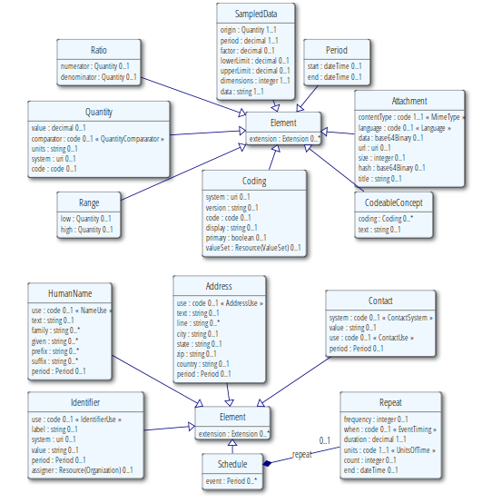     

<a name="Attachment"/>
<a name="attachment"/>

#### 1.13.0.3  Attachment

参考[示例](datatypes-examples.html#Attachment), [正式定义](datatypes-definitions.html#Attachment) and [映射](datatypes-mappings.html#Attachment).

该数据类型针对的是包含或引用附件的情况-一些用其他格式定义的数据内容.最常用的情况是包含图片或诸如PDF等格式的报告.然而可以用来表示任何拥有MIME类型的数据.

*   [Structure]()
	
*   [UML](#tabs-uml)
	
*   [XML](#tabs-xml)
	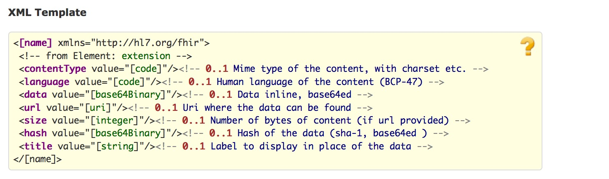
*   [JSON](#tabs-json)
	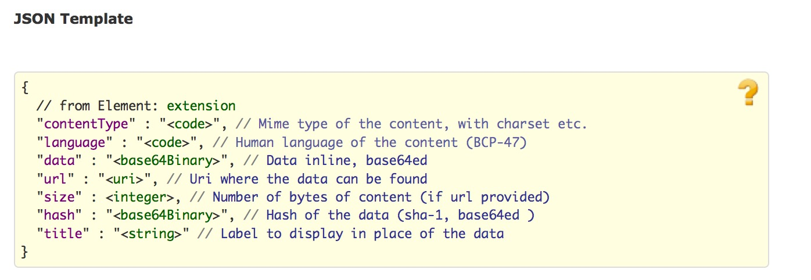
*   [All](#tabs-all)


ContentType元素应始终赋值。根据情况，它可以包含字符集charset信息和其他MIME类型扩展。在contentType中如果没有设置字符集，那么操作中会出现问题，但有些媒体类型可以使用默认的字符集和或字符集可以通过内容的检查来确定。 

附件的实际内容可以直接使用data元素或者可以提供一个URL引用来表示。如果两者都设置，则引用指向的内容应该和data中的内容一致。引用不能被重用，即同一个引用指向一些不同的数据（即参考特定版本）。该URL引用应指向解析为实际数据的位置;一些如CID：的URI能够满足这一要求。如果URL是相对地址，对于同一个资源引用，它可以理解为指向同样的路径。

应可以根据hash值来验证URL返回的内容是否被改变。

在很多使用附件的情况下，该附件基数大于1。有效地重复利用可以传达使用不同MIME类型和语言的相同内容。关于重复利用元素的意义说明应该在该重复资源元素定义或指定该类型扩展引用的时候提供。在language字段中，对附件的语言描述使用的是BCP47编码。

>约束条件
* 	Inv-1:如果附件存在data字段，它必须有一个contentType类型(xpath: not(exists(f:data)) or exists(f:contentType))若data  和url字段都不存在，value字段中应表明不存在规定的mimeType或语言的数据.使用时可以规定附件的格式和类型，也就是可以使用的mime types.

Attachment常用于:

[Communication](communication.html), [Practitioner](practitioner.html), [QuestionnaireAnswers](questionnaireanswers.html), [BodySite](bodysite.html), [CommunicationRequest](communicationrequest.html), [Observation](observation.html), [SupportingDocumentation](supportingdocumentation.html), [RelatedPerson](relatedperson.html), [Person](person.html), [Media](media.html), [DocumentReference](documentreference.html), [ImagingStudy](imagingstudy.html), [DiagnosticReport](diagnosticreport.html), [Contract](contract.html) and [Patient](patient.html)

<a name="Coding"> </a>
<a name="coding"> </a>
<a name="codesystem"> </a>

####  1.17.0.4  Coding

See also [Examples](datatypes-examples.html#Coding), [Detailed Descriptions](datatypes-definitions.html#Coding) and [Mappings](datatypes-mappings.html#Coding).

编码是使用“编码系统”里面定义好的一些符号来表示一个已经定义好的概念
- see [Using Codes in resources](terminologies.html) for more details.

*   [Structure]()
	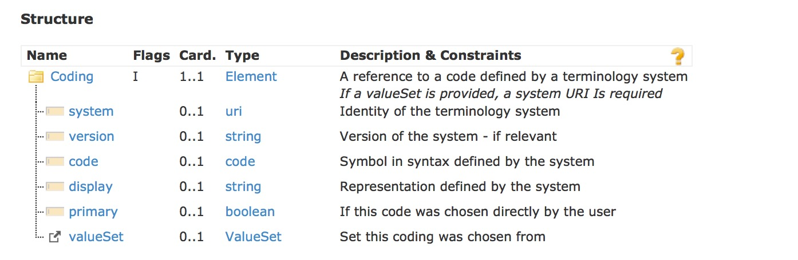
*   [UML](#tabs-uml)
	
*   [XML](#tabs-xml)
	
*   [JSON](#tabs-json)
	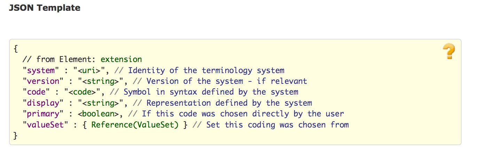
*   [All](#tabs-all)

编码的含义是由code来定义。_system_提供代码定义的源，以及一个可选的version。display是human display，用于由系统定义的文本 – 它不会添加其他的值。该 valueSet 值对内容中选择的代码信息提供语境相关信息。
 
system 字段的值是定义该code的的字典/代码系统的URI。该URI可能：
•	一个[可命名的系统列表]()中定义的URI
•	一个存在于[HL7 OID注册库中]()的OID (urn:oid:) 或UUID (urn:uuid:).。
•	一个直接引用该系统定义的URL，它可以是一个编码系统，这个编码系统是作为某个ValueSet资源中一部分定义的（即在ValueSet.define.system的值）
•	或者唯一标识编码系统定义的任何其他URI

对于某个字典/编码体系而言，system 的正确取值可以按照下面的顺序来查找：
•	标准中已经罗列出来的[字典列表]()
•	[HL7 OID注册库]()
•	和字典/编码系统有关的文档
•	咨询代码系统的所有者
•	在HL7词汇邮件列表中提问

有时候可能会提供代码系统的版本。如果编码的含义在代码系统中不同的版本一致，则可不提供系统版本。当编码系统的不同版本不能保持语义的一致性时，必须提供version字段。如果引用了一个值集合，并且该值集合定义了这个code system，而在code system定义中规定了版本， 则两个version字段(ValueSet.define.version和Coding.version)的值应保持一致。请注意使用以下系统必须给version字段赋值：
•	LOINC编码系统
•	不同版本的ICD
•	某些国家发布的SNOMED CT（在不同行政辖区之间，定义的一致性会不同，甚至一些行政辖区会指定他们自己的规则）

See the [discussion of code system versions in the Value Set resource](valueset.html#versioning) for further discussion on versioning.

如果使用了code字段，编码必须是原始系统所定义的符号。在某些编码系统如SNOMED CT，可能是其他一些预定义的符号（如post-coordination）组成的表达式。需要注意的是，除非代码系统指定，否则区分大小写。display 是由系统定义代码的文本表示，在不了解系统的情况下通过一个应用来展示代码的含义。

如果编码系统定义了多个展示用的字符串，至少在display字段中应该使用其中一个。如果某个被标记为优选项，它应被优先使用。如果编码系统中没有定义文本表示（例如SNOMED CT的表达式），那么display字段不能有值，不能理解编码的表达式的系统也无法获取编码的含义。

在一些情况下，可能不知道出自哪个字典system - 只知道code编码。在这种情况下，除非该系统可以由上下文安全地判断，否则不能对编码进行处理。可以预见的是，信息将在更大范围内共享，不能在不知道字典的情况下使用code编码，应尽可能避免出现这种做法。

如果知道是哪个字典，但没有编码，可以理解为，在系统中没有合适的代码来表达这个含义。

如果两个编码，system、 version 和code 字段值都相同，则两个编码表达的是相同的含义。如果version不存在，或者system, version和code取值不同，这两个编码的关系需要在编码系统中和已有的映射关系中查找。

如果用户在界面中选择了某个特殊的编码值，可以将其标记为主编码，在进行翻译等操作的时候，主编码是优先考虑的。

有时候会在valueset字段中提供对某个valueset的引用值，以帮助用户或系统来理解编码的上下文。在某些情况下，编码取自哪里会影响编码的含义。这里需要注意的是Coding.system字段的值并不能替代Coding.valueSet。Coding.system字段中URI的值不能指向一个valueset的引用。（如果value set中的编码是它自己所定义的，那么该使用ValueSet.define.system而不是Coding.system字段，并且这个value set包含对这个valueset资源的直接引用。

>约束条件：
如果使用了Coding.valueSet字段,则Coding.system字段必须赋值，且其值与ValueSet.define.system 或ValueSet.compose.include.system一致。
 The context of use (as defined in the resource or applicable profile) usually makes rules about what codes and systems are allowed or required in a particular context by binding the element to a value set. 

Coding常用于：
[CodeableConcept](#CodeableConcept), [Signature](#Signature), [ValueSet](valueset.html), [OralHealthClaim](oralhealthclaim.html), [Coverage](coverage.html), [Composition](composition.html), [Conformance](conformance.html), [StatusResponse](statusresponse.html), [PharmacyClaim](pharmacyclaim.html), [Reversal](reversal.html), [EligibilityRequest](eligibilityrequest.html), [QuestionnaireAnswers](questionnaireanswers.html), [PaymentReconciliation](paymentreconciliation.html), [ProfessionalClaim](professionalclaim.html), [ClaimResponse](claimresponse.html), [ExplanationOfBenefit](explanationofbenefit.html), [SupportingDocumentation](supportingdocumentation.html), [InstitutionalClaim](institutionalclaim.html), [AuditEvent](auditevent.html), [EligibilityResponse](eligibilityresponse.html), [StatusRequest](statusrequest.html), [VisionClaim](visionclaim.html), [Readjudicate](readjudicate.html), [PaymentNotice](paymentnotice.html), [Questionnaire](questionnaire.html), [OperationOutcome](operationoutcome.html), [VisionPrescription](visionprescription.html), [ImagingStudy](imagingstudy.html), [Provenance](provenance.html), [StructureDefinition](structuredefinition.html), [MessageHeader](messageheader.html), [PendedRequest](pendedrequest.html), [EnrollmentRequest](enrollmentrequest.html), [Contract](contract.html) and [EnrollmentResponse](enrollmentresponse.html)

>**设计说明**：本规范定义了两种数据类型来表示编码值：
•	**Coding**:简单的引用其他编码系统中所定义的编码值
•	**CodeableConcept**: 文本描述和或一组编码列表（如系统定义的一组编码引用）

Coding  针对的是最简单的情况，但在FHIR中并不常用。经验告诉我们，在一般的情况下，系统需要的编码中包括了多种翻译值和或原始文本。
如果确定值必须取自某些已经选定的编码，Coding数据类型可以直接使用


####  1.17.0.5 CodeableConcept

See also [Examples](datatypes-examples.html#CodeableConcept), [Detailed Descriptions](datatypes-definitions.html#CodeableConcept) and [Mappings](datatypes-mappings.html#CodeableConcept).

CodeableConcept所表示的值，常常可以通过提供对一个或多个术语或本体的引用来得到(也就是这个值含义是由该术语、本体所定义的)，也可以通过所提供的文本来定义。这是在医疗数据是很常见的


*   [Structure]()
	
*   [UML](#tabs-uml)
	
*   [XML](#tabs-xml)
	
*   [JSON](#tabs-json)
	
*   [All](#tabs-all)

每个coding都是上面所述的concept的一种表达方式。在不同的系统中同样的concept可以编码多次（甚至在相同的代码系统中多次编码，其中多个形式是可能的，例如在SNOMED CT中）。由于编码规则的差异，不同coding可以具有轻微不同的粒度。在CodeableConcept中Coding的排序是没有意义的。一个典型的使用CodeableConcept场景是当发送一个概念的本地非标化编码，与此同时，该概念可以转换到多个标化字典例如LOINC或SNOMED CT。发送本地化编码在调试和完整性审计中是非常有用和重要的。

不管 _coding_ 字段是否存在，_text_ 都是用户输入或选择的概念的表达方式，而且最能代表用户或概念的本意。很多时候，text和coding.display两个字段值是一样的。其中一个Codings可能被标记为主编码-也就是用户直接选择的那个code或concept。当没有coding元素被标记为主编码，优先选择text（如果存在）的含义。

>约束条件
•	Inv-2: On 一组coding中，只能有一个coding是由用户直接选择的(xpath:count(f:coding[f:primary/@value='true'])<=1).具体使用场景通常通过元素与某个value set绑定来对允许或要求使用那些编码和字典做出规定，

CodeableConcept在以下内容中使用:
 [Condition](condition.html), [Supply](supply.html), [DeviceComponent](devicecomponent.html), [Communication](communication.html), [Group](group.html), [ValueSet](valueset.html), [Appointment](appointment.html), [Slot](slot.html), [Contraindication](contraindication.html), [EpisodeOfCare](episodeofcare.html), [Composition](composition.html), [Conformance](conformance.html), [NamingSystem](namingsystem.html), [HealthcareService](healthcareservice.html), [OrderResponse](orderresponse.html), [ConceptMap](conceptmap.html), [Practitioner](practitioner.html), [CarePlan](careplan.html), [ClinicalAssessment](clinicalassessment.html), [Substance](substance.html), [DeviceUseRequest](deviceuserequest.html), [Schedule](schedule.html), [ImagingObjectSelection](imagingobjectselection.html), [BodySite](bodysite.html), [CommunicationRequest](communicationrequest.html), [RiskAssessment](riskassessment.html), [Observation](observation.html), [AllergyIntolerance](allergyintolerance.html), [RelatedPerson](relatedperson.html), [Alert](alert.html), [AuditEvent](auditevent.html), [ProcedureRequest](procedurerequest.html), [DeviceMetric](devicemetric.html), [Organization](organization.html), [ImmunizationRecommendation](immunizationrecommendation.html), [MedicationDispense](medicationdispense.html), [MedicationPrescription](medicationprescription.html), [MedicationStatement](medicationstatement.html), [AppointmentResponse](appointmentresponse.html), [Media](media.html), [Other](other.html), [VisionPrescription](visionprescription.html), [DocumentReference](documentreference.html), [Immunization](immunization.html), [Provenance](provenance.html), [Device](device.html), [StructureDefinition](structuredefinition.html), [Order](order.html), [Procedure](procedure.html), [DiagnosticReport](diagnosticreport.html), [Medication](medication.html), [MessageHeader](messageheader.html), [DataElement](dataelement.html), [DocumentManifest](documentmanifest.html), [MedicationAdministration](medicationadministration.html), [Encounter](encounter.html), [List](list.html), [DeviceUseStatement](deviceusestatement.html), [NutritionOrder](nutritionorder.html), [ReferralRequest](referralrequest.html), [FamilyHistory](familyhistory.html), [Location](location.html), [Contract](contract.html), [Basic](basic.html), [Specimen](specimen.html), [Patient](patient.html), [CarePlan2](careplan2.html) and [DiagnosticOrder](diagnosticorder.html)

<a name="Quantity"/>
<a name="quantity"/>

####  1.17.0.6 Quantity

See also [Examples](datatypes-examples.html#Quantity), [Detailed Descriptions](datatypes-definitions.html#Quantity) and [Mappings](datatypes-mappings.html#Quantity).

测定量（或可以潜在的被测量的量）。
*   [Structure]()
	
*   [UML](#tabs-uml)
	
*   [XML](#tabs-xml)
	
*   [JSON](#tabs-json)
	
*   [All](#tabs-all)

value 字段值包含了物理量的数值，包括一个隐含的精度。如果没有指定comparator的值，该值是一个点（即“=”）。永远不能忽略comparator 字段的值。

units字段值包含你所测量内容的单位对应的文本表示。后续也可以使用code和system字段来进一步对其进行编码。

如果该units字段值能够使用UCUM进行编码，且存在code字段的话，code字段值必须是一个UCUM 编码。如果code字段值必须是一个UCUM 编码，我们可以得到一个可以在不同物理量之间进行比较的标准值。需要注意的是，通常情况下 units 字段值包含了UCUM单位的文字表达方式(如US$
、US$)，但units字段值到底是不是一个有效的UCUM单位则需要进一步验证。
> 约束条件
•	Inv-3: 如果code字段存在，则system字段也必须存在(xpath: not(exists(f:code)) or exists(f:system))
具体使用场景常常定义了Quantity的类型是什么，单位是什么。进一步也可以对单位进行编码。也可能对value的值进行限制。

Quantity在以下内容中用到:
 [Range](#Range), [Ratio](#Ratio), [SampledData](#SampledData), [Supply](supply.html), [Group](group.html), [OralHealthClaim](oralhealthclaim.html), [PharmacyClaim](pharmacyclaim.html), [CarePlan](careplan.html), [Substance](substance.html), [QuestionnaireAnswers](questionnaireanswers.html), [ProfessionalClaim](professionalclaim.html), [BodySite](bodysite.html), [Observation](observation.html), [InstitutionalClaim](institutionalclaim.html), [VisionClaim](visionclaim.html), [MedicationDispense](medicationdispense.html), [MedicationPrescription](medicationprescription.html), [MedicationStatement](medicationstatement.html), [VisionPrescription](visionprescription.html), [Immunization](immunization.html), [Medication](medication.html), [MedicationAdministration](medicationadministration.html), [NutritionOrder](nutritionorder.html), [Contract](contract.html) and [Specimen](specimen.html)

#### 1.17.0.6.1 Quantity数据类型的变种

以下数据类型常常用于资源内容模型的定义之中，但其实它们都只是添加了额外约束的Quantity类型，
<a name="Age"> </a><a name="age"> </a>
<a name="Count"> </a><a name="count"> </a>
<a name="Money"> </a><a name="money"> </a>
<a name="Distance"> </a><a name="distance"> </a>
<a name="Duration"> </a><a name="duration"> </a>
<table class="list">
 <tr><td>Age</td><td>UCUM编码的时间长度A duration (length of time) with a UCUM code</td><td>StructureDefinition ([XML](Age.profile.xml.html), [JSON](Age.profile.json.html))</td></tr>
 <tr><td>Count</td><td>离散元素的个数 没有单位A count of a discrete element (no unit)</td><td>StructureDefinition ([XML](Count.profile.xml.html), [JSON](Count.profile.json.html))</td></tr>
 <tr><td>Money</td><td>货币的数量，An amount of money. With regard to precision, see [[X]]</td><td>StructureDefinition ([XML](Money.profile.xml.html), [JSON](Money.profile.json.html))</td></tr>
 <tr><td>Distance</td><td>距离A measure of distance</td><td>StructureDefinition ([XML](Distance.profile.xml.html), [JSON](Distance.profile.json.html))</td></tr>
 <tr><td>Duration</td><td>时间长度A length of time</td><td>StructureDefinition ([XML](Duration.profile.xml.html), [JSON](Duration.profile.json.html))</td></tr>
</table>

<a name="Range"/>
<a name="range"/>

####  1.17.0.7 Range

See also [Examples](datatypes-examples.html#Range), [Detailed Descriptions](datatypes-definitions.html#Range) and [Mappings](datatypes-mappings.html#Range).

有上限和下限的一组有序数量值，
Range规定了一组允许值；通常，可以取范围内的一个值(例如：患者可以服2-4片药)。Range通常用在指示、指令、医嘱instruction当中。


*   [Structure]()
	
*   [UML](#tabs-uml)
	
*   [XML](#tabs-xml)
	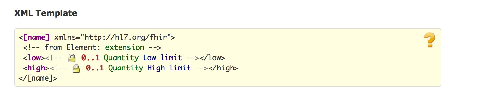
*   [JSON](#tabs-json)
	
*   [All](#tabs-all)

low和 high字段中units 和code/system元素值应一致。如果low或 high字段不存在，意思是上限或下限是未知的，因此都不是完整的范围。

在low和 high字段中不能存在comparator字段。注意，对于超出某个范围的度量值，应该使用带comparator的quantity类型来表示，而不是使用Range类型

low和 high字段值是闭区间，并且被假定为具有任意高的精度。例如范围1.5至2.5，包括1.50，2.50，但不包括1.49或2.51。

>约束条件
•	Inv-2: 如果存在，low的值应比low小（(xpath: not(exists(f:low/f:value/@value)) or not(exists(f:high/f:value/@value)) or (number(f:low/f:value/@value) <= number(f:high/f:value/@value)))）
•	Inv-3: low和 high字段值都不能有comparator字段

Range 用于:

[Group](group.html), [RiskAssessment](riskassessment.html), [Observation](observation.html), [MedicationDispense](medicationdispense.html), [MedicationPrescription](medicationprescription.html) and [FamilyHistory](familyhistory.html)

<a name="Ratio"/>
<a name="ratio"/>

#### 1.17.0.8 Ratio

See also [Examples](datatypes-examples.html#Ratio), [Detailed Descriptions](datatypes-definitions.html#Ratio) and [Mappings](datatypes-mappings.html#Ratio).

用分子与分母来表示的两个Quantity值之间的关系


*   [Structure]()
	
*   [UML](#tabs-uml)
	
*   [XML](#tabs-xml)
	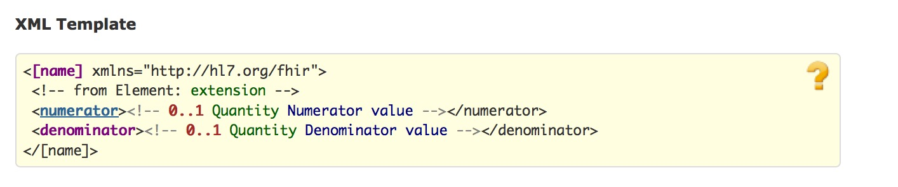
*   [JSON](#tabs-json)
	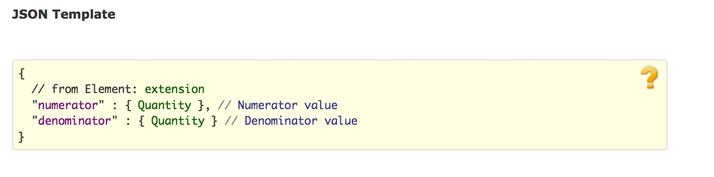
*   [All](#tabs-all)


 
在分子和分母的共同因素是不会自动抵消。Ratio数据类型用于滴速（例如，“1：128”）和其他用比率来表示的实验室检验结果。比率不是简单的“结构化的数字” - 例如血压测量（例如，“120/60”）并不是比率。另外，比率所使用的地方，在分子和分母共同因素不抵消。这样做的最常见的例子是，其中的比率代表一个单位成本，而分子是一种货币（例如，50/10美元）。

一个适当的比率同时具有分子和分母;然而，这些都不是强制性的，可以使用扩展来表示一些额外的信息。

> 约束条件
•	Inv-1:: numerator和denominator字段要么都存在，要么都不存在(xpath: count(f:numerator) = count(f:denominator))
具体使用时分子或分母可能需要特定类型的Quantity。

Ratio 常用于:
	[Substance](substance.html), [Observation](observation.html), [MedicationDispense](medicationdispense.html), [MedicationPrescription](medicationprescription.html), [MedicationStatement](medicationstatement.html), [Medication](medication.html), [MedicationAdministration](medicationadministration.html) and [NutritionOrder](nutritionorder.html)

<a name="Period"/>
<a name="period"/>

####  1.17.0.9 Period

See also [Examples](datatypes-examples.html#Period), [Detailed Descriptions](datatypes-definitions.html#Period) and [Mappings](datatypes-mappings.html#Period).

由开始和结束日期/时间所定义的时间段。
Period规定了时间间隔。具体使用时指定是否整个范围内都适用（例如，“病人在这段时间内住院”）或一段时间内的一个值（例如“2013年6月24日下面2点到4点给病人服药“）。

*   [Structure]()
	
*   [UML](#tabs-uml)
	
*   [XML](#tabs-xml)
	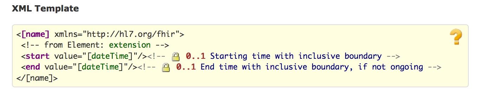
*   [JSON](#tabs-json)
	
*   [All](#tabs-all)


如果不存在start字段，该时间间隔的开始日期是未知的。如果end不存在，这意味着该时间间隔仍在进行中。
End的值包括了日期时间在内.比如2011-05-23 to 2011-05-27 包括了23和27号全天的时间。 

Period常用于:
 [Identifier](#Identifier), [Supply](supply.html), [Coverage](coverage.html), [EpisodeOfCare](episodeofcare.html), [Composition](composition.html), [NamingSystem](namingsystem.html), [Practitioner](practitioner.html), [CarePlan](careplan.html), [DeviceUseRequest](deviceuserequest.html), [Schedule](schedule.html), [PaymentReconciliation](paymentreconciliation.html), [RiskAssessment](riskassessment.html), [Observation](observation.html), [RelatedPerson](relatedperson.html), [ProcedureRequest](procedurerequest.html), [MedicationDispense](medicationdispense.html), [MedicationPrescription](medicationprescription.html), [MedicationStatement](medicationstatement.html), [DocumentReference](documentreference.html), [Provenance](provenance.html), [Procedure](procedure.html), [DiagnosticReport](diagnosticreport.html), [MedicationAdministration](medicationadministration.html), [Encounter](encounter.html), [PendedRequest](pendedrequest.html), [DeviceUseStatement](deviceusestatement.html), [ReferralRequest](referralrequest.html), [FamilyHistory](familyhistory.html), [Contract](contract.html), [Specimen](specimen.html), [Patient](patient.html) and [CarePlan2](careplan2.html)

<a name="SampledData"/>
<a name="sampleddata"/>

####  1.17.0.10 SampledData

See also [Examples](datatypes-examples.html#SampledData), [Detailed Descriptions](datatypes-definitions.html#SampledData) and [Mappings](datatypes-mappings.html#SampledData).

由设备采集得到的一系列的值，有上限和下限。数据的维度可能不止一个。

SampledData类型提供了一个简洁的方式来处理由设备产生的对生理状态进行高频采用的数据。一个典型的使用便是心电图或心电图设备的输出。

*   [Structure]()
	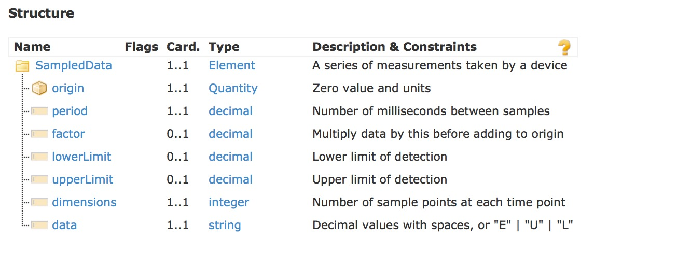
*   [UML](#tabs-uml)
	
*   [XML](#tabs-xml)
	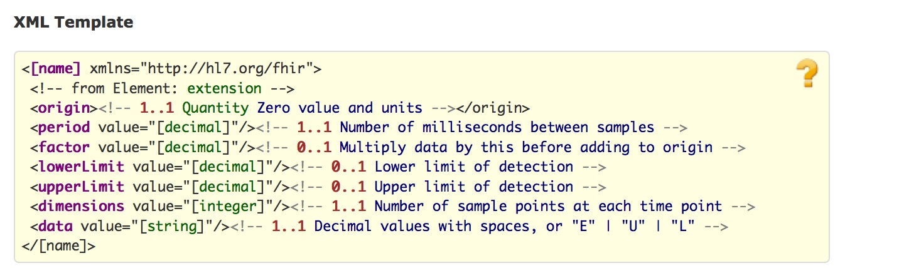
*   [JSON](#tabs-json)
	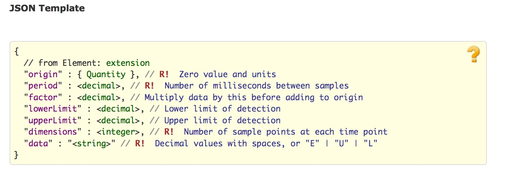
*   [All](#tabs-all)


一组由空格（Unicode字符U20）分隔的带小数点的十进制值。除了带小数点的十进制值之外，也可使用特殊值“E”（错误），“L”（低于检测限）和“U”（高于检测限）。如果多个维度互相交织在一起，则某个时间点的所有数据表示在一起。默认的倍数值factor字段为1。

SampledData类型常用于: 
 [Observation](observation.html)

<a name="Identifier"/>
<a name="identifier"/>

#### 1.17.0.11 Identifier

See also [Examples](datatypes-examples.html#Identifier), [Detailed Descriptions](datatypes-definitions.html#Identifier) and [Mappings](datatypes-mappings.html#Identifier).

在一个系统内，与一个单独的对象或实体相关联的数字或字母组成的数字串。典型地，标识符在资源中被用来将内容连接到其他框架或协议表示的外部内容。标识符与对象相关联，并且会随着人为或系统的处理和错误被改变或不再使用。

*   [Structure]()
	
*   [UML](#tabs-uml)
	
*   [XML](#tabs-xml)
	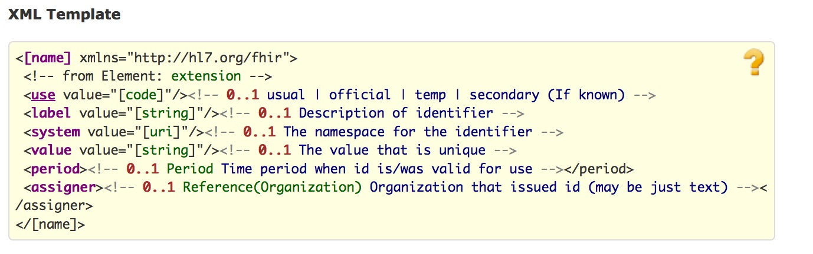
*   [JSON](#tabs-json)
	
*   [All](#tabs-all)

system字段的值指向标识符如何定义的URI(怎么样确保标识符的唯一性等等)。它可能是一个特定的应用程序或一个公认的标准/规范的所定义的唯一标识符。Value字段值在system定义的范围内应是唯一的，并具有一致的含义。system 和 value字段值都是大小写敏感的。

FHIR直接定义了 [一些有用的URI](terminologies-systems.html)。如果内容是共享的或跨越机构边界交换，应该在[HL7 OID registry](http://hl7.org/oid) 或任何公开的注册库中登记OIDs (urn:oid:) 和UUIDs (urn:uuid:)。如果标识符本身自然是全球唯一的（例如，一个OID，一个UUID，或没有尾随部分URI），那么system的值应该取“urn:ietf:rfc:3986”。

在某些情况下，可能不知道system的值 – 只知道value 字段值(例如：它是一个可以扫条形码的简易装置) 或该系统默认是知道的(在有限的情况下简单的交流，往往是由条码阅读器驱动)。在这种情况下，除非该系统可以根据上下文安全地推断出system的值，否则不能对value的值进行任何匹配。若信息在更大范围内共享，应避免这种做法，没有system值的values值实用性有限有地限于在使用中。

assigner 字段表示是哪个注册中心、国家、机构/等负责分配标识符。

Identifier常用于: 
 [Condition](condition.html), [Supply](supply.html), [DeviceComponent](devicecomponent.html), [Communication](communication.html), [Group](group.html), [ValueSet](valueset.html), [OralHealthClaim](oralhealthclaim.html), [Coverage](coverage.html), [Appointment](appointment.html), [Slot](slot.html), [Contraindication](contraindication.html), [EpisodeOfCare](episodeofcare.html), [Composition](composition.html), [HealthcareService](healthcareservice.html), [OrderResponse](orderresponse.html), [StatusResponse](statusresponse.html), [ConceptMap](conceptmap.html), [PharmacyClaim](pharmacyclaim.html), [Reversal](reversal.html), [Practitioner](practitioner.html), [CarePlan](careplan.html), [Substance](substance.html), [DeviceUseRequest](deviceuserequest.html), [Schedule](schedule.html), [EligibilityRequest](eligibilityrequest.html), [QuestionnaireAnswers](questionnaireanswers.html), [PaymentReconciliation](paymentreconciliation.html), [ProfessionalClaim](professionalclaim.html), [ClaimResponse](claimresponse.html), [BodySite](bodysite.html), [CommunicationRequest](communicationrequest.html), [RiskAssessment](riskassessment.html), [Observation](observation.html), [AllergyIntolerance](allergyintolerance.html), [ExplanationOfBenefit](explanationofbenefit.html), [SupportingDocumentation](supportingdocumentation.html), [RelatedPerson](relatedperson.html), [InstitutionalClaim](institutionalclaim.html), [Alert](alert.html), [AuditEvent](auditevent.html), [EligibilityResponse](eligibilityresponse.html), [StatusRequest](statusrequest.html), [Person](person.html), [ProcedureRequest](procedurerequest.html), [VisionClaim](visionclaim.html), [DeviceMetric](devicemetric.html), [Organization](organization.html), [Readjudicate](readjudicate.html), [ImmunizationRecommendation](immunizationrecommendation.html), [MedicationDispense](medicationdispense.html), [MedicationPrescription](medicationprescription.html), [PaymentNotice](paymentnotice.html), [MedicationStatement](medicationstatement.html), [AppointmentResponse](appointmentresponse.html), [Questionnaire](questionnaire.html), [Media](media.html), [Other](other.html), [VisionPrescription](visionprescription.html), [DocumentReference](documentreference.html), [Immunization](immunization.html), [ImagingStudy](imagingstudy.html), [Device](device.html), [StructureDefinition](structuredefinition.html), [Order](order.html), [Procedure](procedure.html), [DiagnosticReport](diagnosticreport.html), [DataElement](dataelement.html), [DocumentManifest](documentmanifest.html), [MedicationAdministration](medicationadministration.html), [Encounter](encounter.html), [PendedRequest](pendedrequest.html), [List](list.html), [DeviceUseStatement](deviceusestatement.html), [Goal](goal.html), [NutritionOrder](nutritionorder.html), [ReferralRequest](referralrequest.html), [FamilyHistory](familyhistory.html), [EnrollmentRequest](enrollmentrequest.html), [Location](location.html), [Contract](contract.html), [Basic](basic.html), [Specimen](specimen.html), [EnrollmentResponse](enrollmentresponse.html), [Patient](patient.html), [CarePlan2](careplan2.html) and [DiagnosticOrder](diagnosticorder.html)

<a name="HumanName"/>
<a name="humanname"/>

#### 1.17.0.12 HumanName

See also [Examples](datatypes-examples.html#HumanName), [Detailed Descriptions](datatypes-definitions.html#HumanName) and [Mappings](datatypes-mappings.html#HumanName).

包含了文本、不同部分和用途信息的一个人的名字。

名字可以更改或弃用。一个人在不同的场景下可以有名字。名称可以分割成不同的部分。对于人名，不同部分可以有一些暗含的意义，也可能没有；各种文化对于不同部分的重视程度各不相同。


*   [Structure]()
	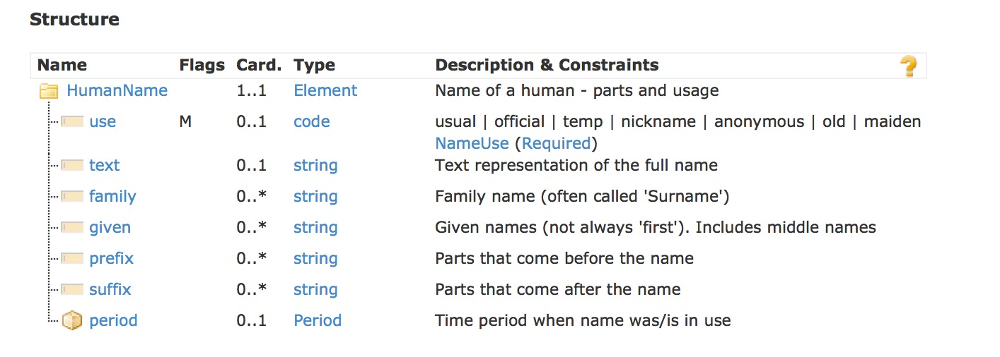
*   [UML](#tabs-uml)
	
*   [XML](#tabs-xml)
	
*   [JSON](#tabs-json)
	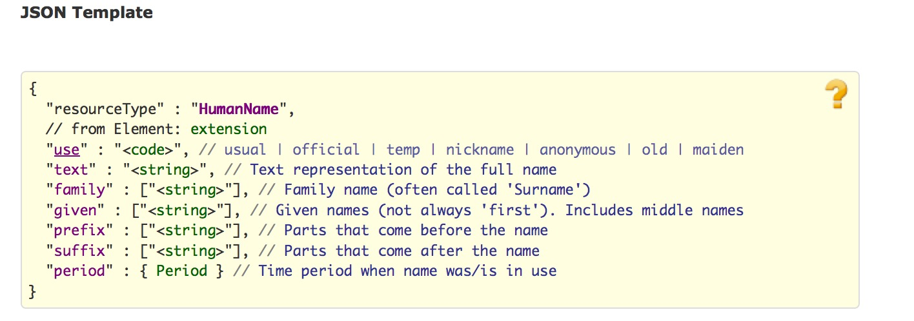
*   [All](#tabs-all)


下表总结了一个人的名字中有哪些常见的部分：
<table class="lines">
 <tr><td>**Name**</td><td>**Example**</td><td>**Destination / Comments**</td></tr>
 <tr><td>Surname</td><td>Smith</td><td>Family Name</td></tr>
 <tr><td>First name</td><td>John</td><td>Given Name</td></tr>
 <tr><td>Title</td><td>Mr</td><td>Prefix</td></tr>
 <tr><td>Middle Name</td><td>Samuel</td><td>Subsequent Given Names</td></tr>
 <tr><td>Patronymic</td><td>bin Osman</td><td>Family Name</td></tr>
 <tr><td>Multiple family names</td><td>Carreño Quiñones</td><td>Family Name. See note below about repeats</td></tr>
 <tr><td>Initials</td><td>Q.</td><td>Given Name as initial (&quot;.&quot; recommended)</td></tr>
 <tr><td>Nick Name</td><td>Jock</td><td>Given name, with Use = common</td></tr>
 <tr><td>Qualifications</td><td>PhD</td><td>Suffix</td></tr>
 <tr><td>Honorifics</td><td>Senior</td><td>Suffix</td></tr>
</table>

For further information, including all [W3C International Examples](http://www.w3.org/International/questions/qa-personal-names), 
consult the [examples](datatypes-examples.html#HumanName).

text字段规定了整个姓名的文本表达方式。可以是整体或以不同部分的形式来表示。姓名的不同部分之间不应该包含空格。对于姓名中的姓，带连字符的姓名如“Smith-Jones”认为是一个名称，但带空格的如“Smith Jones”的名字则可分解成多个部分。对于姓名中的名而言，如果没有记录全名的话可以用首字母代替。其中given 类型的顺序是有意义的，必须记录其顺序，至于姓和名顺序的使用则取决于文化和使用环境。跨文化系统一般在呈现时应依赖text字段的值，并使用不同的部分来做索引/搜索功能。

在更新姓名时，系统应保证text和不同部分保持一致，或者之选其中一种。若系统不支持原始数据中的姓名的多个不同部分的话，可以使用空格将其拼接起来放在text字段中。

HumanName 常用于: 
 [Practitioner](practitioner.html), [RelatedPerson](relatedperson.html), [Person](person.html), [Organization](organization.html) and [Patient](patient.html)

<a name="Address"/>
<a name="address"/>

####  1.17.0.13  Address

See also [Examples](datatypes-examples.html#Address), [Detailed Descriptions](datatypes-definitions.html#Address) and [Mappings](datatypes-mappings.html#Address).

Address有多种世界各地的界定通信地址格式。通信地址通常用于记录可以访问、找到的患者或人的位置。


*   [Structure]()
	
*   [UML](#tabs-uml)
	
*   [XML](#tabs-xml)
	
*   [JSON](#tabs-json)
	
*   [All](#tabs-all)

text元素表示的是整个地址。可以是整体或以不同部分的形式来表示。在更新地址时，系统应保证text和不同部分保持一致，或者之选其中一种。
Address常用于:
 [Practitioner](practitioner.html), [RelatedPerson](relatedperson.html), [Person](person.html), [Organization](organization.html), [Location](location.html) and [Patient](patient.html)

<a name="ContactPoint"/>
<a name="contactpoint"/>

####  1.17.0.14 ContactPoint

See also [Examples](datatypes-examples.html#ContactPoint), [Detailed Descriptions](datatypes-definitions.html#ContactPoint) and [Mappings](datatypes-mappings.html#ContactPoint).

一个人或组织的各种联络方式，包括电话，电子邮件等详细信息。


*   [Structure]()
	
*   [UML](#tabs-uml)
	
*   [XML](#tabs-xml)
	
*   [JSON](#tabs-json)
	
*   [All](#tabs-all)


如果联系方式是电话、传真或其他类似的方式，value值的格式应遵循 [ITU-T E.123](http://www.itu.int/rec/T-REC-E.123-200102-I/e). 由于遗留数据和采集方式的不同，这通常是难以实现的

> 约束条件
•	Inv-2: value字段存在的话，system必须存在. (xpath: not(exists(f:value)) or exists(f:system))

ContactPoint常用于: 
 [ValueSet](valueset.html), [Conformance](conformance.html), [NamingSystem](namingsystem.html), [HealthcareService](healthcareservice.html), [ConceptMap](conceptmap.html), [Practitioner](practitioner.html), [OperationDefinition](operationdefinition.html), [RelatedPerson](relatedperson.html), [Person](person.html), [Organization](organization.html), [Questionnaire](questionnaire.html), [Subscription](subscription.html), [Device](device.html), [StructureDefinition](structuredefinition.html), [MessageHeader](messageheader.html), [DataElement](dataelement.html), [SearchParameter](searchparameter.html), [Location](location.html) and [Patient](patient.html)

<a name="Timing"/>
<a name="timing"/>

#### 1.17.0.15 Timing

See also [Examples](datatypes-examples.html#Timing), [Detailed Descriptions](datatypes-definitions.html#Timing) and [Mappings](datatypes-mappings.html#Timing).

Timing规定了可重复出现多次的某个事件，Timing schedule不适用于记录已经发生的事件，而是用于记录那些即将发生或要求发生的事件。Timing schedule既可以是说明了起止日期时间的事件列表，也可是说明了重复条件的单个事件，也可以是只是重复条件而没有具体的事件。
 

*   [Structure]()
	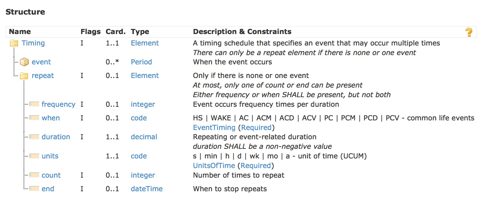
*   [UML](#tabs-uml)
	
*   [XML](#tabs-xml)
	
*   [JSON](#tabs-json)
	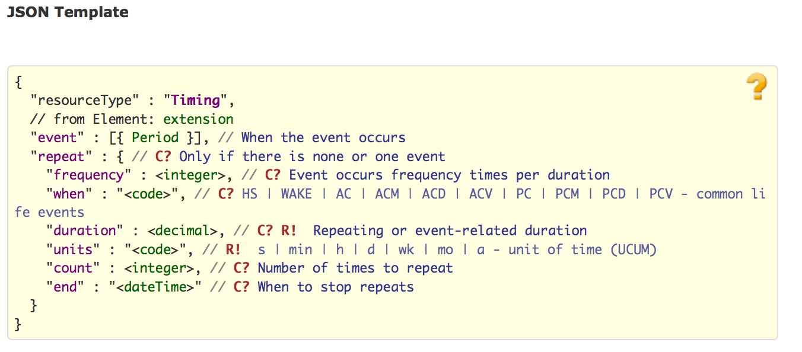
*   [All](#tabs-all)

如果指定的事件，每个事件必须要有一个event.start字段值。如果event.end没有值，认为该时间持续了一段时间，但不知道何时停止。

如果timing包含了重复条件，在每个规定的时间间隔或与某个现实生活的事件关联起来，事件会重复发生多次。如果是重复事件的话，可以规定其停止时间，可以通过时间重复的次数或者停止事件安排的截止日期时间来实现。如果没有指定截止日期时间，timing schedule会根据其他地方的一些条件停止。

> 约束条件
•	Inv-1: event元素出现一次以下时才能使用repeat字段。 (xpath: not(exists(f:repeat)) or count(f:event) <2) 
•	Inv-2: 对于Timing.repeat: 最多只能出现一个frequency或when元素，但二者不能同时出现 (xpath on f:Timing/f:repeat: exists(f:frequency) != exists(f:when))
•	Inv-3: 对于 Timing.repeat: 最多只能出现一次count或end元素 (xpath on f:Timing/f:repeat: not(exists(f:count) and exists(f:end)))
•	Inv-4: 对于 Timing.repeat.duration: duration应取正值 (xpath on f:Timing/f:repeat/f:duration: @value > 0 or not(@value))


Timing常用于: 
 [CarePlan](careplan.html), [DeviceUseRequest](deviceuserequest.html), [ProcedureRequest](procedurerequest.html), [DeviceMetric](devicemetric.html), [MedicationDispense](medicationdispense.html), [MedicationPrescription](medicationprescription.html), [MedicationStatement](medicationstatement.html), [Order](order.html), [DeviceUseStatement](deviceusestatement.html) and [NutritionOrder](nutritionorder.html)

<a name="Signature"/>
<a name="signature"/>

#### 1.17.0.16 Signature

See also [Examples](datatypes-examples.html#Signature), [Detailed Descriptions](datatypes-definitions.html#Signature) and [Mappings](datatypes-mappings.html#Signature).

A Signature holds a Digital Signature and supporting context in a FHIR accessible form. The non-repudiation proof is provided through the XML-Signature blob. 

*   [Structure]()
	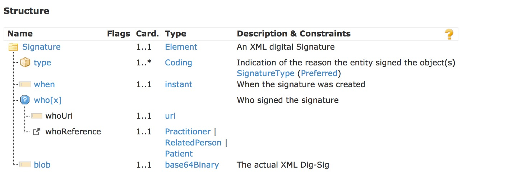
*   [UML](#tabs-uml)
	
*   [XML](#tabs-xml)
	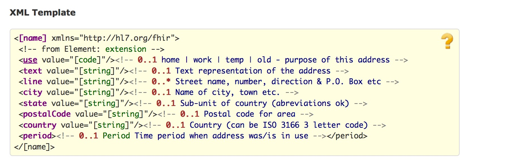
*   [JSON](#tabs-json)
	
*   [All](#tabs-all)


Signature.blob 字段值为base64编码的 XML 数字签名。 XML 数字签名是[Detached](http://www.w3.org/TR/2002/REC-xmldsig-core-20020212/#def-SignatureDetached) Signature.签名的内容和签名本身是分离的。

为了支持长期的签名，Signature应该遵循XAdES-X-L 。XAdES-X-L标准增加了签名的时间戳，包括了签名的认证信息和废止的声明

被签名的内容是FHIR 资源，签名本身
Where the signed content is a FHIR Resource(s), the signature is accross the the XML form of the resource(s).

The content should be canonicalized using the &quot;Canonical XML 1.1. with Comments&quot;.

Signature宜使用哈希算法sha256。XML-Signature中表明了所使用的算法。也可使用其他哈希算法，签名的验证策略视实际情况来定

Signature应总是包含一个“CommitmentTypeIndication” 元素来表示签名的目的。The Purpose can be the action being attested to, or the role associated with the signature. The value shall come from ASTM E1762-95(2013). 
The Signature.type shall contain the same values as committmentTypeIndication.

签名的确认分三个层次: 

1.  verifying that the Digital Signature block itself has integrity through verifying the signature across the XML-Signature,
2.  confirming that the signer was authentic, not revoked, and appropriate to the signature purpose,
3.  confirming that the signed content of interest are unmodified using the hash algorithm.

Deviations from these guidelines would need to be expressed in site policy, and would be enumerated in the XML-Signature block. 
For example some environments may choose a different XAdES profile, hashing algorithm, policy identifier, or signature purpose vocabulary. 


> **约束条件**

Signature常用于:
 [Provenance](provenance.html)

<a name="open"> </a>

####  1.17.0.17  Open Type Element

一些元素中并没有规定使用那种具体的数据类型.该类型由通配符 “*”表示。在这些情况下，数据类型可以是下列之一：:

*   [integer](datatypes.html#integer)
*   [decimal](datatypes.html#decimal)
*   [dateTime](datatypes.html#dateTime)
*   [date](datatypes.html#date)
*   [instant](datatypes.html#instant)
*   [time](datatypes.html#time)
*   [string](datatypes.html#string)
*   [uri](datatypes.html#uri)
*   [boolean](datatypes.html#boolean)
*   [code](datatypes.html#code) - if the extension definition provides a binding to a suitable set of codes
*   [base64Binary](datatypes.html#base64Binary)
*   [Coding](datatypes.html#Coding)
*   [CodeableConcept](datatypes.html#CodeableConcept)
*   [Attachment](datatypes.html#Attachment)
*   [Identifier](datatypes.html#Identifier)
*   [Quantity](datatypes.html#Quantity)
*   [Range](datatypes.html#Range)
*   [Period](datatypes.html#Period)
*   [Ratio](datatypes.html#Ratio)
*   [HumanName](datatypes.html#HumanName)
*   [Address](datatypes.html#Address)
*   [ContactPoint](datatypes.html#ContactPoint)
*   [Timing](datatypes.html#Timing)
*   [Signature](datatypes.html#Signature)
*   [Reference](references.html#Reference) - a reference to another resource

元素名称为“[X]”结尾，可以用具体的数据类型的名称来替换“[X]”。

开放式元素常用于：
 [Parameters](parameters.html)

<a name="other"> </a>

####  1.17.0.18  Other Types

下列类型被定义为数据类型的部分，但在本说明书别处说明：:

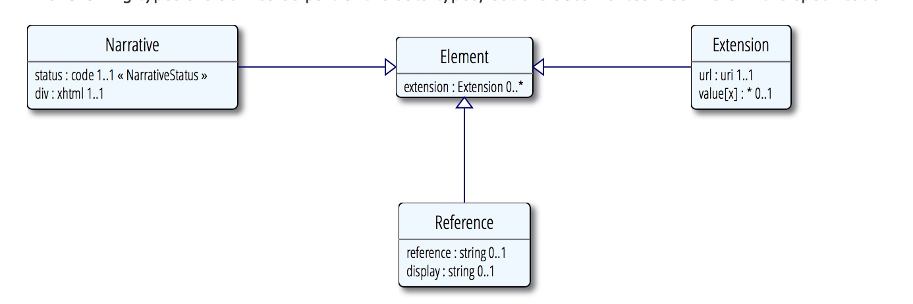

*   **[Resource](resource.html#metadata)** - the conceptual base class for all resources
*   **[Reference](references.html#Reference)** - for references from one resource to another
*   **[Extension](extensibility.html)** - used to convey additional data in a resource
*   **[Narrative](narrative.html#Narrative)** - conveys a human-readable representation of the content of a resource


  
&copy; © HL7.org 2011+. FHIR DSTU (v0.5.0-5149) generated on Fri, Apr 3, 2015 14:36+1100\.  
链接：[试行版是什么](http://hl7.org/implement/standards/fhir/dstu.html) |[版本更新情况](http://hl7.org/implement/standards/fhir/history.html) | [许可协议](http://hl7.org/implement/standards/fhir/license.html) |[提交变更建议](http://gforge.hl7.org/gf/project/fhir/tracker/?action=TrackerItemAdd&tracker_id=677) 	  