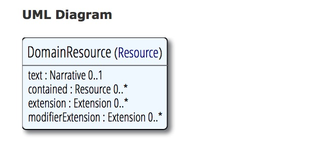

title: 
date: 
categories: doc
---

[首页](../home/index.html) >[文档](documentation.html) > **领域资源 Resource**

*   [Content](#)
*   [示例](domainresource-examples.html)
*   [详细描述](domainresource-definitions.html)
*   [对应关系](domainresource-mappings.html)
*   [规范](domainresource-packages.html)

# 1.12.2 DomainResource 资源

## 1.12.2.1 范围和用途
该资源用于在基础资源中添加对文本、内嵌资源和扩展的支持。作为一个抽象资源，该资源不会直接存在，存在的只能是它的子类。
更多信息请参考
* text: 参考[资源中的叙述性文本](narrative.html)
* contained:参考[嵌套资源](references.html#contained)
* extension modifierExtension: 参考[扩展](extensibility.html)

## 1.12.2.2 范围和关系
该资源继承了base 资源，[资源列表](,./res/resourcelist.html)中除了Bundle和Binary之外都继承了该资源。

## 1.12.2.3 资源内容
结构：

UML：

XML：

JSON：

### 1.12.2.3.1 约束条件
* dom-1：如果资源被嵌套在某个资源之中，它不应包含任何叙述性文本(xpath: not(parent::f:contained and f:text))
* dom-2:如果资源被嵌套在某个资源之中，它不应再嵌套资源 (xpath: not(parent::f:contained and f:contained))
* dom-3:如果资源被嵌套在某个资源之中，在资源的其他地方要引用被嵌套资源。 (xpath: not(exists(for $id in f:contained/*/@id return $id[not(ancestor::f:contained/parent::*/descendant::f:reference/@value=concat('#', $id))])))
## 1.12.2.4 查询变量
该资源并未定义任何通用 查询变量。
如果要查询扩展，需要为扩展定义一个查询变量。其他查询变量的命名采用资源中内容的化名，一些情况下，查询参数的名称与元素名称一样，但并不都是。对于扩展的查询也是这样，先定义一个通过URL来标识value扩展的名称，查询时即可根据扩展的值来进行过滤。

