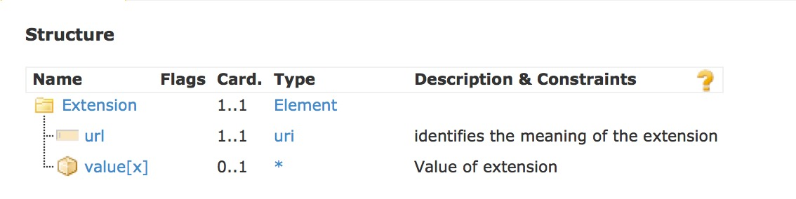
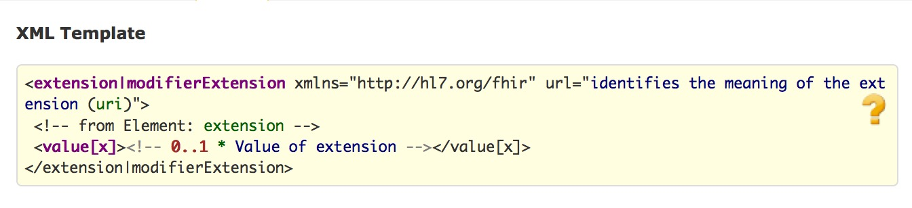

title: 
date: 
categories: doc
---

[首页](../home/index.html) >[文档](documentation.html) >[资源定义](resources.html) >**扩展**       

这部分:

  

*   [Content](#)
*   [示例](extensibility-examples.html)
*   [详细描述](extensibility-definitions.html)
*   [扩展的注册库](extensibility-registry.html)
#### 1.19.0  扩展        

同时请参考扩展[示例](extensibility-examples.html).                     

该交换标准是以卫生保健领域普遍认可的通用需求为基础-涵盖多个地区,领域和不同功能.因此,对于某个特殊的实现而言,会存在一些标准中并没有覆盖的需求,如果将所有这些需求都融合到标准中将会导致标准非常冗长且难于实现.然而,该标准期望在实现中将此类区域性的额外需求视为扩展.            


因此,扩展是该标准设计中的基础部分,资源的每个元素都可能会有extension子元素,用以标识不属于资源基础定义的其他信息.应用程序不应只是因为资源中包含扩展而拒绝它们,尽管可能会由于扩展中的某些特殊内容而拒绝它们.              

因此，扩展是该标准设计中基础的一部分，资源中的每个元素都可能会包含扩展来表示本不属于资源基本定义中的信息。应用程序不能因为资源中包含扩展而拒绝此类资源，但可以因为扩展中包含某些具体的内容而拒绝。

需要注意的是,与其他标准不同的是,无论是机构还是地区定义或使用了这些扩展,在任何应用程序,项目或标准中,都不应该对扩展的使用感到困扰.正是由于对扩展的使用才使得对于每个人而言,FHIR标准能够保持它的简单性.                      


为了安全,易管理的使用扩展,对于扩展的定义和使用有严格的治理机制.尽管允许开发人员定义和使用扩展,在定义和使用扩展时也必须满足一系列的要求.           


#####  1.19.0.1 扩展的元素

资源或数据类型中的每个元素都有一个可选的可出现任意次数的 &quot;extension&quot; 子元素, &quot;extension&quot; 子元素在所有子元素中第一个出现,优先于其他所有子元素,每个资源中所出现的&quot;extension&quot; 的内容模型如下:       

结构：    
       
                 
UML:
     

XML:
   

JSON:
                      

其他定义: 资源规范 ([XML](Extension.profile.xml.html), [JSON](Extension.profile.json.html))                          

注意事项:               

*    url是一个强制性必须存在的属性,是对定义了扩展内容和含义的[资源规范](profile.html)的标识                   
*   扩展的实际内容要么是value[x]元素,要么是包含其他扩展,每个扩展都有对应的定义它们的URL和各自的内容.                 
*   处理资源的内容时，忽略扩展对应用程序而言是很不安全的，扩展必须以不同的方式来表达(参考http://hl7-fhir.github.io/extensibility.html#modifier)
*   对于大多数扩展而言,处理资源内容的应用程序无视该扩展的内容应该是安全的.尤其是,对于扩展内容的理解不会改变包含它的元素的含义.更多讨论参考如下内容.                

value[x]元素中的[x]可以用如下的任意一种数据类型替换:

*   [integer](datatypes.html#integer)
*   [decimal](datatypes.html#decimal)
*   [dateTime](datatypes.html#dateTime)
*   [date](datatypes.html#date)
*   [instant](datatypes.html#instant)
*   [string](datatypes.html#string)
*   [uri](datatypes.html#uri)
*   [boolean](datatypes.html#boolean)
*   [code](datatypes.html#code) (only if the extension definition provides a [fixed](terminologies.html#code) binding to a suitable set of codes)
*   [base64Binary](datatypes.html#base64Binary)
*   [Coding](datatypes.html#Coding)
*   [CodeableConcept](datatypes.html#CodeableConcept)
*   [Attachment](datatypes.html#Attachment)
*   [Identifier](datatypes.html#Identifier)
*   [Quantity](datatypes.html#Quantity)
*   [Range](datatypes.html#Range)
*   [Period](datatypes.html#Period)
*   [Ratio](datatypes.html#Ratio)
*   [HumanName](datatypes.html#HumanName)
*   [Address](datatypes.html#Address)
*   [ContactPoint](datatypes.html#Contact)
*   [Timing](datatypes.html#Timing)
*   [Signature](references.html#Signature) 
*   [Reference ](references.html#Reference ) 


XML格式的扩展如下所示
```
<name>
  <extension url="http://hl7.org/fhir/StructureDefinition/iso-21090-name-use" >
    <valueCode value="I" />
  </extension>
  <text value="Chief Red Cloud"/>
</name>
````

 JSON格式:
```
  "name" : {
    "extension" : [{
      "url" : "http://hl7.org/fhir/StructureDefinition/iso-21090-name-use",
      "valueCode" : "I"
    }],
   "text" : "Chief Red Cloud"
  }

````

明确的声明数据类型意味着任何系统都无需获取事先获取扩展的定义就可以读写扩展中的数据。

扩展之中也可以包含扩展，要么是因为扩展的定义中定义了复杂内容，要么是使用单独定义的扩展对这个扩展进行了扩展。（好绕啊）

第一种情况的话，扩展中的标识那部分是指向扩展定义的相对或绝对地址，比如，考虑对患者进行扩展，增加三个字段，临床试验的准入状态，记录日期和纳入人 XML格式：
```

<Patient>
  <extension url="http://acme.org/fhir/StructureDefinition/trial-status" >
    <extension url="code" >
      <valueCode value="unsure" />
    </extension>
    <extension url="date" >	  
      <valueDate value="2009-03-14" />	  
    </extension>
    <extension url="registrar" >	  
      <valueReference>	  
        <reference value="Practitioner/example" />	  	    
      </valueReference>	  
    </extension>
  </extension>
  <!-- other data for patient -->
</Patient>

````

JSON格式：

```
{
  "resourceType" : "Patient",
  "extension" : [{
    "url" : "http://acme.org/fhir/StructureDefinition/trial-status",
    "extension" : [{
      "url" : "code",
      "valueCode" : "unsure"
    }, {
      "url" : "date", 
      "valueDate" : "2009-03-14" 
    },  {
      "url" : "registrar",
      "valueReference" : {
        "reference" : "Practitioner/example"
       }
    }]
  }]
  ... other data for patient ...
}


```

第二种情况，内嵌的扩展是单独定义的，登记人员是一个单独定义的扩展，该扩展的URL是不一样的

```
<Patient>
  <extension url="http://acme.org/fhir/StructureDefinition/trial-status" >
    <extension url="code" >
      <valueCode value="unsure" />
    </extension>
    <extension url="date" >
      <valueDate value="2009-03-14" />
    </extension>
    <extension url="http://acme.org/fhir/StructureDefinition/registrar" >
      <valueReference array="true">
        <reference value="Practitioner/example" />
      </valueReference>
    </extension>
  </extension>
  <!-- other data for patient -->
</Patient>
````

```
{
  "resourceType" : "Patient",
  "extension" : [{
    "url" : "http://acme.org/fhir/StructureDefinition/trial-status",
    "extension" : [{
      "url" : "code",
      "valueCode" : "unsure"
    }, {
      "url" : "date",
      "valueDate" : "2009-03-14"
    }, {
      "url" : "http://acme.org/fhir/StructureDefinition/registrar",
      "valueReference" : {
        "reference" : "Practitioner/example"
      }
    }]
  }]
  ... other data for patient ...
}

````


#####  1.19.0.2 扩展修饰符Modifier Extensions

有一些情况,扩展中的信息会改变包含它的元素的含义.典型的,这也就是说信息能够否定或证明包含它的元素含义.例如:            
*   给 [Adverse Reaction](adversereaction.html)加一个确定性扩展,值为 &quot;highly doubtful&quot;            
*   给 [value set](valueset.html)中的某个概念新增一个包含关系                  
*   anti-prescription:记录一条不用药的指令                 
*   利用 [Condition](condition.html)资源记录断言:病人并不存在某个诊断         
*   声明 医务人员并没有参与某个手术[Procedure](procedure.html)
*   记录并没有提供某个[Supply](supply.html)(i.e. 拒绝配药refusal to fill)

开发人员宜尽可能避免使用扩展修饰符/限定符.任何使用应谨慎考虑可能引发的后果.然而,由于资源使用的业务要求,开发人员常常不得不这么做,因此,该标准中提供了一个处理此类问题的框架.如果出现了扩展限定符,除非应用程序知道扩展对于数据使用的影响,否则应用程序无法安全的处理它.

 This specification allows for such modifier elements to be included at the base of a resource or in any elements that do not have a data type (e.g. the elements that correspond to classes in the resource UML diagrams). Elements that are data types, or that are inside data types SHALL NOT have modifier extensions. 
 
  该标准中允许在资源的基础部分或没有数据类型的任意元素中可以包含修饰符元素(比如资源UML图中类对应的元素),但本身是数据类型的元素或者数据类型内部不能有修饰性扩展。
  
  
  在XML中，修饰性元素名称为&quot;modifierExtension&quot;,内容与extension元素相同.                             
范例：如果Procedure中没有任何元素，你可以认为它表达的是“该手术没有发生”，在源系统中存在对该手术记录的特殊标记，但如果要在合作厂商之间共享该记录，就需要在资源中添加如下的扩展：
````
<Procedure>
  <modifierExtension url="http://example.org/fhir/StructureDefinition/negation">
    <valueBoolean value="true"/>
  </modifierExtension>
  <!-- ... other content ... -->
</Procedure>
````
JSON格式如下：
```
{
  "resourceType" : "Procedure",
  "modifierExtension" : [{
    "url" : "http://example.org/fhir/StructureDefinition/negation",
    "valueBoolean" : "true"
  }],
  .. other content ...
}
````

在处理资源中数据时，应该检测是否存在修饰性扩展，如果存在的话，须确保以下事项：
1、能够理解使用扩展时扩展所带来的影响.
2、如果处理资源内容的应用程序无法识别modifierExtension,且应用程序要处理它所扩展元素的内容,应用程序应该要么拒绝处理数据,要么对数据相关的操作或者是从数据处理中所得到的结果输出发出警示,以告知使用者它并没有充分理解原始信息.             


并不要求开发中以任何有意义的方式&quot;support&quot;扩展-它们可以拒绝这些包含扩展的实例,也能够理解.另外,开发中可能会根据开发环境,确定不会使用这些扩展.然而,不管怎样,应用程序都宜对扩展进行检查核对.     

需要注意的是资源中数据的处理一般而言意味着将资源中的数据复制或过滤出来用以其他的场合(展示给人看,决策支持,以另一种格式对部分信息进行交换,为了其他用途而存储).的如果服务器和后台处理过程只是将整个资源进行转移,资源本身未发生变化也就不是"对资源数据的处理",因此这类程序不需要核对哪些未知的扩展.             

* 1 当应用程序能够理解此类扩展，也就是说由于存在此类扩展，某个开发人员针对它提供了特殊的处理指令
* 2 也就是说在实现之中不要求以任何有意义的方式支持修饰性扩展，可以只是简单拒绝此类数据。当然，在确保安全的情况下，应用程序可以忽略此类扩展，但事实常常不是这样   
  当然在特定的实现环境之中，开发人员可以在设计阶段就确保不存在修饰性扩展，但集成和部署总是常常变化，应用系统在处理资源中数据时总是应该核实是否存在修饰性扩展。
* 3 提醒用户的一种方式是从特定URL下载扩展的定义，然后使用所定义的展示名称把扩展呈现给用户。一个错误消息可能如下所示：

注意：在资源的叙述性文本之中必须包含此类限制信息，因此以这种方式把资源内容呈献给用户从临床上来看是安全的。可以用警告对话框的形式把原始的文本描述呈现给用户。
```
<Procedure xmlns="http://hl7.org/fhir">
  <text>
    <status value="generated"/>
    <div xmlns="http://www.w3.org/1999/xhtml">Routine appendicectomy for Fred Smith performed By Susan Taylor. Note: This operation was not performed by Dr Lakin</div>
  </text>
  <!-- ...data... -->
  <performer>
    <modifierExtension url="http://example.org/fhir/StructureDefinition/negation">
      <boolean value="true"/>
    </modifierExtension>
    <person>
      <reference value="Practitioner/example"/>
      <display value="Dr Lakin"/>
    </person>
  </performer>
  <!-- ...data... -->
</Procedure>

````
在这个案例中，如果应用程序压根就不需要手术操作的执行者，那么performer元素 执行者有一个modifierExtension就没有多少关系，应用程序完全可以忽略它。如果它需要处理执行者的信息，在发现修饰性扩展数据的时候，就可以提醒用户，无法理解该数据，将narrative呈现给用户。

######  1.19.0.2.1 总结:扩展修饰符的一致性规则            

*   modifierExtension应只修饰包含它的元素和或它的子元素              
*   将叙述性文本呈现给用户临床上来看总是安全的，任何扩展修饰符都应该展现在叙述性文本当中                         
*   当要处理包含扩展修饰符的元素中的数据时,应用程序总是应核对 modifierExtension,
*	如果发现了不能理解的 modifierExtension,应用程序应要么拒绝处理该资源或受影响的元素,要么给用户提供警告.                   

######  1.19.0.2.2  数据缺失的范例

范例:在开发过程中，开发人员会发现一些元素的最小基数为1，但确实找不到对应的数据。这种情况下，该元素必须出现，但是除非资源本身或者规范中说明了该元素的基础数据类型的值是强制出现的,but unless the resource or a profile on it has made the actual value of the primitive data type mandatory,可以通过一个扩展来说明为什么value属性不存在：
```

<uri>
  <extension url="http://hl7.org/fhir/StructureDefinition/data-absent-reason">
    <code="unknown"/>
  </extension>
</uri>

````

In this example, instead of a value, a data missing code is provided. Note that it is not required that this particular extension be used. This extension is not a modifier extension, because the primitive data type has no value. 


给基础数据类型值创建虚拟数据是无效的,然后添加一个扩展来说明这些数据是用来满足数据 规则的.这种想法是很糟糕的,同时在数据类型中是不允许修饰性扩展存在的.         


#####  1.19.0.3 扩展的交换     

扩展是一种能够在资源中使用同一个信息模型体现本地需求的方法,因此所有系统都能够用同样的工具安全的处理它们.然而,当要处理此类信息时,应用程序能够处理的程度受限于别人告知它们的程度.            
 

当总是能够获取扩展的结构化定义时,仅仅是能够自动的获取定义并不意味着应用程序知道如何正确的处理它们-一般而言,如何处理扩展数据需要人为干预。           

鉴于此,作为扩展出现的本地化需求变成了集成的障碍.共有的需求越多(区域层面或国家层面上),它们产生的影响就越小.该标准中所定义的对扩展统一的表达,定义和注册并不能解决这个问题-只是提供了一种能够更加简单的处理此类问题的框架而已.            


当要部署支持本地化需求的应用程序时,支持不同扩展的应用程序间交换信息时就会出现一些问题.该标准中包含了一些基本规则使得针对这些问题的处理变得相对任意,但并没有完全解决它们.              
*   当交换资源时,系统宜尽其所能的保留未知扩展 (正如它们宜尽其所能的保留核心元素 )                 
*   如果系统对一个资源进行了修饰/限定,它宜移除所修饰元素及其祖先中中无法理解的任意扩展,因为它所作出的限定是否会使得未知扩展值无效.       
*   系统若对资源中已有元素进行删除则被视为是&quot;对资源的处理&quot;
*   系统不应修改它所不能理解的包含 &quot;扩展修饰符&quot; 的资源或元素      
*   如果不是 &quot;扩展修饰符&quot; ,系统无法识别时宜忽略,       
*   不能接受未知扩展的系统应在它们的一致性资源中进行声明.                

系统保留未知扩展的程度是不同类型系统的一个功能:通用目的的FHIR服务器,或者中间件引擎,期望能够保留所有扩展;而通过人机交互界面管理患者注册的应用程序,只能保留用户所设置的信息某个部分的哪些扩展.其他系统则处理这2种极端之间.           


######  1.19.0.3.1 总结:对扩展的处理           

处理资源时采用如下规则作为指南:                  

*   写扩展时需确保事先已经定义好和已发布             
*   读扩展时,先核对一些可能存在扩展修饰符的元素,是否存在扩展修饰符.                
*   读元素时,除非想读取某个扩展,忽略其他的扩展.                    
*   尽你所能保留扩展                                


 &copy; HL7.org 2011 - 2014. FHIR DSTU (v0.2.1-2606)构建于2014  7月2号 16:29+0800 星期三 . 
链接：[试行版是什么](http://hl7.org/implement/standards/fhir/dstu.html) |[版本更新情况](http://hl7.org/implement/standards/fhir/history.html) | [许可协议](http://hl7.org/implement/standards/fhir/license.html) |[提交变更建议](http://gforge.hl7.org/gf/project/fhir/tracker/?action=TrackerItemAdd&tracker_id=677)      