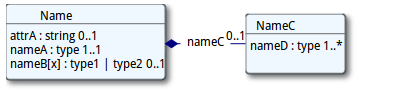

title: 
date:  
categories: doc
---		

[首页](../home/index.html) >[文档](documentation.html) >[资源定义](resources.html) > **资源格式**       

####1.12.5.0 资源格式    
这部分记录了如何描述资源的内容.在实际的交换当中,资源可以是[XML](xml.html)或者 [JSON](json.html)格式的.    
##### 1.12.5.0.1 资源定义      
资源以2种不同的方式来描述：UML图能够概述其内容;伪XML语法能够让大家直观的体会到XML格式的资源实例是长什么样的。注意尽管资源的描述是基于XML的，诸如JSON等其他格式也是等效的。      
###### 1.12.5.0.1.1 XML    

XML语法使用如下标记：     

```
 <Name xmlns="http://hl7.org/fhir" (attrA="value")> 
   <nameA><!-- 1..1 type description of content  --><nameA>
   <nameB[x]><!-- 0..1 type1|type2 description  --></nameB>
   <nameC> <!--  1..* -->
     <nameD><!-- 1..1 type>Relevant records  --></nameD>
   </nameC>
 <name>

```
注意:      
*    资源和元素名称是大小写敏感的()
*    数据类型为[基本数据类型](datatypes.html#primitive)的任何元素都有一个value属性.其中包含了该元素的实际值.      
*    元素都有一个基数用以标识该元素可以或者必须出现的次数. 如果基数的字体是粉红色,也就说还有其他条件影响该基数.这种情况存在于鼠标悬停的文本或者正规定义当中.    
*    除非元素直接包含子元素(如上例中的nameC),不然它们总归是有一个或datatypes.htmldatatypes.html多个数据类型.除"Resource"和"Narrative"之外,除"Resource"和"Narrative"之外都是在[数据类型](datatypes.html)中定义的. 数据类型的名称是超链接形式的.           
*    一些数据类型的子元素和资源中定义的其他一些元素的子元素是一样的.这样的情况下,该元素的数据类型会存在一个指向[path]的引用,而[path]就是拥有已事先定义好子元素的元素.    
*    当一个逻辑元素能够有不止一个数据类型时,它们的名称采用先定义好子元素的元素.    nnn[x]的形式.其中nnn的部分为名称,是固定不变的,[x]可以用实际使用的类型标题大写字幕名称来替换,比如:    
```
  <name>
    <nameBType1>
     ... contents for type1 ...
    </nameBType1>
  </name>
```     
该元素允许使用的数据类型用"|"来分隔,当其中之一是Resource([X])时,元素名称当中的类型名称就简化成"Resource"     
*    伪语法中的每个元素名称都可以超链接到数据字典中该元素的正规定义上去.     
*    如果元素名称是带下划线的,意味着应用程序必须[支持](conformance-rules.html#mustSupport)和/或[理解](conformance-rules.html#ismodifier)该元素.     
*    FHIR元素值永远不能为空. 如果资源中出现了某个元素,它应该要么有一个value属性,子元素,要么有1到多个[扩展](extensibility.html)     
 
 *    属性值也永远不能为空.要么不存在,要么至少要有一个非空格的内容.         
 
###### 1.12.5.0.1.2 UML       

UML图用一些类来表示资源的元素。


当元素的数据类型为可选时，使用上述XML语法中一样的方式来表示可选项。考虑到UML的原理，元素实际的顺序不能够由图来确定的，也无法确定该元素是属性还是元素。元素和类型能够链接到正式定义中。UML图也能显示绑定，也有到详细绑定信息的超链接。     
 
 
这些UML图旨在人与人之间资源内容的交流,不适合于用标准的UML代码生成工具来生成代码.     


 &copy; HL7.org 2011 - 2014. FHIR DSTU (v0.2.1-2606)构建于2014  7月2号 16:29+0800 星期三 . 
链接：[试行版是什么](http://hl7.org/implement/standards/fhir/dstu.html) |[版本更新情况](http://hl7.org/implement/standards/fhir/history.html) | [许可协议](http://hl7.org/implement/standards/fhir/license.html) |[提交变更建议](http://gforge.hl7.org/gf/project/fhir/tracker/?action=TrackerItemAdd&tracker_id=677)      