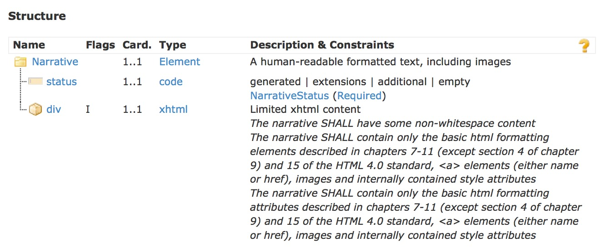
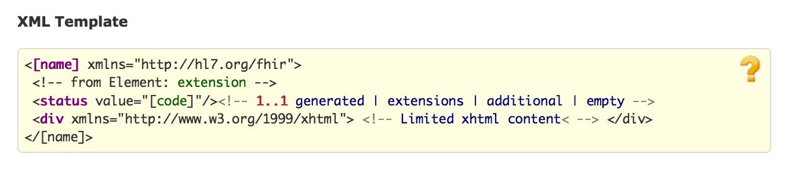

title: 
date:  
categories: doc
---		

[首页](../home/index.html) >[文档](documentation.html) >[资源定义](resources.html) > **叙述性文本**

*   [叙述性文本](#)
*   [示例](narrative-examples.html)
*   [详细描述](narrative-definitions.html)

###  1.17.0 叙述性文本     

每个资源可包含一个供人可读的叙述性文本，其中包含了对资源的总结摘要，可用作把资源的内容展示给人看。如果存在叙述性文本,除了资源内的结构化数据，叙述性文本应该包含全部的内容，所必须的临床和业务信息. 资源定义可能会定义在叙述性文本中应该表达那些内容以确保临床安全。     

资源的叙述性文本上允许包含一些结构化数据中所没有的额外信息，包括人为编辑的内容。这些信息应该在资源定义的范畴之内，叙述性文本中包含从其他所引用的资源中抽取部分额外的描述性信息是很正常的。

资源总是宜包含叙述性文本,作为供人使用的备用. 然而,在一个严格管控的交换体系中,所有系统都共用一个数据模型, 额外的文字是不必要的,甚至会产生一些临床安全风险,叙述性文本可能会被省略. 开发人员在这样做之前应该谨慎考虑,因为这样做意味着这些资源只能够在有限的交换环境下才能被理解.在资源所定义的生命周期里面,封闭式的交换对象环境很可能就会变得开放. 另外,很多工作流步骤涉及了查找和组合资源,如果所涉及的资源没有自己的文本描述,这将变得更加困难或者繁琐. 
注意,内嵌资源不应该包含自己的叙述性文本.


叙述性文本是一个xhtml的片段，有一个flag来标记它和数据之间的关系:

Structure


UML


XML


JSON


div元素的内容是XHTML片段，应该只包含HTML4.0标准中第7-11(除了第9章第4部分)章和第15章所介绍的基本html元素,    <a>   元素(要么是name,要么是href)、  images和内部包含的style属性。XHTML内容不应包含head、body元素和外部的stylesheet引用、废弃的元素、script、form、base/link/xlink、frame、iframe和object或事件event相关的属性(如onCLick).这是为了保证叙述性文本的内容能够包含在资源内部,不会存在处于激活状态的内容-因为这会引入一些安全问题和在从XHTML中抽取文本时潜在的安全问题.。

div元素必须包含一些非空格内容。    
```
 <narrative>
    <div xmlns=&quot;http://www.w3.org/1999/xhtml&quot;>This is a simple 
          example with only plain text</div>
  </narrative>
   <narrative>
   <div xmlns=&quot;http://www.w3.org/1999/xhtml&quot;>
     <p>
       This is an <i>example</i> with some <b>xhtml</b> formatting.
     </p>
   </div>
  </narrative>
```     

div内容中的inner部分常常用在浏览器中的innerHTML属性中。为了简化此类处理，如果是用JSON表示叙述性文本,叙述性文本应编码，这样子第一个 &quot;>&quot; 和最后一个&quot;<&quot; 之间的内容就是<div>元素的字节内容,例如    
	
```
 "div": "<div>text</div>"
 
```     
上述例子是有效的,但下面这个则不是:     


注意:XHTML是嵌在一般的XML中的，因此不支持如_&amp;nbsp;_ or _&amp;copy;_等HTML entity。应该使用Unicode字符来代替。用_&amp;#160;_ 替换_&amp;nbsp;.     

叙述性文本的内容应采用[资源所使用的语言](base-definitions.htm#Resource.language)，但并强求HTML 类型的工具能理解资源中的language 元素。 鉴于此，
&lt;div&gt;元素中宜使用lang属性([参考HTML5标准中使用语言的注意事项](http://www.w3.org/html/wg/drafts/html/master/dom.html#the-lang-and-xml:lang-attributes))       


#### 1.17.0.1 图片引用
image源引用可能是资源内的一个局部/本地引用：      
```
  

```

这是对同一资源中某个元素的id属性的[内部引用](references.htm#idref) 。这个元素的类型要么是&quot;[Attachment](datatypes.htm#Attachment)&quot;类型,要么是内嵌的[Binary](http.htm#binary)资源。      
```
<Patient xmlns="http://hl7.org/fhir">
  <text>
    <status value="generated"/>
    <div xmlns="http://www.w3.org/1999/xhtml">
      <p>... . ....</p>
    </div>
  </text>
  <contained>
    <Binary id="pic1" contentType="image/gif">MEKH....SD/Z</Binary>
  </contained>
```

叙述性文本和资源数据之间的引用都是通过XML 的id/idref属性来实现的。在JSON之中，id属性和XML的id属性用法一样。

The "id" attribute SHALL have a unique value within the resource with regard to any other id attributes: the uniqueness and resolution scope of these id references is within the resource that contains them. Contained resources are included in the id uniqueness scope of the resource that contains them. 


If multiple resources are combined into a single piece document, such as an bundle, duplicate values of the id attribute may occur between resources. This SHALL be managed by applications reading the resources.

Since that are not contained in the resource cannot be guaranteed to be be available when the resource is presented to a user, the source for any images that are an essential part of the narrative SHOULD always be embedded as a data: url, in an attachment or a contained resource.  
 

#### 1.17.0.2  XHTML样式化     

叙述性文本中的XHTML片段可能使用css来样式化,要么是内部的CSS,要么是外部的css。当使用外部css时,利用XHTML元素的class和id属性.当使用内部css时,直接利用XHTML元素的style属性.  为了最小化安全问题和可管理性,编辑系统不会直接指定CSS样式表.反而由展示资源的应用程序提供CSS样式表.这意味着渲染系统选择能够使用那种样式,编辑系统应提前使用. 编辑系统能改使用这些类,也就是说所有渲染系统都要支持:     

<table> <tr> <td>bold</td> <td>Bold</td> <td>{ font-weight: bold }</td> </tr> <tr> <td>italics</td> <td>Italics Text</td> <td>{ font-style: italic }</td> </tr> <tr> <td>underline</td> <td>Underlined Text</td> <td>{ text-decoration: underline }</td> </tr> <tr> <td>strikethrough</td> <td>Strikethrough Text</td> <td>{ text-decoration: line-through }</td> </tr> <tr> <td>left</td> <td>Left Aligned</td> <td>{ text-align : left }</td> </tr> <tr> <td>right</td> <td>Right Aligned</td> <td>{ text-align : right }</td> </tr> <tr> <td>center</td> <td>Center Aligned</td> <td>{ text-align : center }</td> </tr> <tr> <td>justify</td> <td>Justified</td> <td>{ text-align : justify }</td> </tr> <tr> <td>border-left</td> <td>Border on the left</td> <td>{ border-left: 1px solid grey }</td> </tr> <tr> <td>border-right</td> <td>Border on the right</td> <td>{ border-right: 1px solid grey }</td> </tr> <tr> <td>border-top</td> <td>Border on the top</td> <td>{ border-top: 1px solid grey }</td> </tr> <tr> <td>border-bottom</td> <td>Border on the bottom</td> <td>{ border-bottom: 1px solid grey }</td> </tr> <tr> <td>arabic</td> <td>List is ordered using Arabic numerals: 1, 2, 3</td> <td>{ list-style-type: decimal }</td> </tr> <tr> <td>little-roman</td> <td>List is ordered using little Roman numerals: i, ii, iii</td> <td>{ list-style-type: lower-roman }</td> </tr> <tr> <td>big-roman</td> <td>List is ordered using big Roman numerals: I, II, III</td> <td>{ list-style-type: upper-roman }</td> </tr> <tr> <td>little-alpha</td> <td>List is ordered using little alpha characters: a, b, c</td> <td>{ list-style-type: lower-alpha }</td> </tr> <tr> <td>big-alpha</td> <td>List is ordered using big alpha characters: A, B, C</td> <td>{ list-style-type: upper-alpha }</td> </tr> <tr> <td>disc</td> <td>List bullets are simple solid discs</td> <td>{ list-style-type: disc }</td> </tr> <tr> <td>circle</td> <td>List bullets are hollow discs</td> <td>{ list-style-type : circle }</td> </tr> <tr> <td>square</td> <td>List bullets are solid squares</td> <td>{ list-style-type: square }</td> </tr></table>     
注意:出于测试目的,这里有一个包含所有这些样式的[资源实例](../iinfra/other-example-narrative.xml.html).同时也有一个[XHTML格式的](narrative-example.html)和包含了所有这些样式的对应[标准样式表](fhir-runtime.css)      

编辑系统可能会参考其他的类型,但不能奢望它们总是可以支持的, 如果额外的类型对应安全的渲染很重要的话,交换双方的协议中应该作出要求.    

编辑系统也可能会通过style属性来使用外部的样式.这样做的优点在于不用依赖外部的解读,但是副作用在于渲染时导致内容更加难以管理,因此应用程序宜小心使用这种方法.编辑系统可能会固定内容的如下样式:      

*   bold, italic, underline, strikethrough     
*   font color, family and size       
*   background color, text alignment      
*   whitespace interpretation       
*   ordered list number format (since it may be referred to in text)      
These style properties are specified in-line using the style attribute.   当style属性中制定了样式,渲染系统在渲染时宜遵守其中任意一种,尽管允许适当的演绎(比如暗室中低对比度的展示或者是为了视障人士而高对比度的展示,可以根据情况调整颜色).   

注意:允许渲染系统忽略或覆盖上面所述的任意内部/外部样式,但是宜小心谨慎以确保只能在合理的交易双方协议的情况下这么做,因为改变文本的展现方式可能会带来临床安全问题.    

编辑人员可能会指定CSS标准中所规定的额外的样式或样式的属性, 但是这些都是对该标准的扩展,渲染人员毋须遵循.在没有这些额外的样式特征的情况下宜保证查看叙述性文本是安全的.    
注意:对于[文档](../impl/documents.html#css)的展现有一些额外的规则.        

#### 1.17.0.3  临床安全考虑     
卫生保健记录常常有着长时间保留的法律和业务需求(甚至于一个世纪).  跨设备之间不一致的展现方式会带来很高的风险.尽管叙述性文本中允许使用如上所述的标准XHTML和CSS,鼓励在开发中尽量保持简单.即使交换双方协议限制了某个系统的现行需求.经验显式这些协议总归会随着时间而越来越宽泛.       
特别是:    
*  多层的复杂展现要求精心测试xhtml div和span元素以及样式的对应,其中包括了嵌套的表格,可能有一些图片,也会导致很难保持渲染一致性.开发中宜避免这些问题.     
*  如bolding, italics and color等样式的使用不宜作为传达含义或语义的唯一方式,但是宜与其他FHIR资源一道来确保一致的 长久的互操作性.   


 &copy; HL7.org 2011 - 2014. FHIR DSTU (v0.2.1-2606)构建于2014  7月2号 16:29+0800 星期三 . 
链接：[试行版是什么](http://hl7.org/implement/standards/fhir/dstu.html) |[版本更新情况](http://hl7.org/implement/standards/fhir/history.html) | [许可协议](http://hl7.org/implement/standards/fhir/license.html) |[提交变更建议](http://gforge.hl7.org/gf/project/fhir/tracker/?action=TrackerItemAdd&tracker_id=677)      
