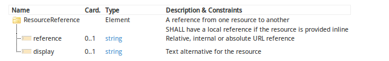

title: 
date: 
categories: doc
---		

[首页](../home/index.html) >[文档](documentation.html) >[资源定义](resources.html) > **引用**

### 1.12.3 资源的引用     

资源包含2种类型的引用:
*  **内部引用**-一个资源内的不同元素间的引用     
*  **外部引用**一个资源与其他资源组件的引用    
#### 1.12.3.1 内部引用    
资源内元素间相互引用有3种情况:

**ResrouceReference和内嵌资源组件的引用**
ResrouceReference引用的元素指的是内嵌资源的id,一个相对于该资源的不完整id.示例参考下面"内嵌资源" 
**叙述性文本数据元素与结构化数据元素组件的引用**    
通过基于id/idref的方法来实现,表示源数据元素与目的数据元素内容一致.xhtml元素与必须理解的数据元素之间的引用建立了一种"衍生自derived from"的关系,而所衍生出的内容指的是源数据元素的内容.注意这意味着有些引用可能是前向推理(对于这些元素的引用是随后在实例中定义的)    
```
<Patient xmlns="http://hl7.org/fhir">
  <text>
    <status value="generated"/>
    <div xmlns="http://www.w3.org/1999/xhtml">
      <p>... <span idref="dob"/>30-11-1972</span>
    </div>
  </text>
  <birthDate id="dob" value="1972-11-30" />
```   
**叙述性文本中的的引用**    
图片源可能是资源内可以找到的图片(比如一个内嵌的[Media](../infra/media.html)或[Binary](extras.html#binary)资源)
```
<Patient xmlns="http://hl7.org/fhir">
  <text>
    <status value="generated"/>
    <div xmlns="http://www.w3.org/1999/xhtml">
      <p>... . ....</p>
    </div>
  </text>
  <contained>
    <Binary id="pic1" contentType="image/gif">MEKH....SD/Z</Binary>
  </contained>
```   
在这三种情况下,目标元素都有一个"id"属性,与资源内其他的id属性相较,应保持唯一值.这些id引用的为一些和范围只是在包含它们的资源内部.如果多个资源整合成一个单独的XML片段,诸如[atom feed](xml.html#atom),资源间可能会出现重复值.这应该由读取资源的应用程序负责管理."id"属性不属于任何命名空间.引用中的源数据元素应指向同一个资源内的某个属性.    
#### 1.12.3.2 资源间的引用
资源内部的许多已定义的元素都会引用其他资源.通过这些引用,这些资源能够整合成医疗保健的信息网络.  
总是单向定义和标识引用-从源资源到目标资源.引用通过URL来标识,可能是绝对地址,也可能是相对地址.后面会继续讨论引用的解析.  

逆向关系逻辑上也存在从目标资源到源资源的逆向关系,但是在资源中没有明确表示.浏览这些逆向关系需要一些外部的架构来追踪资源间的关系([REST API](../impl/http.html)提供了这样的一种架构,通过对引用搜索变量的命名来[搜索](../impl/http.html#search)逆向关系)

由于资源是单独处理的,不能认为资源间的关系是具有传递性的. 比如,[Conidition](../clin/condition.html)资源引用了一个[patient](../admin/patient.html)作为对象,关联了一个[procedure](../clin/procedure.html)作为原因,并没有自动化规则或者说言外之意procedure的对象也是这patient. 反而,procedure的对象必须在procedure资源内明确指出. 另外一种方式是对象的语境并没有继承,也不会随着与procedure的关系而传递.这里仅有的例外在于是内嵌资源的情况.注意,在实践当中,关系必须要描述一个合乎逻辑和条理分明的记录。,在condition和procedure的案例中,常常要求对象是同一个病人,

在资源中，引用是用reference和文字描述来表示的。引用最关键的属性是 reference_——资源是通过URL来标识和寻址的。实际的引用长得像如下：
<pre class="spec">
&lt;<a title="A reference from one resource to another." class="dict" href="base-definitions.html#ResourceReference"><b>[name]</b></a> xmlns="http://hl7.org/fhir"&gt; 
 &lt;!-- from Element: <a href="extensibility.html">extension</a> --&gt;
 &lt;<a title="A reference to a location at which the other resource is found. The reference may a relative reference, in which case it is relative to the service base URL, or an absolute URL that resolves to the location where the resource is found. The reference may be version specific or not. If the reference is not to a FHIR RESTful server, then it should be assumed to be version specific. Internal fragment references (start with '#') refer to contained resources." class="dict" href="base-definitions.html#ResourceReference.reference"><b>reference</b></a> value="[<span style="color: darkgreen"><a href="datatypes.html#string">string</a></span>]"/&gt;<span style="color: Gray">&lt;!--</span>   <span style="color: brown"><b>0..1</b></span><span style="color: red">Relative, internal or absolute URL reference</span><span style="color: Gray"> --&gt;</span>
 &lt;<a title="Plain text narrative that identifies the resource in addition to the resource reference." class="dict" href="base-definitions.html#ResourceReference.display"><b>display</b></a> value="[<span style="color: darkgreen"><a href="datatypes.html#string">string</a></span>]"/&gt;<span style="color: html">&lt;!--</span> <span style="color: brown"><b>0..1</b></span> <span style="color: red">Text alternative for the resource</span><span style="color: Gray"> --&gt;</span>
&lt;/[name]&gt;
</pre>




### 
术语绑定Terminology Bindings
 <span class="sectioncount">1.10.2.1<a name="1.10.2.1"> </a></span>

<table class="grid">
 <tr><th>Path</th><th>Definition</th><th>Type</th><th>Reference</th></tr>
 <tr><td title="ResourceType" valign="top">ResourceReference.type </td><td valign="top">One of the resource types defined as part of FHIR</td><td>[Incomplete](terminologies.htm#codeable)</td><td valign="top">[http://hl7.org/fhir/resource-types](resource-types.htm)</td> </tr>
</table>

&nbsp;

注意:

*   无论资源定义中元素的资源引用类型是否固定，_type_ 中都必须明确资源类型。The _type_ must specify the resource type, whether or not the type of the resource reference is fixed for the element in the resource definition
*   _reference_ 元素要么包含一个绝对的URL，要么是一个相对与 [服务基础URLService Base URL](http.htm#root)的相对URL，要么是一个内部片段引用。The _reference_ element contains a url that is either an absolute URL, or a relative URL that is relative to the [Service Base URL](http.htm#root), or an internal fragment reference (see below)
*   绝对URL提供了一种稳定可扩展的方式，适合与云/web环境，而相对/逻辑引用为封闭的系统边界间进行交互时提供了一种灵活方式。Using absolute URLs provides a stable scalable approach suitable for a cloud/web context, while using relative/logical references provides a   flexible approach suitable for use when trading across closed ecosystem boundaries. (see [implementation issues for further discussion](use.htm#identity))
*   尽管是首选方法，绝对URL却无需指向[FHIR RESTful server](http.htm)。如果url的后面满足&quot;/[type]/@[id]&quot; or &quot;/[type]/@[id]/history/@[id]&quot; 结构，应被视为引用是指向[FHIR RESTful server](http.htm).无论引用是否指向[FHIR RESTful server](http.htm)，引用必须指向某种资源。Absolute URLs do not need to point to a [FHIR RESTful server](http.htm), though this is the preferred approach. If the tail of the url   conforms to the structure &quot;/[type]/@[id]&quot; or &quot;/[type]/@[id]/history/@[id]&quot; then it should be assumed that the reference is to a [FHIR RESTful server](http.htm).   Whether or not the reference is to a FHIR RESTful server, the reference must point to a Resource as defined by this specification
*   URL综述大小写敏感的，首选小写字母。URLs are always considered to be case-sensitive and lowercase is preferred
*   一般而言，_display_ 和引用资源的Resource.text内容不一样，它的目的在于确定被引用的是什么，而非完整的描述它。The _display_ is generally not the same content as the Resource.text of the referenced resource.  The purpose is to   identify what's being referenced, not to more fully describe it

<div class="use">

**约束Constraints**

*   **Inv-1**: 如果reference存在，必须要有一个type。Must have a type if a reference is provided (xpath: <span style="font-family: Courier New, monospace">exists(f:type) or not(exists(f:reference))</span>)
*   **Inv-2**:如果资源以内置方式提供，必须包含一个本地引用。 Must have a local reference if the resource is provided inline (xpath: <span style="font-family: Courier New, monospace">not(starts-with(f:reference/@value, '#')) or exists(ancestor::a:content/f:*/f:contained/f:*[local-name(.)=current()/f:type/@value and @id=substring-after(current()/f:reference/@value, '#')]|/f:*/f:contained/f:*[local-name(.)=current()/f:type/@value and @id=substring-after(current()/f:reference/@value, '#')])</span>)

</div>

<div class="example">

在&quot;context&quot;元素中对某个FHIR Restful服务器上 [patient](patient.htm) &quot;034AB16&quot; 的相对引用：A relative reference to the [patient](patient.htm) &quot;034AB16&quot; in an element named &quot;context&quot; on a FHIR RESTful server:

<pre class="xml" fragment="ResourceReference">
  &lt;context&gt;
    &lt;type value=&quot;Patient&quot; /&gt;
    &lt;reference value=&quot;patient/@034AB16&quot; /&gt;
  &lt;/context&gt;
</pre>

在&quot;profile&quot;元素中对 [resource profile](profile.htm)的绝对引用：An absolute reference to a [resource profile](profile.htm) in an element named &quot;profile&quot;:

<pre class="xml" fragment="ResourceReference">
  &lt;profile&gt;
    &lt;type value=&quot;Profile&quot; /&gt;
    &lt;reference value=&quot;http://fhir.hl7.org/svc/profile/@c8973a22-2b5b-4e76-9c66-00639c99e61b&quot; /&gt;
  &lt;/profile&gt;
</pre>

_注意HL7还未创建一个profile注册库，也没有决定使用URL。Note that HL7 has not yet actually created a profile registry, nor decided on a URL for it_.

简单的display文本提供了人可读的信息：A short display text that provides a human readable identification of the resource may be provided:

<pre class="xml" fragment="ResourceReference">
  &lt;custodian&gt;
    &lt;type value=&quot;Organization&quot; /&gt;
    &lt;reference value=&quot;organization/@123&quot; /&gt;
    &lt;display value=&quot;HL7, Inc&quot; /&gt;
  &lt;/custodian&gt;
</pre>

当系统无法解析实际的资源时，可以使用该文本。This text can be used by a system that is unable to resolve the reference to an actual resource.

</div>

<a name="contained"> </a>

### 内嵌资源Contained Resources <span class="sectioncount">1.10.2.2<a name="1.10.2.2"> </a></span>

在某些情况下，资源引用中指向的内容不能脱离包含它的资源而独立存在，既不能单独的被标识，也不能拥有独立的事务范围。一般而言，这样的情况是由于源数据的二次用户组装该资源，如中间件引擎。如果知道当资源构建时未包含记录主键或绝对的标识信息，就不能将该资源组装起来，即使有一些任意标识与之关联，该资源永远不能脱离引用它的资源的语境而成为某事务的对象。In some circumstances, the content referred to in the resource reference does not have an independent 
existence apart from the resource that contains it - it cannot be identified independently, and nor 
can it have its own independent transaction scope. Typically, such circumstances arise where the resource
is being assembled by a secondary user of the source data, such as a middleware engine. If the data available
when the resource is constructed does not include record keys or absolute identification information, then
a properly identified resource cannot be assembled, and even if an arbitrary identification was associated
with it, the resource could never be the subject of a transaction outside the context of the resource that
refers to it.

在这些情况下，资源被置于引用的内部。In these circumstances, the resource is placed directly in line in the reference. **当内容能够正确标识时决不能这样子做，因为一旦丢失标识信息，想要恢复就极其困难。This should never be 
done when the content can be identified properly, as once identification is lost, it is extremely difficult 
(and context dependent) to restore it again.**

<div class="example">

内嵌资源的实例：An example of a contained resource:

<pre class="xml">   <!-- Can't fragment test this - too incomplete -->
 &lt;Document xmlns=&quot;http://hl7.org/fhir&quot;&gt;
  &lt;extension&gt;...&lt;/extension&gt;
  &lt;text&gt;...&lt;/text&gt;
  &lt;contained&gt;
    &lt;Organization id=&quot;org1&quot;&gt;
      &lt;!-- whatever information is available --&gt;
    &lt;/Organization&gt;
  &lt;/contained&gt;
  &lt;information&gt;
    &lt;!-- other attributes --&gt;
    &lt;custodian&gt;
      &lt;type value=&quot;Organization&quot; /&gt;
      &lt;reference value=&quot;#org1&quot; /&gt;
    &lt;/custodian&gt;
    &lt;!-- other attributes --&gt;
  &lt;information&gt;
 &lt;/Document&gt;
</pre>

The same example in JSON:

<pre class="json"> 
{ &quot;Document&quot; : {
  &quot;extension&quot; : { ... },
  &quot;text&quot; : { .. },
  &quot;contained: [
    {&quot;Organization&quot; : {
      &quot;_id&quot; : &quot;org1&quot;,
      .. whatever information is available ...
	}}
  ]
  &quot;information: {
    ... other attributes ...
    &quot;custodian&quot; : {
      &quot;type&quot; : { &quot;value&quot; : &quot;Organization&quot; },
      &quot;url&quot; : { &quot;value&quot; : &quot;#org1&quot; }
	}
    ... other attributes ...
  }
}}
</pre>
</div>

type and url是必须的，即使有时候略显重复，这是为了确保只能用一种方式来解决资源引用——分析URL，获取资源。The type and url are always required, even though somewhat redundant in this case, to ensure that a
single approach to resolving resource references can be used - simply by resolving the URL, and accessing
accordingly.

一些使用和解释内嵌资源的注意事项：Some notes about use and interpretation of contained resources:

*   内嵌资源和父资源共有同样的内部id分辨空间。Contained resources share the same internal id resolution space as the parent resource
*   内嵌资源不会包含其他内嵌资源。Contained resources do not contain additional contained resources
*   内嵌资源也继承了父资源的语境。比如，如果父资源包含一个&quot;subject&quot;,被内嵌的资源也包含一个subject元素，但是没有指明任何subject，处理程序可能推断出subject 是一样的。记住，这样的推断是针对某个特殊场景的。比如，没有规则说父资源和内嵌资源的subject的含义就是一样的。 Resources that are contained inline also &quot;inherit&quot; context from their parent resource. For instance, if    the parent resource contains a &quot;subject&quot;, and the contained resource also has a subject element defined,    but does not specify any subject, a processing application may infer that the subject is the same. Note,
    however, that such inferences are specific to a particular circumstance. There is no rule, for instance,	that the meaning of the &quot;subject&quot; element is the same in both parent and contained resources
*   内嵌资源不需要包含任何叙述性文本。Contained resources do not need to contain any narrative

<a name="atom-refs"> </a>

#### 解决资源引用Resolving references to Resources <span class="sectioncount">1.10.2.2.1<a name="1.10.2.2.1"> </a></span>

当碰到一个[resource reference](#Resource)，资源组合的读者总是要在atom feed中去查找资源。资源引用可能会包含资源类型，相对url，也就是目标的id，如下：Readers of the resources bundles should always look through the resources in the 
atom feed when a [resource reference](#Resource) is encountered. 
The resource reference may have the resource type and a relative url, 
which is the id of the target, like this:

<div class="example">
<pre class="xml" fragment="ResourceReference">
  &lt;institution&gt;
    &lt;type value=&quot;Organization&quot; /&gt;
    &lt;reference value=&quot;organization/@23&quot; /&gt;
  &lt;/institution&gt;
</pre>
</div>

读者要找到_institution_ 元素所确定的资源总是要先在atom feed中去查找一个个条目，而不是现在其他地方去找。如果如上的资源的feed.id包含链接http://example.org/,绝对URL就是http://example.org/organization/@23.如果feed中包含organization，则应如下所示： A reader trying to find the resource this _institution_ element identifies 
should always look through the entries in the atom feed prior to looking 
anywhere else for the institution. If the feed.id for the resource that contains
the link above is http://example.org/, then the absolute 
URL is http://example.org/organization/@23. If that organization is in the feed, 
it would look like this:

<div class="example">
<pre class="xml">
   .. feed ..
  &lt;entry&gt;
    .. 
    &lt;id&gt;http://example.org/organization/@23&lt;id&gt;
    .. 

    &lt;content type=&quot;text/xml&quot;&gt;
      &lt;Organization xmlns=&quot;http://hl7.org/fhir&quot;&gt;
         &lt;!-- Content for the resource --&gt;
      &lt;/Organization&gt;
    &lt;/content&gt;
  ... feed ...
</pre>
</div>

当然也可以通过相对url来定位资源。这时候， _id_元素包含对资源位置的直接引用：It would also be possible to locate the resource by an absolute url. In this case, 
the _id_ element contains a direct reference to the location of the resource:

<div class="example">
<pre class="xml" fragment="ResourceReference">
  &lt;institution&gt;
    &lt;type value=&quot;Organization&quot; /&gt;
    &lt;reference value=&quot;http://example.org/organization/@23&quot; /&gt;
  &lt;/institution&gt;
</pre>
</div>

如果在atom feed中找不到正确的URL对应的资源，应用程序可尝试直接访问该URL或者使用其他方法来搞定如何找到该资源。
If there is no resource in the atom feed with an appropriate URL, then 
the application may try accessing the provided URL directly or use some 
other implementation-specific method for resolving how to find the resource.